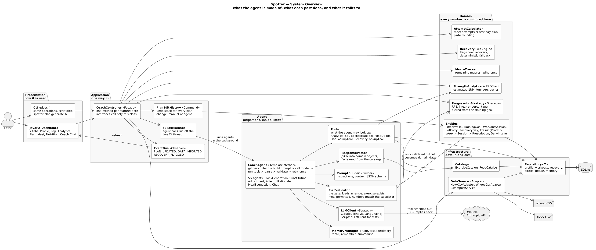

# 1. Project Overview

## 1.1 The Problem

A lifter who trains seriously generates a surprising amount of data and gets very little back from it. Sets, reps, loads and RPE go into a workout tracker. Sleep, HRV and recovery scores go into a wearable. Calories and macros go into a third app. Each one shows its own numbers well, and none of them answers the questions that actually decide what happens in the gym: given how the last four weeks went, what should the next four look like; today's recovery was poor, so should this session change; the programme calls for an exercise this gym does not have, so what replaces it; how close is the current level of strength to a heavy single worth attempting.

Answering those questions is what a coach does. A coach is also expensive, is not available at the moment the question arises, and for many lifters is not an option at all. The gap is not a lack of data or a lack of published training theory; it is that nothing connects one to the other for this particular lifter, this week, with this equipment and this recovery.

## 1.2 Target Users

The primary user is a self coached or remotely coached strength trainee who already tracks their training. The design deliberately does not assume a competitor. The profile carries a training goal, one of meet preparation, strength, hypertrophy, or general fitness, and a meet date is optional. Someone preparing for a powerlifting meet gets a block that peaks toward a date and competition attempt selection; someone who simply wants to get stronger, or who trains because they enjoy it, gets a block built around their goal and a planned heavy single on a test day instead. Everything else in the system, the analytics, the recovery handling, the equipment substitution and the nutrition features, is the same for both.

There is no administrator role and no multi user requirement. Spotter runs locally against one lifter's data.

## 1.3 What the Agent Does

Spotter imports a workout history and recovery history, computes strength metrics from them, and then uses an LLM agent to make the judgement calls that arithmetic alone cannot.

The deterministic half of the system parses the CSV exports, estimates a one rep max from RPE based sets, aggregates weekly tonnage and trends, calculates attempt or test day numbers with correct plate rounding, tracks macros against targets, and applies fixed thresholds to flag a day after poor recovery.

The agent half plans a training block from that evidence, rewrites a session when recovery is poor, chooses a substitute exercise when the gym lacks equipment, explains attempt selection in terms of how the block actually went, composes a meal that fits the macros remaining for the day, and answers coaching questions in conversation while remembering earlier ones.

Eleven features are specified in section 2. Both interfaces reach all of them: a JavaFX dashboard with tabs for profile, log, analytics, plan, meet, nutrition and chat, and a picocli command line tool exposing the same operations, which also makes the agent scriptable for the Stage 3 behavioural tests.

## 1.4 Why an Agent Rather Than a Program

Three properties of the problem make an agent appropriate, and it is worth being precise about them, because an agent is the wrong choice for most software.

The first is that the output is open ended. A training block is not a lookup or a formula; it is a structure of exercises, sets, loads and progressions that has to satisfy several soft constraints at once, and there is no single correct answer to compute.

The second is that the inputs are heterogeneous and incomplete. Equipment lists, training history, recovery trends, a goal and a date have to be weighed together, and the weighing changes with the situation in ways that a rule engine would encode as an unmanageable thicket of conditionals.

The third is that the useful interaction is a conversation. "Why is Tuesday lighter this week" is a reasonable question, and answering it requires both retrieval and explanation.

What does not require an agent is anything with a correct answer: estimated one rep max, attempt percentages, plate rounding, macro arithmetic, adherence, recovery thresholds. Those are ordinary code, and keeping them there is the central design decision of the project, covered in section 3.

## 1.5 AI Model and Integration

Spotter uses Anthropic Claude, reached through LangChain4j's `AnthropicChatModel` and wrapped in the project's own `ClaudeClient`. The model name, token limit and timeout come from configuration rather than being compiled in.

The wrapper matters. `ClaudeClient` implements the project's `LLMClient` interface, so no agent, validator or domain class depends on LangChain4j or on Anthropic types. The second implementation, `ScriptedLLMClient`, replays fixed responses, which allows the whole agent loop to be unit tested in Stage 3 without network access or API cost.

The model is reached through exactly one path. Every AI feature runs `CoachAgent.run()`, the template method that gathers context, builds a prompt through `PromptBuilder`, calls the model with the tool schemas the agent registered, executes any tools Claude requests through `ToolManager`, parses the reply with `ResponseParser`, and validates the result with `PlanValidator` before anything reaches the domain model. A failed validation is fed back into the prompt for one retry; a second failure returns a clear error rather than a bad plan.

Cost is bounded by design: each agent declares a `ModelTier`, so only block generation uses the stronger model; `CachingLLMClient` returns a stored reply for an identical request; tools return summaries rather than raw history; and the single retry and bounded tool loop cap what any one feature can spend.

Three properties follow from this arrangement, and they are what make the system testable rather than merely functional.

Model output is never trusted. A training block only becomes a `TrainingBlock` after the validator has checked loads against the lifter's progression strategy and confirmed every exercise exists. A substitute exercise must be one of the candidates the deterministic filter produced. A meal's nutrition figures are read from the food catalog, not from the model's reply. Numbers in an attempt rationale must match what `AttemptCalculator` produced.

The agent works from retrieved facts rather than from memory of its training data. Tools such as `AnalyticsTool`, `ExerciseDBTool`, `FoodDBTool`, `PlanLookupTool` and `RecoveryLookupTool` are how it learns anything about this lifter.

Failure is a designed path. Tool errors are returned to the model rather than thrown, the tool loop is bounded, and features that can fall back deterministically do so, such as the recovery adjustment which offers a fixed reduction when the agent is unavailable.

## 1.6 Architecture

The diagram below is the whole system on one page: every component, what it does, and what it talks to. It is the right starting point for anyone who wants to understand Spotter before reading the class diagram.

Five layers, each depending only on the layer beneath it or on an interface.

| Layer | Contents | Responsibility |
|---|---|---|
| Presentation | `DashboardApp` with seven panels, `CoachCLI` | Collect input, display results. No logic. |
| Application | `CoachController`, `EventBus`, `PlanEditHistory`, `FxTaskRunner` | One entry point per feature; notify the GUI; record undoable edits; keep long work off the UI thread. |
| Domain | Entities plus `StrengthAnalytics`, `AttemptCalculator`, `MacroTracker`, `RecoveryRuleEngine`, `ProgressionStrategy` | The data model and every calculation. Knows nothing about LLMs. |
| Agent | `CoachAgent` and six agents, `ClaudeClient`, `ToolManager` and five tools, `PromptBuilder`, `ResponseParser`, `PlanValidator`, `MemoryManager` | Turn a request into validated output using the model and tools. |
| Infrastructure | CSV adapters behind `DataSource`, `CsvImportService`, catalogs, SQLite repositories | Get data in and out. |

Because an agent call takes seconds and JavaFX has a single UI thread, `CoachController` dispatches agent work through `FxTaskRunner` on a background thread and returns results through `Platform.runLater()`. The CLI calls the same controller methods and blocks, having no UI thread to protect.

Eight design patterns are applied, each solving a problem that exists independently of the requirement to use patterns: Facade, Strategy, Observer, Command, Adapter, Factory Method, Template Method and Decorator, with Builder and Repository as supporting patterns. Section 4 explains each one.

## 1.7 Technology

| Concern | Choice |
|---|---|
| Language and build | Java 21, Maven |
| GUI | JavaFX 21, with built in `LineChart` and `BarChart` for analytics |
| CLI | picocli, command name `spotter` |
| Storage | SQLite through `sqlite-jdbc`, behind `Repository<T>` |
| LLM | Anthropic Claude through LangChain4j, wrapped in `ClaudeClient` |
| JSON | Jackson |
| Data sources | Hevy and Whoop CSV exports behind `DataSource` |
| Unit testing | JUnit 5, Mockito, AssertJ |
| Agent behaviour testing | KUMA, driving the Java CLI through a small Python harness |

The application is entirely Java. Python appears only in `tools/kuma/`, because KUMA is a Python SDK with no Java equivalent; the harness starts the Java process, passes the test input and returns the result and trace to KUMA, and contains no application logic.

Live Hevy and Whoop APIs are deliberately out of scope. Both require account authentication that would consume implementation time without demonstrating any additional design, so the system reads their CSV exports instead. The `DataSource` interface is the extension point: adding `HevyApiAdapter` later would change nothing above it.

## 1.8 Document Map

| Section | Contents |
|---|---|
| 2 | Eleven feature specifications with inputs, outputs, workflow, errors and AI classification |
| 3 | UML class diagram, five views, with relationships and multiplicities |
| 4 | Seven design patterns: problem, participants, rationale, and the cost of omitting each |
| 5 | Use case diagram with actors and include and extend relationships |
| 6 | Fifteen use case descriptions |
| 7 | Nine sequence diagrams covering every feature |
| 8 | Feature to design traceability table |
| 9 | How each feature is realized by its classes and methods |

Every diagram exists as PlantUML source rendered to PNG and SVG, and as a UMLet `.uxf` file generated from the same model, so the design can be opened and edited in UMLet.
