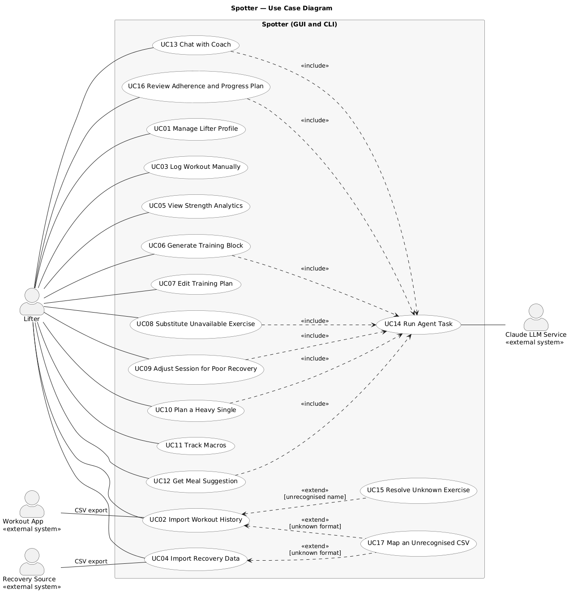

# 5. Use Case Diagram

Source: `diagrams/usecase/usecase.puml`, also available as `diagrams/uxf/usecase.uxf` for UMLet

## 5.1 Actors

| Actor | Type | Role |
|---|---|---|
| Lifter | Primary, human | The powerlifter using Spotter through either the GUI or the CLI. Initiates every use case. |
| Workout App | Secondary, external system | Produces the workout history CSV consumed by UC02. Hevy is recognised automatically; any other app is read through a confirmed column mapping (UC17). Spotter never calls these apps directly. |
| Recovery Source | Secondary, external system | Produces the recovery CSV consumed by UC04. Whoop is recognised automatically, other wearables through a mapping. A lifter with no wearable uses the check in in UC04 instead, so this actor is optional. |
| Claude LLM Service | Secondary, external system | Anthropic's Claude model, reached through `ClaudeClient`. Participates only through UC14, so every AI feature reaches the model through one controlled path. |

## 5.2 Relationships

**Include.** UC06, UC08, UC09, UC10, UC12, UC13 and UC16 all include **UC14 Run Agent Task**. UC14 captures the behaviour every AI feature shares: gather context, call Claude with tools, parse, validate, and retry once on failure. This mirrors the Template Method `CoachAgent.run()` in the class diagram.

**Extend.** **UC17 Map an Unrecognised CSV** extends UC02 and UC04 at the extension point "header matches no known format", and **UC15 Resolve Unknown Exercise** extends UC02 at the extension point "unrecognised exercise name", because it only happens when an imported name is not in the exercise catalog.

UC08 and UC09 end with the lifter accepting a change. That acceptance is carried out through the same plan edit mechanism as UC07 (a `PlanEditCommand`), which is why accepted substitutions and adjustments can be undone from UC07. This is described in the flows below rather than drawn as an extend relationship, to keep the diagram readable.

## 5.3 Interfaces

Every use case initiated by the lifter is available in both interfaces. The GUI action and the equivalent CLI command are listed in each description. Both call the same `CoachController` method, so the two interfaces behave identically.

---

# 6. Use Case Descriptions

## UC01 — Manage Lifter Profile

| Field | Description |
|---|---|
| Actor(s) | Lifter |
| Goal | Create or update the profile that every other feature depends on: bodyweight, training goal, split preference, optional meet date and weight class, training days, equipment, dietary constraints, and macro targets. |
| Interface | GUI: Profile tab, Save. CLI: `spotter profile set`, `spotter profile show` |
| Preconditions | The application is running and the database is initialised. |
| Trigger | The lifter opens the Profile tab and clicks Save, or runs `spotter profile set`. |
| Main Success Scenario | 1. Lifter enters or edits profile fields. 2. `ProfilePanel.onSaveClicked()` builds a `LifterProfile` and calls `CoachController.saveProfile()`. 3. The controller validates required fields, weight class, and meet date. 4. `ProfileRepository.save()` persists the profile. 5. The controller publishes `PROFILE_UPDATED` on the `EventBus`. 6. Subscribed panels refresh and a confirmation is shown. |
| Alternative / Exception Flows | 3a. A required field is missing: the save is blocked and the field is highlighted. 3b. A meet date is given but is in the past: the save is rejected with a message. 3d. The meet prep goal is selected with no meet date: the lifter is asked for one; every other goal leaves the field empty and unused. 3c. No equipment is selected: the profile is saved with bodyweight only equipment and a warning that plan generation will be limited. |
| Postconditions | A valid `LifterProfile` is stored and all panels show current values. |
| Related Feature(s) | F01, and macro targets for F09 |

## UC02 — Import Workout History

| Field | Description |
|---|---|
| Actor(s) | Lifter (primary), Hevy App (secondary, source of the file) |
| Goal | Load training history from a Hevy CSV export so analytics and planning have data. |
| Interface | GUI: Log tab, Import Hevy CSV. CLI: `spotter import hevy <file>` |
| Preconditions | A profile exists. The lifter has exported a CSV from Hevy. |
| Trigger | The lifter selects a file in the file picker, or runs the CLI command with a file path. |
| Main Success Scenario | 1. `LogPanel.onImportHevyClicked()` calls `CoachController.importWorkouts(path)`. 2. `CsvImportService.importFile()` asks `DataSourceFactory` for the correct adapter, which detects the Hevy header and returns a `HevyCsvAdapter`. 3. The adapter reads rows through `CsvFileReader` and converts them to `WorkoutSession` and `SetEntry` objects in an `ImportBatch`. 4. The service maps each exercise name through `ExerciseCatalog.byName()`. 5. Duplicate sessions (same date and exercises) are removed. 6. New sessions are saved through `WorkoutRepository`. 7. The controller publishes `DATA_IMPORTED`. 8. An `ImportReport` is shown with counts of imported sessions, skipped duplicates, and row errors. |
| Alternative / Exception Flows | 2a. The header matches neither Hevy nor Whoop: the import stops with "unrecognised file format" and nothing is saved. 3a. Individual rows are malformed: those rows are skipped and listed in the report, and valid rows continue. 4a. An exercise name is not in the catalog: **UC15** runs. 5a. The lifter chooses "import anyway" for duplicates: they are saved as separate sessions. |
| Postconditions | Valid sessions are stored, the Log and Analytics tabs reflect them, and the lifter has a report of anything skipped. |
| Related Feature(s) | F02 |

## UC03 — Log Workout Manually

| Field | Description |
|---|---|
| Actor(s) | Lifter |
| Goal | Record a session directly, either by confirming the prescribed session was completed or by typing it in. |
| Interface | GUI: Plan tab, Log as Prescribed on a session, or Log tab manual entry form. CLI: `spotter log prescribed <sessionId>`, `spotter log add` |
| Preconditions | A profile exists. |
| Trigger | The lifter submits the manual entry form. |
| Main Success Scenario | 1. The lifter either clicks Log as Prescribed, which calls `CoachController.logSessionAsPrescribed()` and turns the prescription into a logged session with only the deviations entered, or types a session in, calling `CoachController.logWorkout()`. 2. Either path produces a `WorkoutSession`. 3. The controller validates ranges (reps at least 1, RPE between 6 and 10, weight above zero). 4. `WorkoutRepository.save()` stores the session. 5. `DATA_IMPORTED` is published and the Log and Analytics tabs refresh. |
| Alternative / Exception Flows | 3a. A value is out of range: the specific field is highlighted and nothing is saved. 1a. The exercise is not in the catalog: the lifter is offered the same mapping choice as UC15. |
| Postconditions | The session is stored and included in analytics. |
| Related Feature(s) | F02 |

## UC04 — Import Recovery Data

| Field | Description |
|---|---|
| Actor(s) | Lifter (primary), Whoop App (secondary, source of the file) |
| Goal | Give the system something to judge recovery by, from a wearable export or a direct check in. |
| Interface | GUI: Log tab, Import CSV, or the Check In panel. CLI: `spotter import whoop <file>`, `spotter import csv <file> <profile>`, `spotter checkin` |
| Preconditions | A profile exists. The lifter has a recovery export, or is completing a check in. No wearable is required. |
| Trigger | The lifter selects a Whoop file or runs the CLI command. |
| Main Success Scenario | 1. `LogPanel.onImportWhoopClicked()` calls `CoachController.importRecovery(path)`. 2. `DataSourceFactory` detects the Whoop header and returns a `WhoopCsvAdapter`. 3. The adapter converts rows into `RecoveryDay` objects. 4. `RecoveryRepository` saves them. 5. The controller runs `RecoveryRuleEngine.evaluate()` on upcoming training days. 6. `DATA_IMPORTED` and, if any days were flagged, `RECOVERY_FLAGGED` are published. 7. The Plan tab shows warning badges on flagged sessions. |
| Alternative / Exception Flows | 3a. A day is missing some fields: it is stored with those fields empty rather than rejected. 4a. Dates overlap an earlier import: the lifter confirms, and newer values replace older ones. 2a. Unrecognised format: same as UC02 2a. |
| Postconditions | Recovery data is stored and any low recovery sessions are flagged. |
| Related Feature(s) | F03, and it triggers the flagging step of F07 |

## UC05 — View Strength Analytics

| Field | Description |
|---|---|
| Actor(s) | Lifter |
| Goal | See estimated one rep max trends, weekly tonnage, and best sets for a competition lift. |
| Interface | GUI: Analytics tab, lift dropdown. CLI: `spotter analytics <squat or bench or deadlift>` |
| Preconditions | A profile exists. |
| Trigger | The lifter selects a lift, or runs the CLI command. |
| Main Success Scenario | 1. `AnalyticsPanel.onLiftSelected()` calls `CoachController.getAnalytics(lift)`. 2. The controller loads history through `WorkoutRepository.findByLift()`. 3. `StrengthAnalytics` computes an e1RM for each set using `RPEChart`, then builds the e1RM series, weekly tonnage, and best set. 4. An `AnalyticsSummary` is returned. 5. The GUI draws a chart and summary figures; the CLI prints a table. |
| Alternative / Exception Flows | 2a. No history for the lift: an empty state is shown with a prompt to import data. 3a. A set has an invalid RPE or RPE 10 at more than one rep: it is excluded and a data quality note is shown. |
| Postconditions | No data changes. The lifter sees current strength figures. |
| Related Feature(s) | F04 |

## UC06 — Generate Training Block

| Field | Description |
|---|---|
| Actor(s) | Lifter (primary), Claude LLM Service (secondary, via UC14) |
| Goal | Produce a multi week training block toward the meet date that respects the lifter's strength levels, equipment, and chosen progression scheme. |
| Interface | GUI: Plan tab, Generate Block. CLI: `spotter plan generate <weeks>` |
| Preconditions | A profile exists with a training goal. At least some workout history exists for each main lift. A meet date is not required. |
| Trigger | The lifter clicks Generate Block or runs the CLI command. |
| Main Success Scenario | 1. `PlanPanel.onGenerateClicked()` calls `CoachController.generateBlock(weeks)`. 2. The controller asks `ProgressionStrategyFactory.forGoal()` for the strategy matching the training goal, builds an `AgentRequest` carrying the training days and split preference, and calls `BlockGenerationAgent.run()`. 3. **UC14** runs: the agent gathers current e1RMs through `AnalyticsTool` and available exercises through `ExerciseDBTool`, asks Claude for a block as JSON with a focus label per session, parses it with `ResponseParser.toBlock()`, and validates it with `PlanValidator.validateBlock()` against the active `ProgressionStrategy` and with `validateSplit()` against the lifter's training days and split preference. 4. The validated `TrainingBlock` is saved through `BlockRepository`. 5. `PLAN_UPDATED` is published. 6. The Plan tab displays the block week by week. |
| Alternative / Exception Flows | 1a. Not enough history for a lift: the lifter is warned and may continue, in which case the agent is told to use conservative loads. 3a. UC14 fails after its retry: an error is shown and any existing block is left unchanged. 4a. A block already exists: the lifter confirms replacement before saving. |
| Postconditions | A new validated block is active and visible. The previous block, if any, is kept in history. |
| Related Feature(s) | F05 |

## UC07 — Edit Training Plan

| Field | Description |
|---|---|
| Actor(s) | Lifter |
| Goal | Make manual changes to the active block (swap an exercise, change a load) and undo any change, including changes that came from the agent. |
| Interface | GUI: Plan tab, inline edits and Undo. CLI: `spotter plan edit load <prescriptionId> <kg>`, `spotter plan edit swap <prescriptionId> <exercise>`, `spotter plan undo` |
| Preconditions | An active training block exists. |
| Trigger | The lifter edits a value in the plan, or clicks Undo. |
| Main Success Scenario | 1. The lifter changes a load. 2. `PlanPanel` creates a `ChangeLoadCommand` and calls `CoachController.applyEdit(cmd)`. 3. `PlanEditHistory.execute()` runs the command, which records the old value and updates the `TrainingBlock`. 4. `BlockRepository.save()` persists the block. 5. `PLAN_UPDATED` is published and the tab refreshes. |
| Alternative / Exception Flows | 1a. The lifter clicks Undo: `CoachController.undoLastEdit()` calls `PlanEditHistory.undo()`, which pops the last command and restores the old value. 1b. Nothing to undo: the Undo button is disabled and the CLI prints "nothing to undo". 1c. The swap target requires equipment the lifter does not have: the edit is refused with a message suggesting UC08. |
| Postconditions | The block reflects the edit and the change is on the undo stack. |
| Related Feature(s) | F05, F06, F07 |

## UC08 — Substitute Unavailable Exercise

| Field | Description |
|---|---|
| Actor(s) | Lifter (primary), Claude LLM Service (secondary, via UC14) |
| Goal | Replace an exercise the lifter's gym cannot support with the closest suitable alternative. |
| Interface | GUI: Plan tab, warning icon, Suggest Substitute. CLI: `spotter plan substitute <prescriptionId>` |
| Preconditions | An active block exists and at least one prescription requires equipment not in the profile. |
| Trigger | The lifter clicks Suggest Substitute on a flagged exercise. |
| Main Success Scenario | 1. `PlanPanel.onSubstituteClicked()` calls `CoachController.suggestSubstitute(id)`. 2. `SubstitutionAgent.run()` executes **UC14**: `ExerciseDBTool` returns candidates with the same movement pattern and muscle groups that use only available equipment; Claude picks one and explains why. 3. `PlanValidator.validateSubstitution()` confirms the choice is one of the candidates. 4. The suggestion and rationale are shown. 5. The lifter accepts. 6. The controller applies a `SwapExerciseCommand` through `PlanEditHistory`, as in UC07. |
| Alternative / Exception Flows | 2a. No candidates exist: the lifter is told no automatic substitute is available and can swap manually through UC07. 3a. Claude picks an exercise outside the candidate list: validation fails and UC14 retries; if it fails again the candidate list is shown for manual choice. 5a. The lifter rejects the suggestion: nothing changes. |
| Postconditions | If accepted, the prescription uses an available exercise and the change is undoable. |
| Related Feature(s) | F06 |

## UC09 — Adjust Session for Poor Recovery

| Field | Description |
|---|---|
| Actor(s) | Lifter (primary), Claude LLM Service (secondary, via UC14) |
| Goal | Reduce the demand of a planned session when recovery data shows the lifter is under recovered. |
| Interface | GUI: Plan tab, recovery badge, Adjust Session. CLI: `spotter plan flags`, `spotter plan adjust <sessionId>` |
| Preconditions | An active block exists and recovery data exists for the session date or the day before. |
| Trigger | The lifter clicks Adjust Session on a flagged session. |
| Main Success Scenario | 1. `RecoveryRuleEngine.evaluate()` has already flagged the session (recovery score below 33 or sleep below 6 hours). 2. `PlanPanel.onAdjustClicked()` calls `CoachController.adjustSession(id)`. 3. `AdjustmentAgent.run()` executes **UC14** with the session, the `RecoveryFlag` reasons, and recent recovery trend; Claude returns a revised session and rationale. 4. `PlanValidator` confirms loads are not increased and competition lifts are not removed. 5. The original and adjusted sessions are shown side by side. 6. The lifter accepts, and an `ApplyAdjustmentCommand` is applied through `PlanEditHistory`. |
| Alternative / Exception Flows | 1a. Recovery data is missing: the session is not flagged and the lifter is told why. 3a. UC14 fails: the lifter is shown a deterministic fallback (reduce sets by one third) and may accept it instead. 6a. The lifter rejects the adjustment: the original session is kept. |
| Postconditions | If accepted, the session is lighter, carries an adjustment note, and can be undone. |
| Related Feature(s) | F07 |

## UC10 — Plan a Heavy Single (Meet Attempts or Test Day)

| Field | Description |
|---|---|
| Actor(s) | Lifter (primary), Claude LLM Service (secondary, via UC14) |
| Goal | Get either competition attempts (when a meet date is set) or a test day plan (when it is not), with an explanation grounded in recent training. |
| Interface | GUI: Meet tab, Calculate Attempts. CLI: `spotter meet attempts` |
| Preconditions | A profile exists and recent history exists for the competition lifts. |
| Trigger | The lifter clicks Calculate Attempts or runs the CLI command. |
| Main Success Scenario | 1. `MeetPanel.onCalculateClicked()` calls `CoachController.calculateAttempts()`. 2. The controller gets current e1RMs from `StrengthAnalytics.currentE1RMs()`. 3. `AttemptCalculator.calculateMeetAttempts()` produces `MeetAttempts` for each lift when a meet date is set, or `projectTestDay()` produces a `TestDayPlan` with warm ups and a top single when it is not. Both round to 2.5 kg. 4. `AttemptRationaleAgent.run()` executes **UC14** to write a rationale referencing the recent trend. 5. `PlanValidator.validateRationale()` confirms every number in the rationale matches the calculator. 6. Attempts and rationale are displayed. |
| Alternative / Exception Flows | 2a. Too little recent data for a lift: a conservative percentage is used and a warning shown. 4a. UC14 fails or the rationale contradicts the calculator: the attempts are still shown, without a rationale, and a note explains why. 6a. The lifter overrides an attempt manually: the override is stored and marked as manual. |
| Postconditions | Attempts are displayed and stored. The numbers always come from the deterministic calculator. |
| Related Feature(s) | F08 |

## UC11 — Track Macros

| Field | Description |
|---|---|
| Actor(s) | Lifter |
| Goal | Log daily food intake and see remaining macros and weekly adherence against targets. |
| Interface | GUI: Nutrition tab. CLI: `spotter macros log <food> <grams>`, `spotter macros today`, `spotter macros week` |
| Preconditions | Macro targets are set in the profile (UC01). |
| Trigger | The lifter logs a food entry or opens the Nutrition tab. |
| Main Success Scenario | 1. `NutritionPanel.onLogIntakeClicked()` calls `CoachController.logIntake(entry)`. 2. The food is looked up in `FoodCatalog` and a `FoodEntry` is created with its gram amount. 3. `MacroTracker.recordIntake()` adds it to the day's `DailyIntake`. 4. `IntakeRepository` saves it. 5. `MacroTracker.getRemaining()` and `weeklyAdherence()` are computed. 6. `INTAKE_LOGGED` is published and the tab shows remaining macros and adherence. |
| Alternative / Exception Flows | 2a. The food is not in the catalog: the lifter may enter its macros per 100 g manually, which adds it to the catalog. 3a. Grams are zero, negative, or above a sanity limit: the entry is rejected. 5a. A day has no entries: it is excluded from weekly adherence. |
| Postconditions | The entry is stored and remaining macros are current. |
| Related Feature(s) | F09 |

## UC12 — Get Meal Suggestion

| Field | Description |
|---|---|
| Actor(s) | Lifter (primary), Claude LLM Service (secondary, via UC14) |
| Goal | Receive a vegetarian meal that fits the macros remaining for the day. |
| Interface | GUI: Nutrition tab, Suggest a Meal. CLI: `spotter meal suggest` |
| Preconditions | Macro targets exist. Dietary constraints are set in the profile. |
| Trigger | The lifter clicks Suggest a Meal. |
| Main Success Scenario | 1. `NutritionPanel.onSuggestMealClicked()` calls `CoachController.suggestMeal()`. 2. The controller gets remaining macros from `MacroTracker.getRemaining()`. 3. `MealSuggestionAgent.run()` executes **UC14**: `FoodDBTool` returns foods permitted by `DietaryConstraints`; Claude composes a meal from those foods with gram amounts. 4. `ResponseParser.toMeal()` builds the `MealSuggestion` using catalog nutrition values, not model generated values. 5. `PlanValidator.validateMeal()` confirms every item is permitted and the totals do not exceed remaining calories by more than a tolerance. 6. The meal and its full nutrition breakdown are shown, with an option to log it through UC11. |
| Alternative / Exception Flows | 2a. Remaining calories are near zero: the lifter is told no meal is needed. 3a. No foods fit: the agent explains the shortfall instead of inventing a meal. 5a. A non permitted item appears: validation fails and UC14 retries. |
| Postconditions | A validated suggestion is shown. Nothing is logged until the lifter chooses to. |
| Related Feature(s) | F10 |

## UC13 — Chat with Coach

| Field | Description |
|---|---|
| Actor(s) | Lifter (primary), Claude LLM Service (secondary, via UC14) |
| Goal | Ask free form coaching questions and receive answers grounded in the lifter's own data and earlier conversations. |
| Interface | GUI: Coach Chat tab. CLI: `spotter chat "<question>"` or interactive `spotter chat` |
| Preconditions | A profile exists. |
| Trigger | The lifter sends a message. |
| Main Success Scenario | 1. `ChatPanel.onSendClicked()` calls `CoachController.chat(message)`. 2. `ChatAgent.run()` executes **UC14**: `MemoryManager.recall()` retrieves relevant earlier conversation summaries; Claude decides which tools to call (`AnalyticsTool`, `PlanLookupTool`, `RecoveryLookupTool`), receives their results, and writes an answer. 3. `MemoryManager.remember()` stores the exchange in `ConversationHistory`. 4. The answer is displayed. |
| Alternative / Exception Flows | 2a. The question needs data no tool can provide: the agent says so rather than guessing. 2b. The question is ambiguous: the agent asks a clarifying question. 2c. The conversation exceeds the history limit: older turns are summarised by `MemoryManager.summarizeOlderTurns()`. 2d. A tool fails: the agent reports that the data is unavailable. |
| Postconditions | The answer is shown and the exchange is available to later conversations. |
| Related Feature(s) | F11 |

## UC17 — Map an Unrecognised CSV (extends UC02 and UC04)

| Field | Description |
|---|---|
| Actor(s) | Lifter |
| Goal | Import from an app Spotter does not recognise, by describing its columns once. |
| Interface | GUI: mapping dialog opened automatically during import. CLI: `spotter import csv <file> <profile>` |
| Preconditions | An import is in progress and `DataSourceFactory.detect()` returned `GENERIC`. |
| Trigger | Extension point "header matches no known format" in UC02 or UC04. |
| Main Success Scenario | 1. `DataSourceFactory.suggestMapping()` proposes a `ColumnMapping` by matching header names against known synonyms. 2. The lifter confirms or corrects which column holds each field, the date format, and whether weights are kilograms or pounds. 3. `ColumnMapping.validate()` checks the required fields for the import kind are mapped. 4. The mapping is saved as a named import profile through `ImportProfileRepository`. 5. `GenericCsvAdapter` reads the file through it, converting units and dates. 6. The calling use case continues as normal. |
| Alternative / Exception Flows | 3a. A required column is not mapped: validation names the missing field and the import does not proceed. 2a. The lifter recognises the profile from a previous import and selects it, skipping the dialog. 5a. Rows fail to parse under the mapping: they are reported per row, as in any other import. |
| Postconditions | The file is imported and the mapping is stored, so future exports from that app import in one step. |
| Related Feature(s) | F02, F03 |

## UC16 — Review Adherence and Progress the Plan

| Field | Description |
|---|---|
| Actor(s) | Lifter (primary), Claude LLM Service (secondary, via UC14) |
| Goal | See how the week's training compared with what was prescribed, and let the plan respond to it. |
| Interface | GUI: Plan tab, Review Week and Progress Plan. CLI: `spotter plan review <week>`, `spotter plan progress <week>` |
| Preconditions | An active block exists and at least one session from the week in question has been logged or imported. |
| Trigger | The lifter opens Review Week, typically at the end of a training week. |
| Main Success Scenario | 1. `PlanPanel.onReviewWeekClicked()` calls `CoachController.reviewAdherence(week)`. 2. The controller loads the block and the logged sessions. 3. `PlanAdherence.compare()` matches each prescription to logged sets and assigns a verdict per exercise. 4. The `AdherenceReport` is displayed. 5. The lifter clicks Progress Plan. 6. `ProgressionAgent.run()` executes **UC14** using `AdherenceTool`, and proposes revised remaining weeks with reasons. 7. `PlanValidator.validateProgression()` confirms loads advance only where verdicts allow and within the week over week cap. 8. The lifter accepts, and an `ApplyProgressionCommand` is applied through `PlanEditHistory`. |
| Alternative / Exception Flows | 3a. A prescribed session has no matching log: it is reported as missed rather than assumed complete. 3b. A logged set carries no RPE: the comparison uses reps alone. 6a. There is no shortfall and the lifter does not ask: the report is shown and nothing changes. 7a. Validation fails twice, or the agent is unavailable: the report is still shown, since the comparison is deterministic. 8a. The lifter rejects the revision: the block is unchanged. |
| Postconditions | The lifter knows how the week went. If a revision was accepted, the remaining weeks reflect it and the change is undoable. |
| Related Feature(s) | F12, and it feeds F05 by giving the next block generation an execution history |

## UC14 — Run Agent Task (included)

| Field | Description |
|---|---|
| Actor(s) | Claude LLM Service (secondary). Always initiated by an including use case, never directly by the lifter. |
| Goal | Execute one AI task reliably: produce output that has been parsed and validated, or fail cleanly. |
| Preconditions | `ClaudeClient` is configured with an API key. The calling agent has registered its tools. |
| Trigger | An including use case calls `CoachAgent.run(request)`. |
| Main Success Scenario | 1. `gatherContext()` loads the profile and task inputs. 2. `buildPrompt()` uses `PromptBuilder` to assemble instructions, context, output schema, and memory. 3. `ClaudeClient.complete()` sends the messages and tool schemas to Claude. 4. If Claude requests a tool, `ToolManager.execute()` runs it and the result is sent back; this repeats until Claude returns a final answer. 5. `parse()` converts the answer into a domain object. 6. `validate()` checks it with `PlanValidator`. 7. An `AgentResult` with `success = true` is returned. |
| Alternative / Exception Flows | 5a or 6a. Parsing or validation fails: the errors are added to the prompt and steps 3 to 6 run once more; if they fail again, an `AgentResult` with `success = false` and the errors is returned. 3a. Claude times out or returns an API error: one retry after a short wait, then a failed result. 4a. Claude requests a tool that does not exist or passes invalid arguments: the tool returns an error result to Claude instead of executing. 4b. The tool loop exceeds a fixed limit of rounds: the task stops with a failed result. |
| Postconditions | The caller receives either validated output or a clear failure. Unvalidated model output never reaches the domain. |
| Related Feature(s) | F05, F06, F07, F08, F10, F11 |

## UC15 — Resolve Unknown Exercise (extends UC02)

| Field | Description |
|---|---|
| Actor(s) | Lifter |
| Goal | Map an imported exercise name that is not in the catalog so its sets can be imported. |
| Preconditions | UC02 is in progress and at least one name failed `ExerciseCatalog.byName()`. |
| Trigger | Extension point "unrecognised exercise name" in UC02. |
| Main Success Scenario | 1. The lifter is shown each unknown name with the closest catalog matches. 2. The lifter maps it to an existing exercise. 3. The mapping is saved so future imports resolve it automatically. 4. UC02 continues and imports those sets. |
| Alternative / Exception Flows | 2a. The lifter adds it as a new exercise, entering muscle groups, movement pattern, and equipment. 2b. The lifter skips it: those sets are excluded and listed in the import report. |
| Postconditions | Each unknown name is mapped, added, or explicitly skipped. |
| Related Feature(s) | F02 |

---

## 6.1 Feature Coverage

| Feature | Use Case(s) |
|---|---|
| F01 Lifter Profile and Constraints | UC01 |
| F02 Workout Logging and Import | UC02, UC03, UC15, UC17 |
| F03 Recovery Input | UC04, UC17 |
| F04 Strength Analytics | UC05 |
| F05 Training Block Generation | UC06, UC07, UC14 |
| F06 Equipment Substitution | UC08, UC07, UC14 |
| F07 Recovery Aware Session Adjustment | UC04, UC09, UC07, UC14 |
| F08 Max Testing and Attempt Planning | UC10, UC14 |
| F09 Macro Targets and Adherence | UC01, UC11 |
| F10 Vegetarian Meal Suggestion | UC12, UC14 |
| F11 Coaching Chat with Memory | UC13, UC14 |
| F12 Plan Adherence and Progression | UC16, UC07, UC14 |

Every feature is covered by at least one use case, and every use case maps back to at least one feature.
