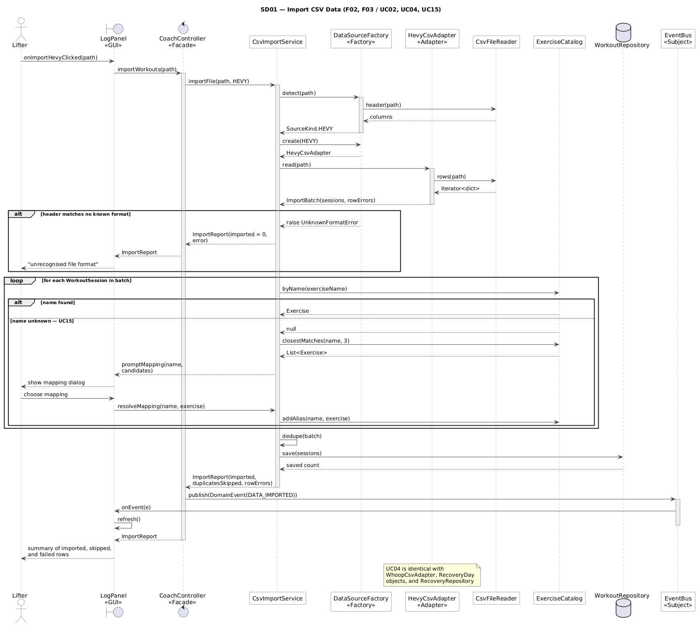
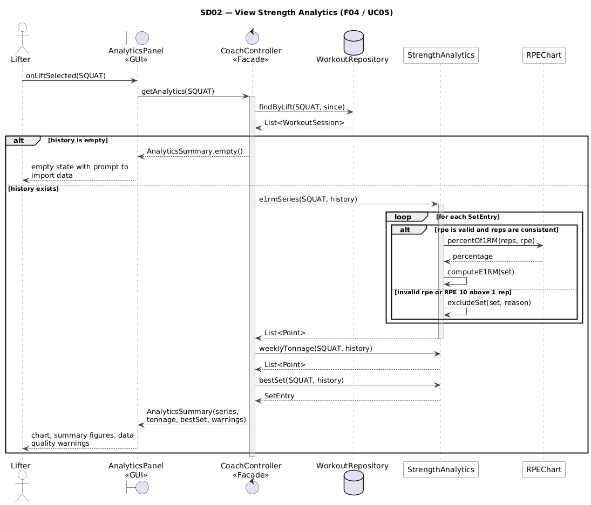
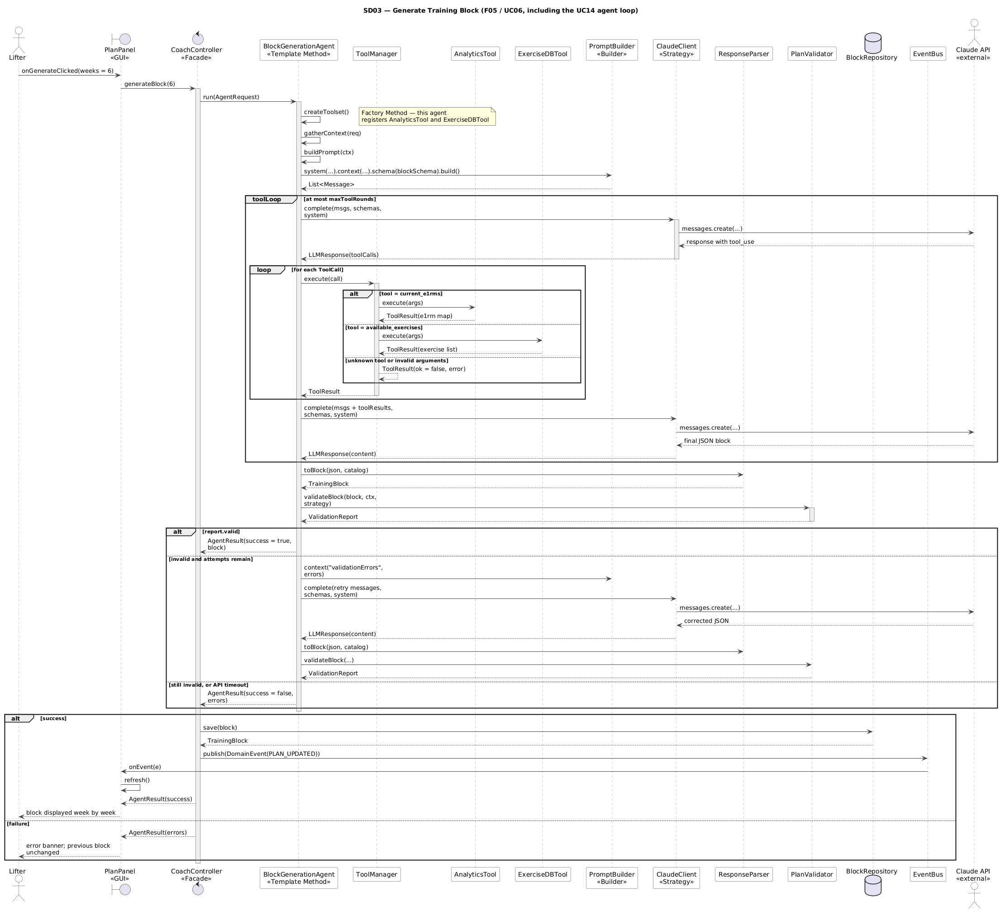
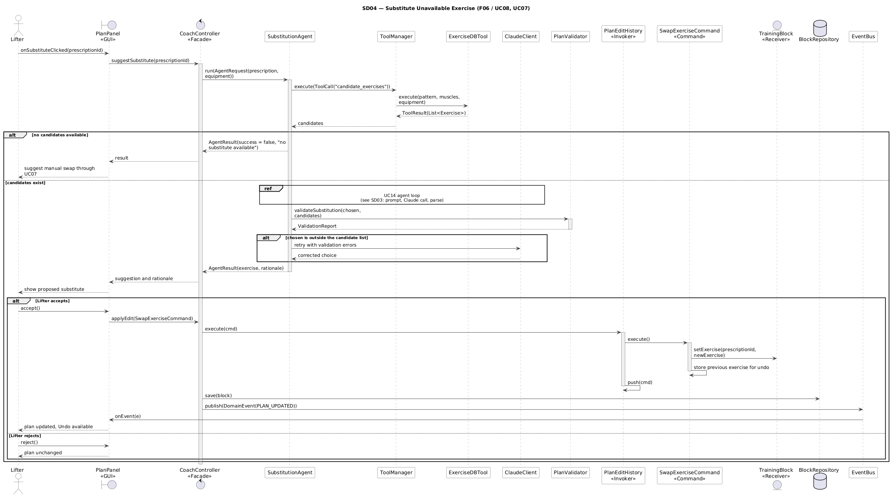
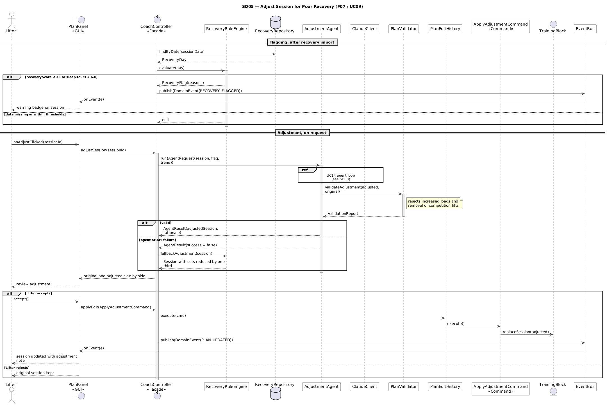
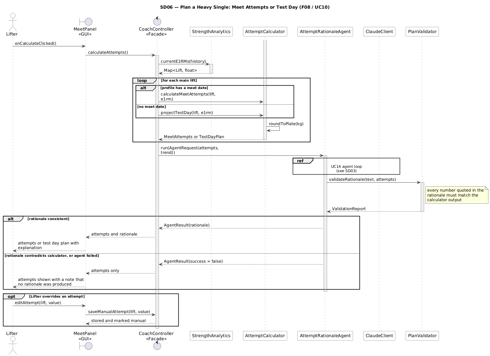
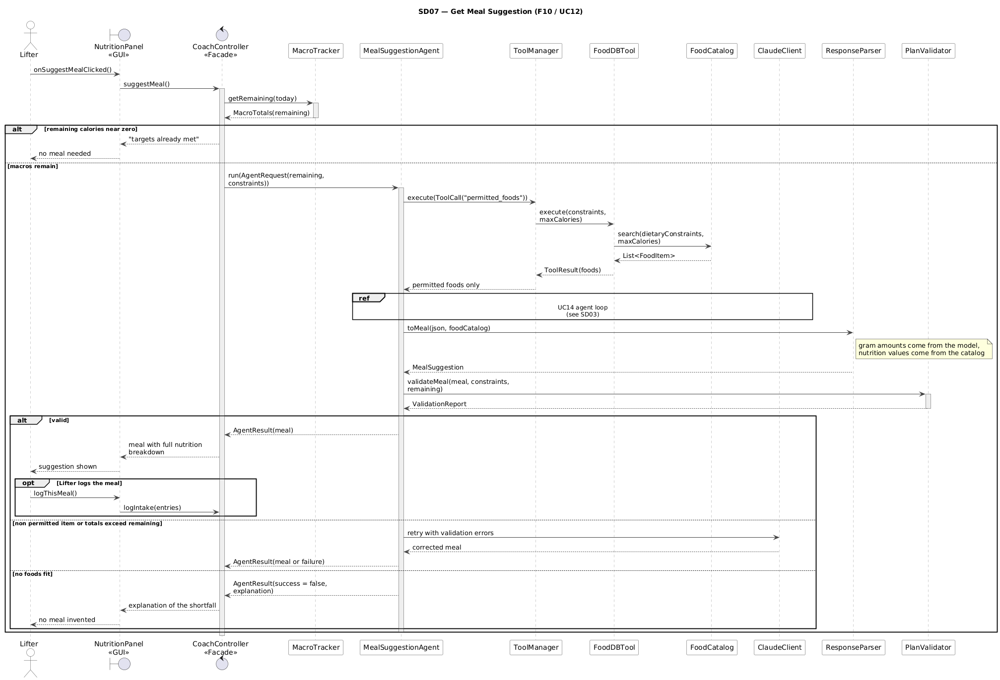
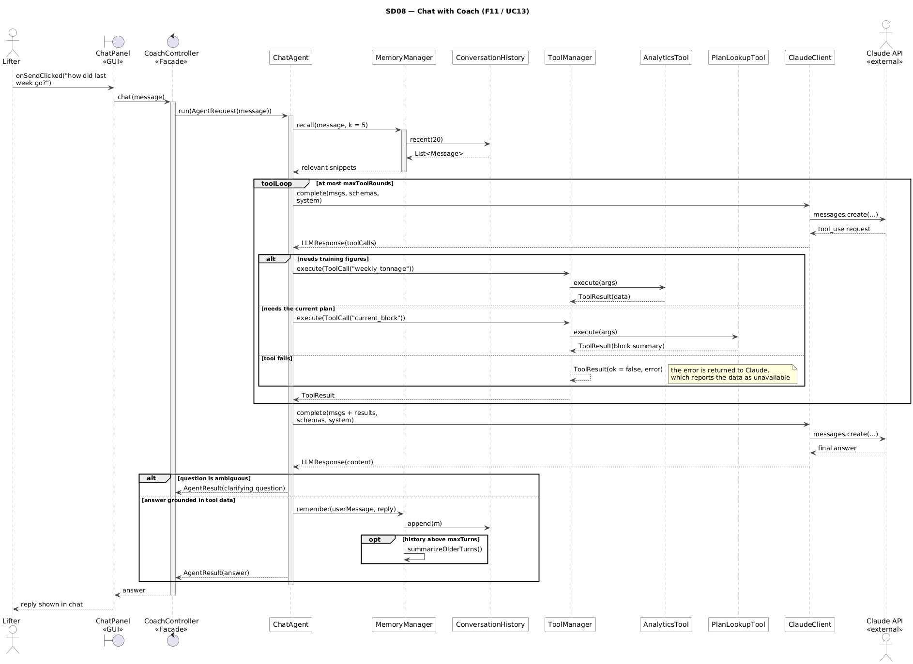
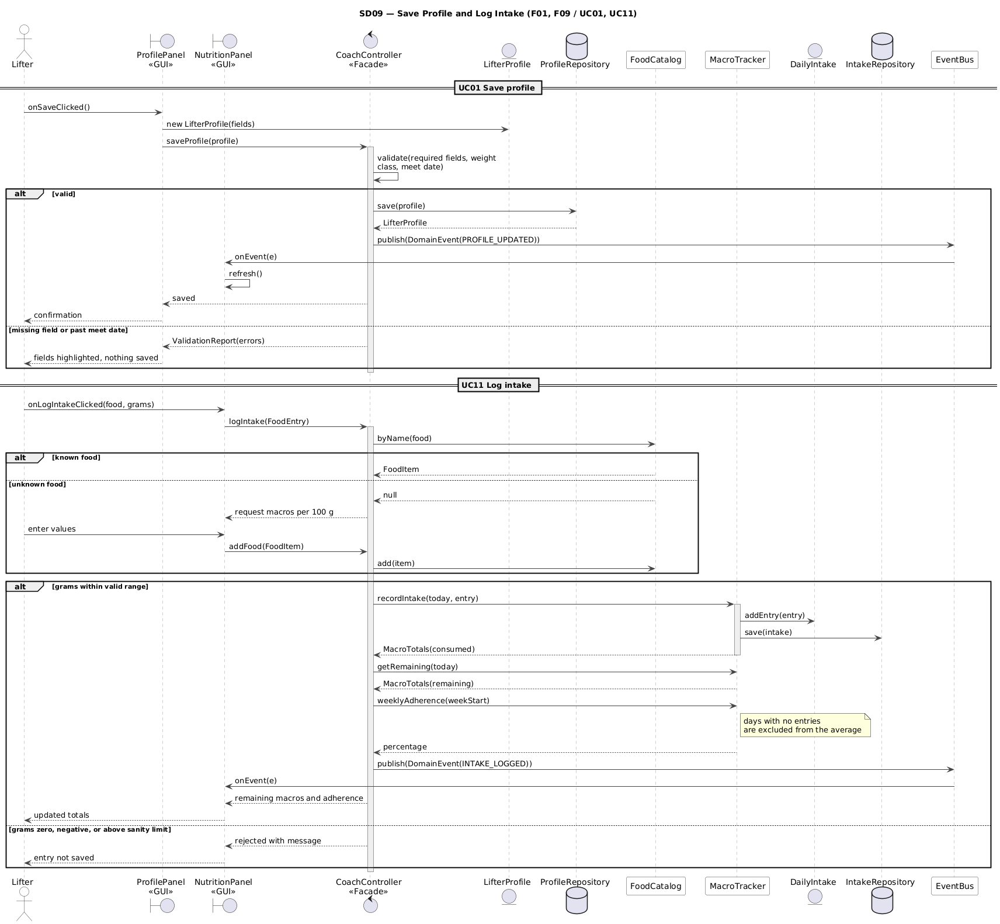
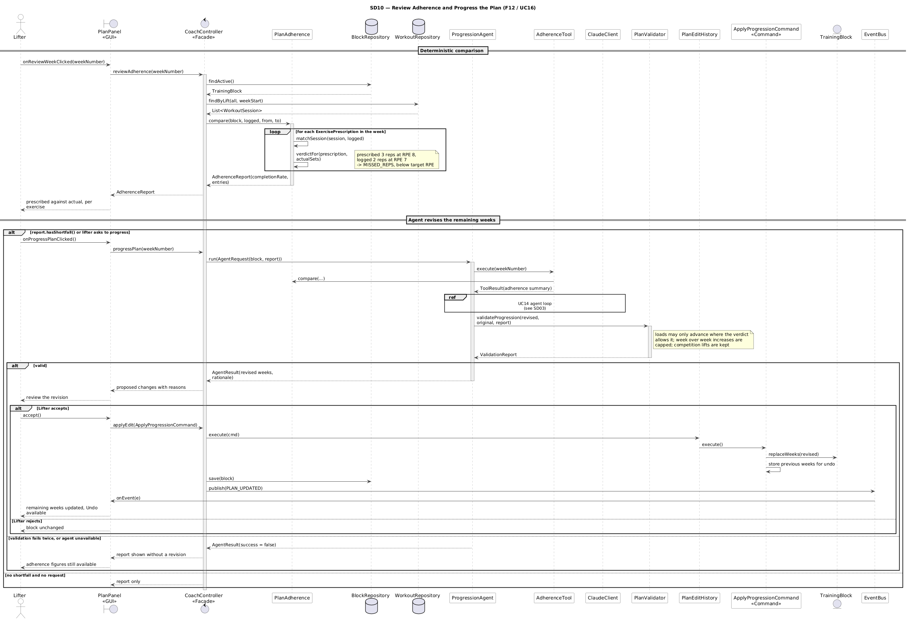

# 7. Sequence Diagrams

Ten sequence diagrams cover every important behaviour in the system. Each one uses the classes and method names defined in the class diagram, shows the initiating actor, the boundary object, the controller, domain objects, agent components, and external services, and includes the alternative and error flows described in the matching use case.

| Diagram | Covers | Use Case(s) | Source |
|---|---|---|---|
| SD01 Import CSV Data | F02, F03 | UC02, UC04, UC15 | `diagrams/sequence/SD01-import-csv.puml` |
| SD02 View Strength Analytics | F04 | UC05 | `SD02-analytics.puml` |
| SD03 Generate Training Block | F05 | UC06, UC14 | `SD03-generate-block.puml` |
| SD04 Substitute Unavailable Exercise | F06 | UC08, UC07 | `SD04-substitute-exercise.puml` |
| SD05 Adjust Session for Poor Recovery | F07 | UC09, UC07 | `SD05-recovery-adjustment.puml` |
| SD06 Plan a Heavy Single | F08 | UC10 | `SD06-meet-attempts.puml` |
| SD07 Get Meal Suggestion | F10 | UC12 | `SD07-meal-suggestion.puml` |
| SD08 Chat with Coach | F11 | UC13 | `SD08-coach-chat.puml` |
| SD09 Save Profile and Log Intake | F01, F09 | UC01, UC11 | `SD09-profile-and-macros.puml` |
| SD10 Review Adherence and Progress the Plan | F12 | UC16, UC07 | `SD10-adherence-progression.puml` |

SD03 is the reference diagram for the agent loop. Because all six AI features share that loop (the Template Method in `CoachAgent.run()`), the other agent diagrams use a UML `ref` fragment pointing back to SD03 rather than repeating the same twelve messages, and show only the parts that differ: which tools are called, what is validated, and what happens to the result.

---

## SD01 — Import CSV Data

The lifter picks a file and `LogPanel` calls `CoachController.importWorkouts()`. `CsvImportService` asks `DataSourceFactory` to identify the file from its header, receives a `HevyCsvAdapter`, and the adapter translates raw rows from `CsvFileReader` into `WorkoutSession` and `SetEntry` objects. Each exercise name is resolved through `ExerciseCatalog`, duplicates are removed, and the surviving sessions are saved. The controller then publishes `DATA_IMPORTED`, which is what causes the Log and Analytics panels to refresh through the Observer relationship.

Three alternative flows appear: an unrecognised header stops the import before anything is saved, individual malformed rows are collected into the report while valid rows continue, and an unknown exercise name opens the UC15 mapping dialog so the lifter can map or add it. Recovery import (UC04) has the same shape with `WhoopCsvAdapter`, `RecoveryDay`, and `RecoveryRepository`, which is noted on the diagram rather than drawn twice.

## SD02 — View Strength Analytics

A purely deterministic path with no agent involvement. `StrengthAnalytics` loops over the history, converts each set into an estimated one rep max through `RPEChart`, and returns the series, weekly tonnage, and best set. The loop contains the data quality rule: sets with an invalid RPE, or RPE 10 above one rep, are excluded and reported rather than silently used. The empty history case returns an empty summary instead of an error.

## SD03 — Generate Training Block

This is the most detailed diagram because it shows the full agent loop that the other AI features reuse.

`BlockGenerationAgent.run()` executes the template: `createToolset()` (the Factory Method, registering only the tools this agent needs), `gatherContext()`, and `buildPrompt()` through `PromptBuilder`. The `toolLoop` fragment then shows the real mechanics of tool use: `ClaudeClient` sends the messages and tool schemas to the Claude API, Claude replies asking for a tool, `ToolManager` executes it, and the result is sent back. The inner `alt` shows the three outcomes of a tool call, including a tool that does not exist or receives invalid arguments, which returns an error result to Claude instead of executing anything.

When Claude returns the final JSON, `ResponseParser.toBlock()` builds a `TrainingBlock` and `PlanValidator.validateBlock()` checks it against the lifter's context and the active `ProgressionStrategy`. The outer `alt` shows the three endings: valid on the first pass, one retry with the validation errors appended to the prompt, and failure after the retry or on API timeout. Only on success is the block saved and `PLAN_UPDATED` published; on failure the previous block is left untouched. This is where the principle that unvalidated model output never reaches the domain becomes visible in the design.

## SD04 — Substitute Unavailable Exercise

`ExerciseDBTool` filters the catalog deterministically first, so Claude chooses from a list it did not invent. `PlanValidator.validateSubstitution()` then confirms the chosen exercise is actually one of those candidates, and a choice outside the list triggers the retry. The second half of the diagram shows the Command pattern in full: acceptance creates a `SwapExerciseCommand`, `PlanEditHistory.execute()` runs it, the command records the previous exercise for undo, and the modified `TrainingBlock` is saved. This is why an agent suggestion can be undone with the same Undo button as a manual edit.

## SD05 — Adjust Session for Poor Recovery

Split into two phases. Flagging is deterministic: `RecoveryRuleEngine.evaluate()` applies the thresholds and, when a day is flagged, `RECOVERY_FLAGGED` is published so a badge appears on the session. The agent is only invoked when the lifter asks for an adjustment, which keeps the LLM out of routine operation.

The validator here enforces direction: an adjustment may not raise loads or remove a competition lift. The diagram also shows the deterministic fallback, `RecoveryRuleEngine.fallbackAdjustment()`, which reduces sets by one third when the agent or the API fails, so the feature still works without Claude.

## SD06 — Plan a Heavy Single

The numbers come from `AttemptCalculator` before the agent is involved at all, including the plate rounding. Which method runs depends on the profile: `calculateMeetAttempts()` when a meet date is set, `projectTestDay()` when it is not, so a lifter who never competes still gets a planned heavy single. The agent only writes the rationale, and `PlanValidator.validateRationale()` confirms every number quoted in that text matches the calculator. If the rationale contradicts the calculator or the agent fails, the attempts are still shown without a rationale. The diagram also covers thin data (a conservative percentage plus a warning) and a manual override by the lifter.

## SD07 — Get Meal Suggestion

`FoodDBTool` returns only foods that `DietaryConstraints.permits()` allows, so the vegetarian constraint is enforced by code before the model sees the options. `ResponseParser.toMeal()` takes the gram amounts from the model but reads every nutrition value from `FoodCatalog`, which means the displayed breakdown cannot contain invented numbers. `PlanValidator.validateMeal()` performs the final check on permitted items and totals. The "no foods fit" branch is deliberate: the agent explains the shortfall instead of inventing a meal.

## SD08 — Chat with Coach

Shows memory and multi step tool use together. `MemoryManager.recall()` supplies relevant earlier turns before the prompt is built, Claude decides which of the chat tools to call, and the results are returned to it before the final answer. After answering, `MemoryManager.remember()` appends the exchange and summarises older turns once the history limit is reached. The alternative flows cover an ambiguous question (the agent asks for clarification rather than guessing) and a failing tool (reported as unavailable rather than answered from memory of the model's training).

## SD09 — Save Profile and Log Intake

Two short deterministic interactions in one diagram. Profile saving shows validation before persistence and the `PROFILE_UPDATED` event that refreshes dependent panels. Intake logging shows the unknown food path (the lifter supplies macros per 100 g, which adds the item to `FoodCatalog`), range validation on the gram amount, and the adherence calculation that excludes days with no entries rather than counting them as zero.

---

## SD10 — Review Adherence and Progress the Plan

Split into a deterministic half and an agent half, which is the point of the feature. `PlanAdherence.compare()` matches each prescription to the logged sets and assigns a verdict, and that comparison is useful on its own: the lifter sees prescribed against actual per exercise whether or not the agent runs. Only when there is a shortfall, or the lifter asks, does `ProgressionAgent` propose revised remaining weeks, reading the comparison through `AdherenceTool` rather than re deriving it.

`PlanValidator.validateProgression()` is stricter than the other validators because this is the path that changes future training: loads may advance only where the verdict permits it, week over week increases are capped, and competition lifts cannot be dropped. An accepted revision is applied as an `ApplyProgressionCommand`, so a progression the lifter dislikes is one Undo away, exactly like a manual edit.

## 7.1 Consistency with the Class Diagram

Every participant in these diagrams is a class in the class diagram, and every message is a method declared on that class. Writing the diagrams surfaced four methods that the first version of the class diagram was missing, and they were added to it rather than left implicit: `ExerciseCatalog.closestMatches()` and `addAlias()` for UC15, `FoodCatalog.byName()` and `add()` for unknown foods, `RecoveryRuleEngine.fallbackAdjustment()` for the SD05 failure path, and `CoachAgent.maxToolRounds` to bound the tool loop. This is the traceability the project asks for working in the intended direction: the design documents correcting each other before any code is written.
