# Spotter — Stage 1 Project Design Report
### An AI Strength Training and Nutrition Coaching Agent

**Course:** EECS 3311 Software Design, Fall 2026 · **Stage:** 1 (Design)
**Student:** Dev Parikh, _219957794_ · **Repository:** [github.com/devparikh28/EECS3311_Project_Spotter](https://github.com/devparikh28/EECS3311_Project_Spotter)

> **Notice:** Spotter gives training and nutrition guidance for informational purposes. It is not medical advice and does not replace a coach, a physician or a dietitian. This notice appears in the GUI footer and in the CLI banner.

This single document contains all nine required Stage 1 deliverables, followed by four appendices. Every diagram referenced below is delivered in two formats in the `diagrams/` folder of the repository: a PNG for reading and a UMLet `.uxf` for opening and editing in UMLet. The two are the same picture, because each PNG is UMLet's own export of the `.uxf` beside it, and both are linked under each figure.

| Deliverable | Section |
|---|---|
| Project overview and AI model used | 1 |
| Feature specifications | 2 |
| UML class diagram | 3 |
| Design patterns, SOLID principles and testing approach | 4 |
| Use case diagram | 5 |
| Use case descriptions | 6 |
| Sequence diagrams | 7 |
| Feature to design traceability | 8 |
| Feature realization by class and method | 9 |
| Appendices: testing map, CLI command map, diagram files, requirements checklist | 10 |

## Contents

- [1. Project Overview](#1-project-overview)
    - [1.1 The Problem](#11-the-problem)
    - [1.2 Target Users](#12-target-users)
    - [1.3 What the Agent Does](#13-what-the-agent-does)
    - [1.4 Why an Agent Rather Than a Program](#14-why-an-agent-rather-than-a-program)
    - [1.5 AI Model and Integration](#15-ai-model-and-integration)
    - [1.6 Architecture](#16-architecture)
    - [1.7 Technology](#17-technology)
    - [1.8 Beyond the Course: Deliberate Extension Points](#18-beyond-the-course-deliberate-extension-points)
    - [1.9 Document Map](#19-document-map)
- [2. Feature Specifications](#2-feature-specifications)
    - [F01 — Lifter Profile and Constraints](#f01-lifter-profile-and-constraints)
    - [F02 — Workout Logging and Import](#f02-workout-logging-and-import)
    - [F03 — Recovery Input](#f03-recovery-input)
    - [F04 — Strength Analytics](#f04-strength-analytics)
    - [F05 — Training Block Generation](#f05-training-block-generation)
    - [F06 — Equipment Substitution](#f06-equipment-substitution)
    - [F07 — Recovery Aware Session Adjustment](#f07-recovery-aware-session-adjustment)
    - [F08 — Max Testing and Attempt Planning](#f08-max-testing-and-attempt-planning)
    - [F09 — Macro Targets and Adherence Tracking](#f09-macro-targets-and-adherence-tracking)
    - [F10 — Vegetarian Meal Suggestion](#f10-vegetarian-meal-suggestion)
    - [F11 — Coaching Chat with Memory](#f11-coaching-chat-with-memory)
    - [F12 — Plan Adherence and Progression](#f12-plan-adherence-and-progression)
    - [F13 — Guided Onboarding](#f13-guided-onboarding)
    - [F14 — Adopt an Existing Programme](#f14-adopt-an-existing-programme)
- [3. UML Class Diagram](#3-uml-class-diagram)
    - [3.1 Architecture Overview](#31-architecture-overview)
    - [3.2 Key Relationships and Multiplicities](#32-key-relationships-and-multiplicities)
    - [3.3 Design Changes Since the Initial Outline](#33-design-changes-since-the-initial-outline)
- [4. Design Patterns](#4-design-patterns)
    - [4.1 Facade — CoachController](#41-facade-coachcontroller)
    - [4.2 Strategy — LLMClient and ProgressionStrategy](#42-strategy-llmclient-and-progressionstrategy)
    - [4.3 Observer — EventBus, EventListener, BasePanel](#43-observer-eventbus-eventlistener-basepanel)
    - [4.4 Command — PlanEditCommand and PlanEditHistory](#44-command-planeditcommand-and-planedithistory)
    - [4.5 Adapter — DataSource, HevyCsvAdapter, WhoopCsvAdapter](#45-adapter-datasource-hevycsvadapter-whoopcsvadapter)
    - [4.6 Factory Method — CoachAgent.createToolset()](#46-factory-method-coachagentcreatetoolset)
    - [4.7 Template Method — CoachAgent.run()](#47-template-method-coachagentrun)
    - [4.8 Decorator — LLMClientDecorator, CachingLLMClient, RecordingLLMClient](#48-decorator-llmclientdecorator-cachingllmclient-recordingllmclient)
    - [4.9 Supporting Patterns (not counted)](#49-supporting-patterns-not-counted)
    - [4.10 Pattern Summary](#410-pattern-summary)
    - [4.11 SOLID Principles in the Design](#411-solid-principles-in-the-design)
    - [4.12 Unit Testing Approach](#412-unit-testing-approach)
- [5. Use Case Diagram](#5-use-case-diagram)
    - [5.1 Actors](#51-actors)
    - [5.2 Relationships](#52-relationships)
    - [5.3 Interfaces](#53-interfaces)
- [6. Use Case Descriptions](#6-use-case-descriptions)
    - [UC01 — Manage Lifter Profile](#uc01-manage-lifter-profile)
    - [UC02 — Import Workout History](#uc02-import-workout-history)
    - [UC03 — Log Workout Manually](#uc03-log-workout-manually)
    - [UC04 — Import Recovery Data](#uc04-import-recovery-data)
    - [UC05 — View Strength Analytics](#uc05-view-strength-analytics)
    - [UC06 — Generate Training Block](#uc06-generate-training-block)
    - [UC07 — Edit Training Plan](#uc07-edit-training-plan)
    - [UC08 — Substitute Unavailable Exercise](#uc08-substitute-unavailable-exercise)
    - [UC09 — Adjust Session for Poor Recovery](#uc09-adjust-session-for-poor-recovery)
    - [UC10 — Plan a Heavy Single (Meet Attempts or Test Day)](#uc10-plan-a-heavy-single-meet-attempts-or-test-day)
    - [UC11 — Track Macros](#uc11-track-macros)
    - [UC12 — Get Meal Suggestion](#uc12-get-meal-suggestion)
    - [UC13 — Chat with Coach](#uc13-chat-with-coach)
    - [UC18 — Complete Guided Onboarding](#uc18-complete-guided-onboarding)
    - [UC19 — Adopt an Existing Programme](#uc19-adopt-an-existing-programme)
    - [UC17 — Map an Unrecognised CSV (extends UC02 and UC04)](#uc17-map-an-unrecognised-csv-extends-uc02-and-uc04)
    - [UC16 — Review Adherence and Progress the Plan](#uc16-review-adherence-and-progress-the-plan)
    - [UC14 — Run Agent Task (included)](#uc14-run-agent-task-included)
    - [UC15 — Resolve Unknown Exercise (extends UC02)](#uc15-resolve-unknown-exercise-extends-uc02)
    - [6.1 Feature Coverage](#61-feature-coverage)
- [7. Sequence Diagrams](#7-sequence-diagrams)
    - [SD01 — Import CSV Data](#sd01-import-csv-data)
    - [SD02 — View Strength Analytics](#sd02-view-strength-analytics)
    - [SD03 — Generate Training Block](#sd03-generate-training-block)
    - [SD04 — Substitute Unavailable Exercise](#sd04-substitute-unavailable-exercise)
    - [SD05 — Adjust Session for Poor Recovery](#sd05-adjust-session-for-poor-recovery)
    - [SD06 — Plan a Heavy Single](#sd06-plan-a-heavy-single)
    - [SD07 — Get Meal Suggestion](#sd07-get-meal-suggestion)
    - [SD08 — Chat with Coach](#sd08-chat-with-coach)
    - [SD09 — Save Profile and Log Intake](#sd09-save-profile-and-log-intake)
    - [SD10 — Review Adherence and Progress the Plan](#sd10-review-adherence-and-progress-the-plan)
    - [SD11 — Complete Guided Onboarding](#sd11-complete-guided-onboarding)
    - [SD12 — Adopt an Existing Programme](#sd12-adopt-an-existing-programme)
    - [7.1 Consistency with the Class Diagram](#71-consistency-with-the-class-diagram)
- [8. Feature to Design Traceability](#8-feature-to-design-traceability)
    - [8.1 Coverage Checks](#81-coverage-checks)
- [9. How Each Feature Is Realized](#9-how-each-feature-is-realized)
    - [F01 — Lifter Profile and Constraints](#f01-lifter-profile-and-constraints)
    - [F02 — Workout Logging and Import](#f02-workout-logging-and-import)
    - [F03 — Recovery Input](#f03-recovery-input)
    - [F04 — Strength Analytics](#f04-strength-analytics)
    - [F05 — Training Block Generation](#f05-training-block-generation)
    - [F06 — Equipment Substitution](#f06-equipment-substitution)
    - [F07 — Recovery Aware Session Adjustment](#f07-recovery-aware-session-adjustment)
    - [F08 — Max Testing and Attempt Planning](#f08-max-testing-and-attempt-planning)
    - [F09 — Macro Targets and Adherence Tracking](#f09-macro-targets-and-adherence-tracking)
    - [F10 — Vegetarian Meal Suggestion](#f10-vegetarian-meal-suggestion)
    - [F11 — Coaching Chat with Memory](#f11-coaching-chat-with-memory)
    - [F12 — Plan Adherence and Progression](#f12-plan-adherence-and-progression)
    - [F13 — Guided Onboarding](#f13-guided-onboarding)
    - [F14 — Adopt an Existing Programme](#f14-adopt-an-existing-programme)
    - [9.1 What This Design Is Meant to Demonstrate](#91-what-this-design-is-meant-to-demonstrate)
- [10. Appendices](#10-appendices)
    - [Appendix A — Testing Map (preparing for Stage 3)](#appendix-a--testing-map-preparing-for-stage-3)
    - [Appendix B — CLI Command Map (GUI and CLI parity)](#appendix-b--cli-command-map-gui-and-cli-parity)
    - [Appendix C — Diagram Files](#appendix-c--diagram-files)
    - [Appendix D — Requirements Checklist](#appendix-d--requirements-checklist)

---

# 1. Project Overview

## 1.1 The Problem

A lifter who trains seriously generates a surprising amount of data and gets very little back from it. Sets, reps, loads and RPE go into a workout tracker. Sleep, HRV and recovery scores go into a wearable. Calories and macros go into a third app. Each one shows its own numbers well, and none of them answers the questions that actually decide what happens in the gym: given how the last four weeks went, what should the next four look like; today's recovery was poor, so should this session change; the programme calls for an exercise this gym does not have, so what replaces it; how close is the current level of strength to a heavy single worth attempting.

Answering those questions is what a coach does. A coach is also expensive, is not available at the moment the question arises, and for many lifters is not an option at all. The gap is not a lack of data or a lack of published training theory; it is that nothing connects one to the other for this particular lifter, this week, with this equipment and this recovery.

## 1.2 Target Users

The primary user is a self coached or remotely coached strength trainee who already tracks their training. The design deliberately does not assume a competitor. The profile carries a training goal, one of meet preparation, strength, hypertrophy, or general fitness, an experience level, a split preference, any physical limitations, and an optional meet date. Experience and limitations are not decoration: the first selects the progression scheme, since a novice can add load session to session and an advanced lifter cannot, and the second removes movements from consideration before anything is prescribed. Someone preparing for a powerlifting meet gets a block that peaks toward a date and competition attempt selection; someone who simply wants to get stronger, or who trains because they enjoy it, gets a block built around their goal and a planned heavy single on a test day instead. Everything else in the system, the analytics, the recovery handling, the equipment substitution and the nutrition features, is the same for both.

There is no administrator role and no multi user requirement. Spotter runs locally against one lifter's data.

## 1.3 What the Agent Does

Spotter imports a workout history and recovery history, computes strength metrics from them, and then uses an LLM agent to make the judgement calls that arithmetic alone cannot.

A lifter with no training history is not left stuck: either they state a known max, which converts into a starting estimate, or the system prescribes a short calibration week and plans from what they log. Spotter offers training suggestions, not medical advice, and treats reported pain conservatively rather than programming around it indefinitely.

The deterministic half of the system parses the CSV exports, estimates a one rep max from RPE based sets, aggregates weekly tonnage and trends, calculates attempt or test day numbers with correct plate rounding, tracks macros against targets, and applies fixed thresholds to flag a day after poor recovery.

The agent half interviews a new lifter to build their profile, interprets a programme they already follow if they would rather keep it, plans a training block from that evidence, revises the remaining weeks when a week is not executed as prescribed, rewrites a session when recovery is poor, chooses a substitute exercise when the gym lacks equipment, explains attempt selection in terms of how the block actually went, composes a meal that fits the macros remaining for the day, and answers coaching questions in conversation while remembering earlier ones.

Fourteen features are specified in section 2. Both interfaces reach all of them: a JavaFX dashboard with tabs for profile, log, analytics, plan, meet, nutrition and chat, and a picocli command line tool exposing the same operations, which also makes the agent scriptable for the Stage 3 behavioural tests.

## 1.4 Why an Agent Rather Than a Program

Three properties of the problem make an agent appropriate, and it is worth being precise about them, because an agent is the wrong choice for most software.

The first is that the output is open ended. A training block is not a lookup or a formula; it is a structure of exercises, sets, loads and progressions that has to satisfy several soft constraints at once, and there is no single correct answer to compute.

The second is that the inputs are heterogeneous and incomplete. Equipment lists, training history, recovery trends, a goal and a date have to be weighed together, and the weighing changes with the situation in ways that a rule engine would encode as an unmanageable thicket of conditionals.

The third is that the useful interaction is a conversation. "Why is Tuesday lighter this week" is a reasonable question, and answering it requires both retrieval and explanation.

What does not require an agent is anything with a correct answer: estimated one rep max, attempt percentages, plate rounding, macro arithmetic, adherence, recovery thresholds. Those are ordinary code, and keeping them there is the central design decision of the project, covered in section 3.

## 1.5 AI Model and Integration

Spotter uses Anthropic Claude, reached through LangChain4j's `AnthropicChatModel` and wrapped in the project's own `ClaudeClient`. The model name, token limit and timeout come from configuration rather than being compiled in.

The wrapper matters. `ClaudeClient` implements the project's `LLMClient` interface, so no agent, validator or domain class depends on LangChain4j or on Anthropic types. The second implementation, `ScriptedLLMClient`, replays fixed responses, which allows the whole agent loop to be unit tested in Stage 3 without network access or API cost.

The model is reached through exactly one path. Every AI feature runs `CoachAgent.run()`, the template method that gathers context, builds a prompt through `PromptBuilder`, calls the model with the tool schemas the agent registered, executes any tools Claude requests through `ToolManager`, parses the reply with `ResponseParser`, and validates the result with `PlanValidator` before anything reaches the domain model. A failed validation is fed back into the prompt for one retry; a second failure returns a clear error rather than a bad plan.

Cost is bounded by design: each agent declares a `ModelTier`, so only block generation uses the stronger model; `CachingLLMClient` returns a stored reply for an identical request; tools return summaries rather than raw history; and the single retry and bounded tool loop cap what any one feature can spend.

Three properties follow from this arrangement, and they are what make the system testable rather than merely functional.

Model output is never trusted. A training block only becomes a `TrainingBlock` after the validator has checked loads against the lifter's progression strategy and confirmed every exercise exists. A substitute exercise must be one of the candidates the deterministic filter produced. A meal's nutrition figures are read from the food catalog, not from the model's reply. Numbers in an attempt rationale must match what `AttemptCalculator` produced.

The agent works from retrieved facts rather than from memory of its training data. Tools such as `AnalyticsTool`, `ExerciseDBTool`, `FoodDBTool`, `PlanLookupTool`, `RecoveryLookupTool` and `AdherenceTool` are how it learns anything about this lifter.

Failure is a designed path. Tool errors are returned to the model rather than thrown, the tool loop is bounded, and features that can fall back deterministically do so, such as the recovery adjustment which offers a fixed reduction when the agent is unavailable.

## 1.6 Architecture

The diagram below is the whole system on one page: every component, what it does, and what it talks to. It is the right starting point for anyone who wants to understand Spotter before reading the class diagram.

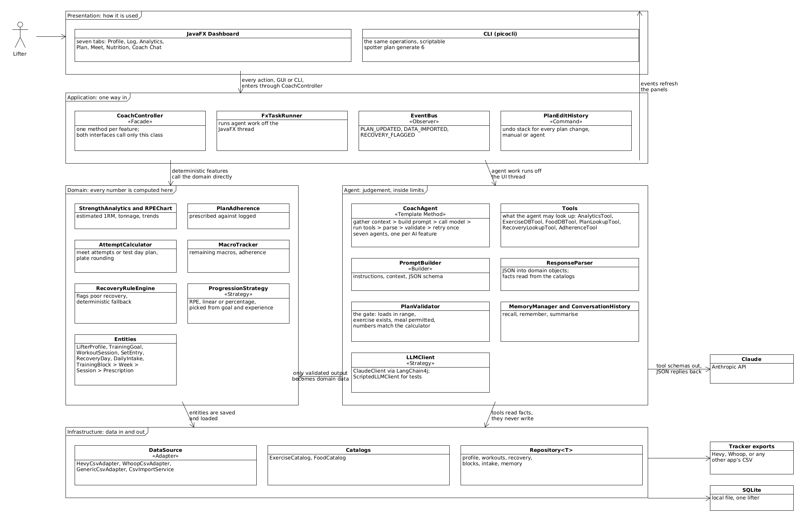

*Image:* [`architecture.png`](https://github.com/devparikh28/EECS3311_Project_Spotter/blob/master/diagrams/architecture.png) · *Editable UMLet source:* [`architecture.uxf`](https://github.com/devparikh28/EECS3311_Project_Spotter/blob/master/diagrams/architecture.uxf)

Five layers, each depending only on the layer beneath it or on an interface.

| Layer | Contents | Responsibility |
|---|---|---|
| Presentation | `DashboardApp` with seven panels, `CoachCLI` | Collect input, display results. No logic. |
| Application | `CoachController`, `EventBus`, `PlanEditHistory`, `FxTaskRunner` | One entry point per feature; notify the GUI; record undoable edits; keep long work off the UI thread. |
| Domain | Entities plus `StrengthAnalytics`, `AttemptCalculator`, `MacroTracker`, `RecoveryRuleEngine`, `ProgressionStrategy` | The data model and every calculation. Knows nothing about LLMs. |
| Agent | `CoachAgent` and seven agents, `ClaudeClient`, `ToolManager` and six tools, `PromptBuilder`, `ResponseParser`, `PlanValidator`, `MemoryManager` | Turn a request into validated output using the model and tools. |
| Infrastructure | CSV adapters behind `DataSource`, `CsvImportService`, catalogs, SQLite repositories | Get data in and out. |

Because an agent call takes seconds and JavaFX has a single UI thread, `CoachController` dispatches agent work through `FxTaskRunner` on a background thread and returns results through `Platform.runLater()`. The CLI calls the same controller methods and blocks, having no UI thread to protect.

Eight design patterns are applied, each solving a problem that exists independently of the requirement to use patterns: Facade, Strategy, Observer, Command, Adapter, Factory Method, Template Method and Decorator, with Builder and Repository as supporting patterns. Section 4 explains each one.

## 1.7 Technology

| Concern | Choice |
|---|---|
| Language and build | Java 21, Maven |
| GUI | JavaFX 21, with built in `LineChart` and `BarChart` for analytics |
| CLI | picocli, command name `spotter` |
| Storage | SQLite through `sqlite-jdbc`, behind `Repository<T>` |
| LLM | Anthropic Claude through LangChain4j, wrapped in `ClaudeClient` |
| JSON | Jackson |
| Data sources | Hevy and Whoop CSV exports behind `DataSource` |
| Unit testing | JUnit 5, Mockito, AssertJ |
| Agent behaviour testing | KUMA, driving the Java CLI through a small Python harness |

The application is entirely Java. Python appears only in `tools/kuma/`, because KUMA is a Python SDK with no Java equivalent; the harness starts the Java process, passes the test input and returns the result and trace to KUMA, and contains no application logic.

Live Hevy and Whoop APIs are deliberately out of scope. Both require account authentication that would consume implementation time without demonstrating any additional design, so the system reads their CSV exports instead. The `DataSource` interface is the extension point: adding `HevyApiAdapter` later would change nothing above it.

## 1.8 Beyond the Course: Deliberate Extension Points

Spotter is built to outlive the course, so several boundaries exist specifically to let it grow without being rewritten. None of the work below is in scope for Stages 2 and 3; it is recorded here because the design accommodates it on purpose rather than by accident.

**Live data sources.** CSV is deliberate for now, because account authentication would consume implementation time without demonstrating additional design. The system is not tied to particular apps: Hevy and Whoop exports are recognised automatically, any other app's export is read through a column mapping the lifter confirms once, and a lifter who tracks nothing can log sessions as prescribed and complete a daily check in. `DataSource` remains the seam for live sync: a `HevyApiAdapter` would implement the same interface with nothing above it changing.

**Other front ends.** `CoachController` has no knowledge of what is calling it, which is why the same methods serve both the JavaFX dashboard and the CLI. A REST layer over the same controller would let a web or mobile client reuse every layer beneath it, which matters because the realistic place to read a training plan is a phone in a gym. The discipline that keeps this possible is simple and is worth stating: no business logic in the panels.

**Safety limits for users other than the author.** `PlanValidator` currently checks that loads sit in the range the progression strategy allows. Before the system is used by anyone else, it should also cap week over week increases and refuse any load beyond a sane multiple of demonstrated strength, so that a poor model response cannot produce a dangerous prescription. This is a deterministic rule in a class that already exists.

**Multiple lifters.** The current design assumes one lifter per installation, which keeps the repositories simple. Adding a lifter identifier to the repository queries would be the first step toward a coach managing several athletes; the domain model already treats `LifterProfile` as the root that other entities hang from.

## 1.9 Document Map

| Section | Contents |
|---|---|
| 2 | Fourteen feature specifications with inputs, outputs, workflow, errors and AI classification |
| 3 | UML class diagram, five views, with relationships and multiplicities |
| 4 | Eight design patterns: problem, participants, rationale, and the cost of omitting each, followed by the SOLID principles and the unit testing approach |
| 5 | Use case diagram with actors and include and extend relationships |
| 6 | Nineteen use case descriptions |
| 7 | Twelve sequence diagrams covering every feature |
| 8 | Feature to design traceability table |
| 9 | How each feature is realized by its classes and methods |

Every diagram is delivered in two formats, a PNG for reading and a UMLet `.uxf` for opening and editing in UMLet, and the two are the same picture: each PNG is UMLet's own export of the `.uxf` beside it. Both live in `diagrams/`. The PlantUML sources the `.uxf` files are generated from are kept in `diagrams/sources/` as build inputs rather than as deliverables.

# 2. Feature Specifications

Fourteen features, each classified as deterministic, AI, or hybrid. The system serves any strength trainee: a meet date is optional, and the training goal recorded in F01 drives planning for everyone else. That classification decides how the feature is tested in Stage 3: deterministic behaviour through automated unit and integration tests, agent behaviour through KUMA.

| ID | Feature | Type |
|---|---|---|
| F01 | Lifter Profile and Constraints | Deterministic |
| F02 | Workout Logging and Import | Deterministic |
| F03 | Recovery Input | Deterministic |
| F04 | Strength Analytics | Deterministic |
| F05 | Training Block Generation | AI |
| F06 | Equipment Substitution | AI |
| F07 | Recovery Aware Session Adjustment | Hybrid |
| F08 | Max Testing and Attempt Planning | Hybrid |
| F09 | Macro Targets and Adherence Tracking | Deterministic |
| F10 | Vegetarian Meal Suggestion | AI |
| F11 | Coaching Chat with Memory | AI |
| F12 | Plan Adherence and Progression | Hybrid |
| F13 | Guided Onboarding | AI |
| F14 | Adopt an Existing Programme | Hybrid |

## F01 — Lifter Profile and Constraints

- **Description:** Stores who the lifter is before anything is prescribed: training goal, experience level, split preference, optional competition details, training frequency, equipment, physical limitations, dietary constraints, preferred units and macro targets. Every other feature reads from this record, and two of these fields change what the system prescribes rather than merely how it displays it.
- **User Interaction:** Profile tab in the GUI, with fields for bodyweight, training goal, split preference, an optional meet date and weight class, training days per week, an equipment checklist, and dietary flags. CLI: `spotter profile set`, `spotter profile show`.
- **Input:** Bodyweight, training goal (meet prep, strength, hypertrophy, or general fitness), experience level (novice, intermediate, advanced), split preference (auto, full body, upper lower, push pull legs, or competition lift focus), any limitations such as a painful joint or a movement to avoid, optional meet date and weight class, training days, equipment list, dietary constraints, display unit, macro targets.
- **Output:** A saved `LifterProfile` record.
- **AI Involvement:** Deterministic.
- **Expected Workflow:** The lifter fills the form and saves; `CoachController.saveProfile()` validates required fields and persists through `ProfileRepository`; a `PROFILE_UPDATED` event refreshes dependent panels.
- **Why experience and limitations matter:** `ProgressionStrategyFactory.forGoal(goal, experience)` returns a different progression for a novice than for an advanced lifter, because a novice can add load session to session while an advanced lifter cannot. Recorded limitations are passed to block generation and substitution, so a movement the lifter must avoid is never prescribed in the first place rather than being corrected afterwards. Spotter gives training suggestions, not medical advice, and says so: a limitation marked painful produces conservative alternatives and a recommendation to seek a professional opinion rather than a plan to train through it.
- **Error and Alternative Cases:** A missing required field blocks the save with an inline message. A meet date is optional; if given it must be in the future. Selecting the meet prep goal without a meet date prompts for one, while every other goal ignores the field entirely. An empty equipment list is allowed and defaults to bodyweight only, with a warning that plan generation will be limited.

## F02 — Workout Logging and Import

- **Description:** Builds the training history from whichever source the lifter actually uses: a recognised export (Hevy), any other app's CSV through a saved column mapping, a one tap confirmation that a prescribed session was completed, or manual entry.
- **User Interaction:** Log tab with Import CSV, a mapping dialog for unrecognised files, and a manual entry form; Plan tab has Log as Prescribed on each session. CLI: `spotter import hevy <file>`, `spotter import csv <file> <profile>`, `spotter log prescribed <sessionId>`, `spotter log add`.
- **Input:** A CSV export from any workout app, or a confirmation with only the sets that differed from the plan, or a manually typed exercise with sets, reps, weight and RPE.
- **Output:** `WorkoutSession` and `SetEntry` records in the database.
- **AI Involvement:** Deterministic.
- **Expected Workflow:** `DataSourceFactory.detect()` recognises a known header and returns the matching adapter. An unrecognised file goes to `suggestMapping()`, which proposes a `ColumnMapping` the lifter confirms or corrects; `GenericCsvAdapter` then reads the file through that mapping, converting units and date formats. The mapping is saved as a named import profile, so the next export from the same app imports in one step. From there the path is identical for every source: `CsvImportService` resolves exercise names, removes duplicates, saves, and returns an `ImportReport`. Log as Prescribed takes the prescribed session and records it as logged, with only the deviations the lifter enters.
- **Error and Alternative Cases:** A file whose header matches no known format opens the mapping dialog rather than being rejected; a mapping missing a required column (date, exercise, weight, reps) fails `ColumnMapping.validate()` with the missing field named. Malformed rows are skipped and listed in the report while valid rows continue. A duplicate session is skipped by default, with an option to import anyway. An unrecognised exercise name opens the mapping dialog, where the lifter maps it, adds it as a new exercise, or skips it.

## F03 — Recovery Input

- **Description:** Records how recovered the lifter is, from a wearable export or from the lifter directly. Whoop is recognised automatically, any other recovery export (Garmin, Oura, Apple Health and similar) is read through a saved column mapping, and a lifter with no wearable at all can complete a short daily check in instead.
- **User Interaction:** Log tab, Import CSV, or the Check In panel with sleep hours, soreness and energy. CLI: `spotter import whoop <file>`, `spotter import csv <file> <profile>`, `spotter checkin`.
- **Input:** A recovery CSV from any source, or sleep hours plus soreness and energy on a one to five scale.
- **Output:** `RecoveryDay` records carrying a `RecoverySource` of wearable export or manual check in, and recovery flags on upcoming sessions.
- **AI Involvement:** Deterministic.
- **Expected Workflow:** A recognised file goes through `WhoopCsvAdapter`, an unrecognised one through `GenericCsvAdapter` and a confirmed mapping, and a check in creates a `RecoveryDay` directly. `RecoveryRuleEngine` then evaluates upcoming training days: against the recovery score and sleep when an objective score exists, and against sleep, soreness and energy thresholds when the source is a check in. The rule engine reads `hasObjectiveScore()` rather than assuming a wearable.
- **Error and Alternative Cases:** A malformed file is rejected; an unrecognised one opens the mapping dialog. Missing fields for a day are stored as empty rather than blocking the import. Overlapping date ranges replace older values after a confirmation. A day with neither an import nor a check in produces no flag, so absence of data is never read as poor recovery.

## F04 — Strength Analytics

- **Description:** Computes an estimated one rep max per lift from RPE based sets, weekly tonnage, and progression trends over time.
- **User Interaction:** Analytics tab with a lift selector, chart, and summary figures. CLI: `spotter analytics <lift>`.
- **Input:** Stored `WorkoutSession` and `SetEntry` history for the selected lift.
- **Output:** An `AnalyticsSummary` with an e1RM series, weekly tonnage, best set, and data quality warnings.
- **AI Involvement:** Deterministic.
- **Expected Workflow:** `StrengthAnalytics.computeE1RM()` applies `RPEChart` to each set, aggregates by week, and returns the series the GUI plots.
- **Error and Alternative Cases:** No history shows an empty state rather than an error. A set with an invalid RPE (outside 6 to 10), or RPE 10 above one rep, is excluded and reported as a data quality warning.

## F05 — Training Block Generation

- **Description:** The agent generates a multi week training block from the profile, the training goal, recent history, current e1RMs, and, when one is set, the time remaining until the meet.
- **User Interaction:** Plan tab, Generate Block with a week count. CLI: `spotter plan generate <weeks>`.
- **Input:** Block length in weeks, plus the stored profile, goal, and history. With a meet date the length defaults to the weeks remaining.
- **Output:** A `TrainingBlock` of `Week`, `Session` and `ExercisePrescription` objects, editable in the GUI. The block records the split it used, and every session carries a focus label such as Upper A, Squat day or Full body, so the plan reads as a programme rather than a list of exercises.
- **AI Involvement:** AI.
- **Preconditions:** A profile with a training goal and experience level. Either some logged history, or a starting estimate entered by the lifter, or a completed calibration week. A meet date is not required.
- **Expected Workflow:** `BlockGenerationAgent` collects e1RMs through `AnalyticsTool` and available exercises through `ExerciseDBTool`, is told the lifter's training days and split preference, `PromptBuilder` assembles the request with an output schema, `ClaudeClient.complete()` calls Claude, `ResponseParser.toBlock()` builds domain objects, and `PlanValidator.validateBlock()` checks loads against the `ProgressionStrategy` that `ProgressionStrategyFactory.forGoal()` selected for the lifter's goal, and `validateSplit()` confirms the session count matches the lifter's training days and the structure matches the chosen split, before the block is saved.
- **Error and Alternative Cases:** A lifter with no history has no estimated one rep max to plan from. `StartingStrength.needsCalibration()` detects this and offers two ways forward: enter known maxes or a recent top set, which `fromStatedMax()` or `fromRecentSet()` converts into a starting estimate, or run a calibration week, where `calibrationSession()` prescribes working up to a single at a moderate RPE on each main lift and the real block is generated from what was logged. A split preference of auto imposes no structural constraint and lets the agent choose; any other value is enforced, and a block whose structure does not match is rejected with that reason. Invalid JSON or a failed validation triggers one retry with the errors appended to the prompt; a second failure shows an error and leaves any existing block unchanged. An API timeout is retried once, then reported. Thin history for a lift produces a warning and conservative loads. An existing block is replaced only after confirmation.

## F06 — Equipment Substitution

- **Description:** Replaces a prescribed exercise with a suitable alternative, for any of the reasons a lifter actually has: the gym lacks the equipment, the movement hurts today, it conflicts with a recorded limitation, or they simply dislike it.
- **User Interaction:** Plan tab, warning icon on the affected exercise, Suggest Substitute. CLI: `spotter plan substitute <prescriptionId>`.
- **Input:** The exercise, a reason (equipment unavailable, pain or discomfort, limitation, preference) with an optional note, and the lifter's equipment and limitations.
- **Output:** A replacement exercise with a short rationale, applied as an undoable plan edit once accepted.
- **AI Involvement:** AI.
- **Expected Workflow:** `ExerciseCatalog.candidatesExcluding()` filters by movement pattern, muscle groups and available equipment, and additionally excludes anything the reason rules out: the painful pattern, or a limitation's avoided movements. The model chooses among what survives and explains why, `PlanValidator.validateSubstitution()` confirms the choice came from that list and violates no limitation, and acceptance applies a `SwapExerciseCommand`.
- **Error and Alternative Cases:** A reason of pain or discomfort produces a conservative alternative and a clear note that persistent pain is a reason to consult a professional, not to train around indefinitely; the system never diagnoses. No candidates means the lifter is told to swap manually or skip the movement. A choice outside the candidate list fails validation and is retried; a second failure shows the candidate list for manual selection. Rejecting the suggestion leaves the plan unchanged.

## F07 — Recovery Aware Session Adjustment

- **Description:** Flags training days that follow poor recovery and lets the agent rewrite that session's volume or intensity.
- **User Interaction:** Plan tab, recovery badge on the session, Adjust Session. CLI: `spotter plan flags`, `spotter plan adjust <sessionId>`.
- **Input:** The flagged session and the matching `RecoveryDay` data.
- **Output:** A revised `Session` with an adjustment note explaining what changed and why.
- **AI Involvement:** Hybrid. `RecoveryRuleEngine` flags deterministically; the agent rewrites only when asked.
- **Expected Workflow:** The rule engine compares recovery score and sleep hours against thresholds, `AdjustmentAgent` proposes a lighter session, `PlanValidator` confirms nothing was made heavier and no competition lift was removed, and acceptance applies an `ApplyAdjustmentCommand`.
- **Error and Alternative Cases:** Missing recovery data means no flag rather than an assumed bad day. If the agent or the API fails, `RecoveryRuleEngine.fallbackAdjustment()` offers a deterministic reduction instead. The lifter can reject the adjustment.

## F08 — Max Testing and Attempt Planning

- **Description:** Plans a heavy single for each main lift, with reasoning based on how the block went. With a meet date set, it produces competition attempts (opener, second, third); without one, it produces a test day plan (warm up progression and a top single) for a lifter who simply wants to see where their strength is.
- **User Interaction:** Meet tab, Plan Test Day or Calculate Attempts depending on the goal. CLI: `spotter meet attempts`, `spotter test plan`.
- **Input:** Current e1RMs for the main lifts, the recent training trend, and whether a meet date is set.
- **Output:** With a meet date, three attempts per lift rounded to 2.5 kg. Without one, a `TestDayPlan` with warm up sets and a top single. Both carry a written rationale.
- **AI Involvement:** Hybrid. The numbers are deterministic; only the explanation comes from the model.
- **Expected Workflow:** `AttemptCalculator.calculateMeetAttempts()` or `AttemptCalculator.projectTestDay()` produces the numbers at fixed percentages of e1RM, rounded to plate increments, then `AttemptRationaleAgent` writes the rationale, which `PlanValidator.validateRationale()` checks against those numbers.
- **Error and Alternative Cases:** Thin recent data uses a conservative percentage with a warning. A rationale that contradicts the calculator, or an agent failure, results in the numbers being shown without a rationale. The lifter can override any value manually.

## F09 — Macro Targets and Adherence Tracking

- **Description:** Stores daily calorie and macro targets and tracks adherence against logged intake.
- **User Interaction:** Nutrition tab with an intake form and daily totals. CLI: `spotter macros log <food> <grams>`, `spotter macros today`, `spotter macros week`.
- **Input:** Macro targets from the profile and daily food entries.
- **Output:** Remaining macros for the day and weekly adherence.
- **AI Involvement:** Deterministic.
- **Expected Workflow:** `MacroTracker.recordIntake()` adds the entry to the day's `DailyIntake`, `getRemaining()` subtracts from the target, and `weeklyAdherence()` averages across days that have entries.
- **Error and Alternative Cases:** An unknown food prompts for macros per 100 g and is added to `FoodCatalog`. Zero, negative, or implausible gram amounts are rejected. Days with no entries are excluded from the weekly average rather than counted as zero.

## F10 — Vegetarian Meal Suggestion

- **Description:** Given the macros remaining for the day and the lifter's dietary constraints, the agent proposes a meal.
- **User Interaction:** Nutrition tab, Suggest a Meal. CLI: `spotter meal suggest`.
- **Input:** Remaining macros and the dietary constraints stored in the profile.
- **Output:** A `MealSuggestion` with items, gram amounts, and a full nutrition breakdown.
- **AI Involvement:** AI.
- **Expected Workflow:** `FoodDBTool` returns only foods permitted by `DietaryConstraints`, the model composes a meal from those foods, `ResponseParser.toMeal()` reads nutrition values from `FoodCatalog` rather than from the model, and `PlanValidator.validateMeal()` checks the items and totals.
- **Error and Alternative Cases:** If no combination fits, the agent explains the shortfall instead of inventing a meal. A non permitted item fails validation and is retried. If the day's targets are already met, no suggestion is made.

## F11 — Coaching Chat with Memory

- **Description:** A conversational interface for coaching questions, grounded in the lifter's own data and in earlier conversations.
- **User Interaction:** Coach Chat tab. CLI: `spotter chat "<question>"` or an interactive session.
- **Input:** A natural language question.
- **Output:** An answer, usually citing figures retrieved through tools.
- **AI Involvement:** AI.
- **Expected Workflow:** `MemoryManager.recall()` supplies relevant earlier turns, the model selects among `AnalyticsTool`, `PlanLookupTool`, and `RecoveryLookupTool`, the results are returned to it, and the answer is stored by `MemoryManager.remember()` for later recall.
- **Error and Alternative Cases:** A question the tools cannot answer receives an honest statement that the data is unavailable rather than a fabricated figure. An ambiguous question prompts a clarifying question. A failing tool is reported as unavailable. Conversations longer than the history limit have older turns summarised.

## F12 — Plan Adherence and Progression

- **Description:** Compares what the block prescribed against what was actually logged, and uses that comparison to advance or hold the remaining weeks. This is what closes the coaching loop: without it the system plans and never learns whether the plan was followed.
- **User Interaction:** Plan tab, Review Week shows the comparison, Progress Plan applies a revision. CLI: `spotter plan review <week>`, `spotter plan progress <week>`.
- **Input:** The active `TrainingBlock` and the `WorkoutSession` records logged during that week.
- **Output:** An `AdherenceReport` with a completion rate and, per exercise, prescribed against completed sets and reps, target against actual RPE, and a verdict. Optionally a revised set of remaining weeks.
- **AI Involvement:** Hybrid. The comparison is deterministic; only the revision is generated.
- **Expected Workflow:** `PlanAdherence.compare()` matches each prescription to the logged sets and assigns a verdict such as `COMPLETED_BELOW_TARGET_RPE` or `MISSED_REPS`. If there is a shortfall, or the lifter asks, `ProgressionAgent` revises the remaining weeks using the report through `AdherenceTool`, and `PlanValidator.validateProgression()` confirms loads advance only where the verdict permits, that week over week increases stay within a cap, and that no competition lift was dropped. An accepted revision is applied as an `ApplyProgressionCommand`, so it can be undone.
- **Error and Alternative Cases:** A session with no matching log is reported as `MISSED_SESSION` rather than assumed complete. A logged set with no RPE is compared on reps alone. If the agent fails or its revision fails validation twice, the report is still shown, since the comparison is deterministic and useful on its own. The lifter can reject a revision.

**Worked example.** A prescription of three reps at RPE 8 with a logged set of two reps at RPE 7 produces `MISSED_REPS` with the note that actual RPE was below target: the volume was not completed but the effort was low, which points to a stopped set or drifting RPE calibration rather than a load that was too heavy. A prescription of three reps at RPE 8 logged as three reps at RPE 6.5 produces `COMPLETED_BELOW_TARGET_RPE`, which is the signal to advance load next week.

## F13 — Guided Onboarding

- **Description:** An agent led intake that asks a handful of questions and fills the profile from the answers, for the many users who do not know what to enter in an empty form. It ends with a concrete first step rather than a blank plan.
- **User Interaction:** Onboarding panel on first run, one question at a time, ending with a draft profile to confirm or correct. CLI: `spotter onboard`.
- **Input:** Free text answers about training history, goals, available days, equipment, injuries or limitations, and preferred units.
- **Output:** A `ProfileDraft` the lifter confirms, which becomes a `LifterProfile`, followed by a starting point: enter known maxes, or run a calibration week.
- **AI Involvement:** AI.
- **Expected Workflow:** `OnboardingAgent` asks at most eight questions, adapting to the answers rather than reading a fixed script, and records each into a `ProfileDraft`. `PlanValidator.validateProfileDraft()` checks required fields are present and the answers do not contradict each other. The lifter reviews the draft, corrects anything wrong, and saves. `StartingStrength.needsCalibration()` then decides whether to ask for known maxes or offer a calibration week.
- **Error and Alternative Cases:** If required answers are still missing after the question limit, the system falls back to the ordinary profile form prefilled with what was answered, so onboarding can never trap a user. A contradiction (meet preparation with no meet date, a novice asking for an advanced split) is raised for the lifter to resolve rather than silently accepted. The lifter can skip onboarding entirely and use the form.

## F14 — Adopt an Existing Programme

- **Description:** Lets a lifter who already follows a programme, from a coach or a published template, bring it in rather than replacing it. Everything else then applies to that plan: adherence tracking, substitutions, recovery adjustments, analytics and coaching chat.
- **User Interaction:** Plan tab, Adopt Programme, with three routes: enter it, import a CSV, or paste it as text. CLI: `spotter plan adopt <file>`, `spotter plan adopt text`.
- **Input:** A programme as structured entry, a CSV with a column mapping, or free text such as a coach's message or a published template.
- **Output:** A `TrainingBlock` with `origin = ADOPTED`, treated exactly like a generated one from that point on.
- **AI Involvement:** Hybrid. Entry and CSV import are deterministic; only interpreting pasted free text uses the agent.
- **Expected Workflow:** `ProgrammeImportService.fromManualEntry()` or `fromCsv()` builds the block deterministically, resolving exercise names through `ExerciseCatalog`. Pasted text goes to `ProgrammeParserAgent`, which maps movements to catalog exercises and structures weeks and sessions. Either way `PlanValidator.validateAdoptedBlock()` confirms the exercises exist, the sessions per week do not exceed the lifter's training days, and the loads are plausible against current strength before the block is saved.
- **Error and Alternative Cases:** Unresolved exercise names are listed for mapping, reusing the same dialog as workout import. Implausible loads are flagged rather than accepted, since an adopted block is not validated by the progression strategy that generated blocks use. Free text that cannot be parsed into a structure falls back to manual entry with whatever was understood prefilled.

# 3. UML Class Diagram

The class diagram is one model shown in five views. A single source file, `diagrams/sources/model.iuml`, defines every class and relationship; the five views are generated from it, so they can never disagree with each other. Each view is delivered as a UMLet `.uxf` file and the PNG UMLet exports from it, both in `diagrams/`.

| View | File | Contents |
|---|---|---|
| Complete | `class-full.uxf` / `class-full.png` | Every class, interface, and relationship across all five layers |
| Presentation and Application | `class-presentation-application.uxf` / `class-presentation-application.png` | GUI panels, CLI, `CoachController` facade, event bus, plan edit commands |
| Domain | `class-domain.uxf` / `class-domain.png` | Domain entities, domain services, progression strategies |
| Agent | `class-agent.uxf` / `class-agent.png` | Agent template, agent subclasses, LLM client, tools, prompt and validation pipeline, memory |
| Infrastructure | `class-infrastructure.uxf` / `class-infrastructure.png` | CSV adapters, import service, catalogs, repositories, database |

The complete diagram, `diagrams/class-full.uxf`, is large by nature; it is included so the whole model can be opened in one UMLet window. The four layer views below are the readable form, and between them they cover every class in the model.

### Presentation and Application

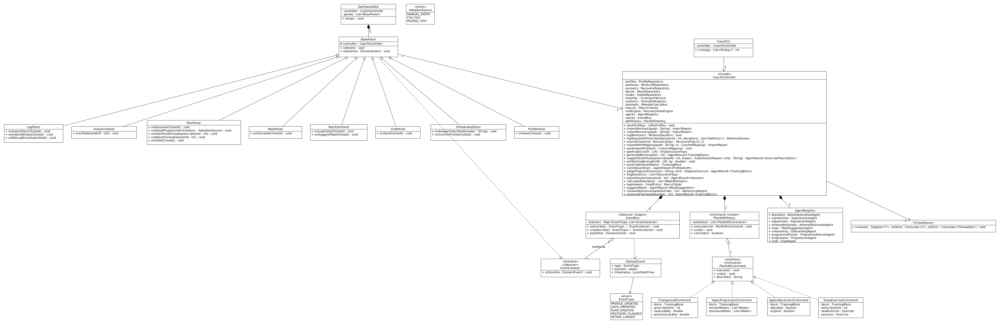

*Image:* [`class-presentation-application.png`](https://github.com/devparikh28/EECS3311_Project_Spotter/blob/master/diagrams/class-presentation-application.png) · *Editable UMLet source:* [`class-presentation-application.uxf`](https://github.com/devparikh28/EECS3311_Project_Spotter/blob/master/diagrams/class-presentation-application.uxf)

### Domain

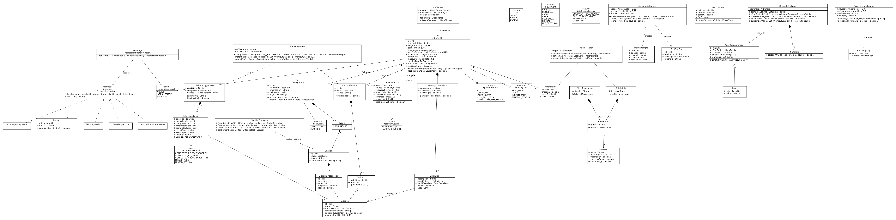

*Image:* [`class-domain.png`](https://github.com/devparikh28/EECS3311_Project_Spotter/blob/master/diagrams/class-domain.png) · *Editable UMLet source:* [`class-domain.uxf`](https://github.com/devparikh28/EECS3311_Project_Spotter/blob/master/diagrams/class-domain.uxf)

### Agent

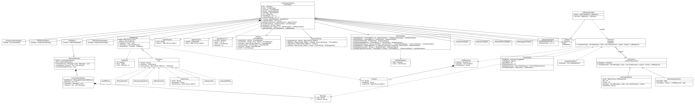

*Image:* [`class-agent.png`](https://github.com/devparikh28/EECS3311_Project_Spotter/blob/master/diagrams/class-agent.png) · *Editable UMLet source:* [`class-agent.uxf`](https://github.com/devparikh28/EECS3311_Project_Spotter/blob/master/diagrams/class-agent.uxf)

### Infrastructure

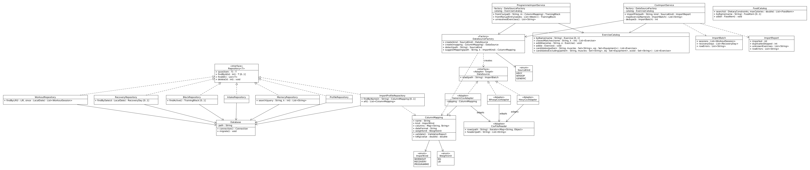

*Image:* [`class-infrastructure.png`](https://github.com/devparikh28/EECS3311_Project_Spotter/blob/master/diagrams/class-infrastructure.png) · *Editable UMLet source:* [`class-infrastructure.uxf`](https://github.com/devparikh28/EECS3311_Project_Spotter/blob/master/diagrams/class-infrastructure.uxf)

## 3.1 Architecture Overview

The system is organised in five layers. Each layer depends only on the layer beneath it or on interfaces, never on a concrete class above it.

**Presentation** holds `DashboardGUI` with seven tab panels (all subclasses of `BasePanel`) and `CoachCLI`. Neither contains business logic. Both call exactly one class, `CoachController`.

**Application** holds `CoachController`, the single entry point for every feature, together with the `EventBus` that notifies the GUI of changes, the `PlanEditHistory` that records undoable plan edits, and `FxTaskRunner`, which keeps long running work off the JavaFX Application Thread.

**Domain** holds the data model (`LifterProfile`, `WorkoutSession`, `SetEntry`, `RecoveryDay`, `TrainingBlock` → `Week` → `Session` → `ExercisePrescription`, `DailyIntake`, `FoodEntry`, `MeetAttempts`) and the deterministic services (`StrengthAnalytics`, `AttemptCalculator`, `MacroTracker`, `RecoveryRuleEngine`). Nothing in this layer knows an LLM exists.

**Agent** holds the abstract `CoachAgent` and seven concrete agents, the `LLMClient` interface with `ClaudeClient`, the `ToolManager` and six tools, `PromptBuilder`, `ResponseParser`, `PlanValidator`, and `MemoryManager`.

**Infrastructure** holds the CSV adapters behind `DataSource` (two recognised formats plus a mapped generic one), `CsvImportService`, the exercise and food catalogs, saved import profiles, and the SQLite repositories behind a generic `Repository<T>` interface.

The LLM is Anthropic Claude, reached through LangChain4j's `AnthropicChatModel` inside `ClaudeClient`. The model name, token limit, and timeout are read from configuration rather than hard coded, so the model can be changed without code changes. Tools are passed to Claude as LangChain4j `ToolSpecification` objects built from our own `ToolSchema`, and structured outputs (training blocks, meal suggestions) are requested as JSON matching a schema supplied by `PromptBuilder`.

An agent call takes seconds, and JavaFX has a single UI thread, so `CoachController` dispatches agent work through `FxTaskRunner` on a background thread and delivers results and events back through `Platform.runLater()`. The GUI therefore stays responsive while Claude is working, and the panels still receive events on the thread that is allowed to touch them. The CLI calls the same controller methods and simply blocks, since it has no UI thread to protect.

Cost and latency are treated as design concerns rather than an afterthought. Each agent declares a `ModelTier` so that only block generation uses the stronger model; `CachingLLMClient` avoids paying twice for an identical request; tools return summaries rather than raw history, which reduces both tokens and the chance of a poor tool choice; and the bounded retry and tool round limits cap the cost of any single feature.

The key principle is that **the LLM never writes directly to the domain**. Every model response passes through `ResponseParser` (structure) and `PlanValidator` (rules) before a domain object is created, and every number the agent reports (e1RM, attempts, macros) comes from a deterministic service or tool rather than from the model. This makes the deterministic layer fully unit testable and gives the agent layer clear behavioural contracts to test with KUMA.

## 3.2 Key Relationships and Multiplicities

| Relationship | Type | Multiplicity | Meaning |
|---|---|---|---|
| `DashboardGUI` → `BasePanel` | Composition | 1 to 7 | The window owns its tab panels |
| `BasePanel` → `CoachController` | Association | * to 1 | Every panel talks to the one facade |
| `LifterProfile` → `DietaryConstraints` | Composition | 1 to 1 | Constraints have no life outside the profile |
| `LifterProfile` → `WorkoutSession` | Association | 1 to 0..* | A lifter logs many sessions |
| `LifterProfile` → `TrainingBlock` | Association | 1 to 0..1 | At most one active block |
| `WorkoutSession` → `SetEntry` | Composition | 1 to 1..* | Sets are deleted with their session |
| `TrainingBlock` → `Week` → `Session` → `ExercisePrescription` | Composition chain | 1 to 1..* at each level | A block is a tree that lives and dies as a unit |
| `ExercisePrescription`, `SetEntry` → `Exercise` | Association | * to 1 | Many prescriptions reference one catalog exercise |
| `CoachAgent` → `ToolManager` | Composition | 1 to 1 | Each agent owns its own tool set |
| `ToolManager` → `Tool` | Aggregation | 1 to * | Tools are shared objects that outlive any one manager |
| `CoachAgent` → `LLMClient` | Aggregation | * to 1 | All agents share one injected client |
| `EventBus` → `EventListener` | Aggregation | 1 to * | Listeners register and unregister freely |
| `PlanEditHistory` → `PlanEditCommand` | Aggregation | 1 to * | The undo stack |
| `ChatAgent` → `MemoryManager` → `ConversationHistory` | Association, then composition | 1 to 1 | Only the chat agent carries long term memory |

Inheritance appears in `BasePanel` (7 panels), `CoachAgent` (7 agents), and interface realisation in `LLMClient`, `Tool`, `DataSource`, `ProgressionStrategy`, `PlanEditCommand`, `EventListener`, and `Repository<T>`.

## 3.3 Design Changes Since the Initial Outline

Several refinements were made while drawing the diagram. A separate `Planner` class was removed because tool selection is handled inside the agent loop (`CoachAgent.toolLoop()`) through Claude tool use, and a separate class would have had no responsibility of its own. `ScriptedLLMClient` was added as a second `LLMClient` implementation that replays fixed responses, so agent orchestration can be unit tested without network calls. The Factory Method pattern was moved from a standalone `ToolFactory` to `CoachAgent.createToolset()`, which is the textbook form of the pattern and removes a class. Finally, the meet date became optional and a `TrainingGoal` was added to `LifterProfile`, because not every lifter competes: the goal now selects the progression strategy, and F08 serves non competing lifters as a test day planner.

---

# 4. Design Patterns

Eight patterns are applied. Each one solves a problem that exists in this system independently of the requirement to use patterns.

## 4.1 Facade — `CoachController`

**Problem.** Every feature touches several subsystems. Generating a block, for example, needs the profile repository, workout repository, strength analytics, the block generation agent, the block repository, and the event bus. The system also has two user interfaces. Without a single entry point, both the GUI and the CLI would need to know about and coordinate all of these subsystems, and that orchestration logic would exist twice.

**Participants.** `CoachController` is the facade. The subsystem classes are `CsvImportService`, `StrengthAnalytics`, `AttemptCalculator`, `MacroTracker`, `RecoveryRuleEngine`, the repositories, `AgentRegistry`, `EventBus`, and `PlanEditHistory`. The clients are every `BasePanel` subclass and `CoachCLI`.

**Why it fits.** The requirement that every feature be reachable from both a GUI and a CLI is exactly the situation a facade is meant for: many clients, one complex subsystem.

**Without it.** Adding the CLI would mean duplicating all orchestration code, the two interfaces would drift apart, and KUMA tests driven through the CLI would not be testing the same code path the GUI uses.

## 4.2 Strategy — `LLMClient` and `ProgressionStrategy`

**Problem.** Two parts of the system have interchangeable algorithms. The LLM provider must be swappable, both for testing (a scripted fake) and so a cheaper or newer model can be tried without touching agent code. The progression scheme used to plan a block (RPE based, linear, or percentage based) changes which loads are valid, and both the prompt and the validator need to follow whichever scheme was chosen.

**Participants.** For the LLM: `LLMClient` is the strategy interface, `ClaudeClient` (which wraps LangChain4j) and `ScriptedLLMClient` are concrete strategies, and `CoachAgent` is the context. Each agent also declares a `ModelTier`, and `LLMClientProvider.forTier()` hands it the matching client: block generation is the only task that needs the stronger model, while substitution, attempt rationale and meal composition are short constrained tasks that a fast model handles, so the same interface carries a cost decision as well as a vendor decision. For progression: `ProgressionStrategy` is the interface, `RPEProgression`, `LinearProgression`, and `PercentageProgression` are concrete strategies, `ProgressionStrategyFactory.forGoal()` selects one from the lifter's `TrainingGoal`, and `BlockGenerationAgent` and `PlanValidator` are the contexts. A lifter preparing for a meet, one building general strength, and one training for fun need different load progressions, and this is what keeps that difference out of the planning code.

**Why it fits.** The contexts only need one operation each (`complete()` and `loadRange()`), and the choice is made once at configuration time.

**Without it.** Agents would depend directly on LangChain4j types, deterministic tests of the agent loop would require live API calls, and the validator would contain an `if scheme == ...` chain that must be kept in sync with the prompt.

## 4.3 Observer — `EventBus`, `EventListener`, `BasePanel`

**Problem.** One change often affects several screens. Importing a Hevy file must refresh the Log and Analytics tabs; applying a recovery adjustment must refresh the Plan tab and clear a warning badge. The controller and agents should not know which panels exist.

**Participants.** `EventBus` is the subject, `EventListener` is the observer interface, every `BasePanel` subclass is a concrete observer, `DomainEvent` and `EventType` carry the notification, and `CoachController` publishes events after each state change.

**Why it fits.** The relationship is one to many and the set of listeners is not known in advance. The CLI simply does not subscribe, and the same controller works for both interfaces.

**Without it.** The controller would hold references to specific panels, coupling application logic to the GUI and making the controller impossible to use from the CLI or from tests without a window.

## 4.4 Command — `PlanEditCommand` and `PlanEditHistory`

**Problem.** Lifters edit generated plans by swapping exercises, changing loads, and accepting or rejecting agent adjustments. These edits must be undoable, and an agent generated adjustment must be applied through exactly the same mechanism as a manual edit so it can be undone the same way.

**Participants.** `PlanEditCommand` is the command interface; `SwapExerciseCommand`, `ChangeLoadCommand`, `ApplyAdjustmentCommand` and `ApplyProgressionCommand` are concrete commands; `PlanEditHistory` is the invoker; `TrainingBlock` is the receiver; `CoachController` is the client that creates commands.

**Why it fits.** Each command stores the previous value it replaced, which makes `undo()` trivial, and the history doubles as an audit log of how a plan evolved.

**Without it.** Undo would require snapshotting the whole block before every edit, and agent changes would bypass whatever manual undo logic existed.

## 4.5 Adapter — `DataSource`, `HevyCsvAdapter`, `WhoopCsvAdapter`

**Problem.** Every tracking app exports a different shape: different column layouts, units and date formats. Hevy and Whoop are the two the system recognises by name, but a lifter may use Strong, FitNotes, Garmin, Oura or anything else, and the import service should not know or care. It needs one uniform interface that returns domain objects.

**Participants.** `DataSource` is the target interface. `HevyCsvAdapter` and `WhoopCsvAdapter` adapt the two recognised formats, and `GenericCsvAdapter` adapts any other file through a `ColumnMapping` the lifter confirms once and which is then saved as a named import profile. `CsvFileReader` is the adaptee, and `CsvImportService` is the client.

**Why it fits.** The vendor formats are fixed and outside our control; only a translation layer can make them conform. The generic adapter shows the pattern paying off twice, since supporting an unknown app became configuration rather than code. This is also the extension point for a live API integration later: a `HevyApiAdapter` would implement the same interface with no change above it.

**Without it.** `CsvImportService` would contain vendor specific parsing branches, every new app would require modifying tested code, and supporting an app the author has never seen would be impossible without a release.

## 4.6 Factory Method — `CoachAgent.createToolset()`

**Problem.** Each agent needs a different set of tools. The block generator needs analytics and the exercise database; the meal agent needs only the food database; the chat agent needs analytics, plan lookup, and recovery lookup. The common agent loop in `CoachAgent` must register tools without knowing which concrete tools a given agent uses.

**Participants.** `CoachAgent` is the creator and declares the abstract factory method `createToolset()`. Each concrete agent is a concrete creator that returns its own tools. `Tool` is the product interface and the five tool classes are concrete products. `DataSourceFactory` applies the related parameterised factory idea on the import side, choosing `HevyCsvAdapter` or `WhoopCsvAdapter` from the file header, and `ProgressionStrategyFactory` does the same for progression schemes, choosing one from the lifter's training goal.

**Why it fits.** Tool selection varies with exactly the same axis as the agent subclass, so letting the subclass decide keeps each agent's capabilities defined in one place.

**Without it.** The base class would need a conditional on agent type to decide which tools to create, and adding a new agent would require editing the base class.

## 4.7 Template Method — `CoachAgent.run()`

**Problem.** All seven agents follow the same algorithm: gather context, build a prompt, call the model (running any requested tools), parse the reply, validate it, and retry once with the validation errors if it fails. Only the individual steps differ between agents.

**Participants.** `CoachAgent` is the abstract class and `run()` is the final template method. The primitive operations are `gatherContext()`, `buildPrompt()`, `parse()`, `validate()`, and `createToolset()`. `BlockGenerationAgent`, `SubstitutionAgent`, `AdjustmentAgent`, `AttemptRationaleAgent`, `MealSuggestionAgent`, `ProgressionAgent` and `ChatAgent` are the concrete classes.

**Why it fits.** The invariant parts (the tool calling loop, retry policy, error handling, and result wrapping) are the parts most likely to contain bugs and most important to test once. Subclasses cannot accidentally skip validation because they never control the sequence.

**Without it.** The loop would be copied six times, a fix to the retry logic would need to be made in six places, and it would be easy for one agent to return unvalidated output.

## 4.8 Decorator — `LLMClientDecorator`, `CachingLLMClient`, `RecordingLLMClient`

**Problem.** Two concerns sit around every model call and belong to neither the agents nor the client. Repeated identical requests should not be paid for twice, which matters most when the Stage 3 suites rerun the same scenarios while prompts are being tuned. And unit tests need real responses without a network call, which means capturing them once and replaying them afterwards. Putting either concern inside `ClaudeClient` would mix caching and test tooling into the class whose only job is talking to the model, and putting them in `CoachAgent` would repeat them for all seven agents.

**Participants.** `LLMClient` is the component interface. `ClaudeClient` and `ScriptedLLMClient` are concrete components. `LLMClientDecorator` is the abstract decorator holding a delegate `LLMClient`. `CachingLLMClient` returns a stored reply for an identical prompt and tool set, and `RecordingLLMClient` writes each live response to a fixture file for later replay. `LLMClientProvider` assembles the chain.

**Why it fits.** Both behaviours wrap a call without changing its contract, and they compose: recording around caching around the real client is a valid configuration, and any of them can be omitted without touching another class. Nothing above `LLMClient` knows whether it is talking to Claude, a cache, or a recording.

**Without it.** `ClaudeClient` would accumulate a cache, a fixture writer and the flags to switch them on and off, which is exactly the class you least want conditional logic in, and testing the cache would then require a live client.

## 4.9 Supporting Patterns (not counted)

`PromptBuilder` follows the **Builder** pattern, assembling prompts step by step from system instructions, context, schema, and memory. The `Repository<T>` interface follows the **Repository** pattern, isolating SQLite behind an interface so tests can use an in memory database. These are listed for completeness but are not counted toward the required patterns.

## 4.10 Pattern Summary

| Pattern | Key Classes | Features Using It |
|---|---|---|
| Facade | `CoachController` | All (F01 to F14) |
| Strategy | `LLMClient`, `ClaudeClient`, `ScriptedLLMClient`; `ProgressionStrategy` and implementations | F05 to F08, F10, F11 |
| Observer | `EventBus`, `EventListener`, `BasePanel` subclasses | F01 to F03, F05 to F07, F09 |
| Command | `PlanEditCommand`, `PlanEditHistory`, four concrete commands | F05, F06, F07, F12 |
| Adapter | `DataSource`, `HevyCsvAdapter`, `WhoopCsvAdapter`, `GenericCsvAdapter`, `CsvFileReader` | F02, F03, F14 |
| Factory Method | `CoachAgent.createToolset()`, concrete agents, `Tool`; `DataSourceFactory`; `ProgressionStrategyFactory` | F02, F03, F05, F06, F10, F11, F14 |
| Template Method | `CoachAgent.run()`, the concrete agents | F05 to F08, F10 to F14 |
| Decorator | `LLMClientDecorator`, `CachingLLMClient`, `RecordingLLMClient` | F05 to F08, F10 to F12 |

## 4.11 SOLID Principles in the Design

Patterns are the visible structure; the five SOLID principles are the reasons that structure is shaped the way it is. Each one is named here against the classes that observe it, and against the design that was rejected because it did not.

**Single responsibility.** Every class changes for one reason. `StrengthAnalytics` changes when the strength maths changes; `PlanValidator` changes when the rules for an acceptable plan change; `HevyCsvAdapter` changes when Hevy changes its export columns; `BlockGenerationAgent` changes when the way a block is asked for changes. The division inside the agent loop is the clearest case: gathering context, building the prompt, calling the model, parsing the reply and validating the result are five classes rather than one, because five different things can change about them independently. The design that was rejected is the obvious one, an agent class that formats its own prompt, parses its own JSON and writes its own rows, which would change for five unrelated reasons and could not be tested in pieces.

**Open for extension, closed for modification.** The extension points are interfaces, and adding to the system means adding a class rather than editing one. A new tracker is a new `DataSource` implementation, and `CsvImportService` is untouched. A new progression scheme is a new `ProgressionStrategy`, and the agents that consume it are untouched. A new coaching capability is a new `CoachAgent` subclass, and `CoachAgent.run()` is untouched. A different model provider is a new `LLMClient`, and nothing above it is untouched. Caching and recording were added around the model call as `LLMClientDecorator` subclasses precisely so that `ClaudeClient` itself did not have to grow flags.

**Liskov substitution.** The substitutions in this design are not hypothetical; the test strategy depends on them. `ScriptedLLMClient` replaces `ClaudeClient` in every Stage 3 unit test, and the agent loop cannot tell the difference, because both honour the same `LLMClient` contract: given a prompt and a set of tool schemas, return a reply or throw `LLMException`. `CoachAgent.run()` is deliberately `final`; subclasses override only the hooks it calls, so no subclass can weaken the guarantee that the template method makes, which is that nothing reaches the domain model until `PlanValidator` has passed it. Every `ProgressionStrategy` returns a `Range` that lies inside the lifter's current capability, so `PlanValidator` can hold every strategy to the same check without knowing which one it has.

**Interface segregation.** The interfaces in this design are narrow because clients need narrow ones. `Tool` declares a name, a schema and `execute`, so `AnalyticsTool` is not obliged to implement anything a food lookup needs. `EventListener` declares one method. `DataSource<T>` is generic in what it reads, so `WhoopCsvAdapter` implements a single `read` returning recovery days and never a workout method it would have to stub out. The fat interface that was avoided is a single `Tracker` interface carrying both `readWorkouts()` and `readRecovery()`, which would have forced every adapter to implement a method it has no data for.

**Dependency inversion.** No class in the application depends downward on a concrete implementation. `CoachController` depends on `LLMClient`, `Repository<T>`, `DataSource<T>` and `ProgressionStrategy`, all interfaces; the concrete `ClaudeClient`, `SqliteWorkoutRepository`, `HevyCsvAdapter` and `RpeProgression` are chosen by `DataSourceFactory`, `ProgressionStrategyFactory` and the application's configuration, which is the factory-mediated inversion described in the lectures. The domain layer is the strictest case: `StrengthAnalytics`, `AttemptCalculator`, `MacroTracker` and `RecoveryRuleEngine` depend on nothing outside the domain at all, which is why they can be unit tested with no database, no network and no model.

## 4.12 Unit Testing Approach

The design is written to be testable, and it is worth stating how, because it explains several of the choices above.

Deterministic behaviour is tested with JUnit 5 against plain objects. `StrengthAnalytics`, `RPEChart`, `AttemptCalculator`, `MacroTracker`, `RecoveryRuleEngine`, the progression strategies and the CSV adapters each have a test class, built around a fixture created in a `@BeforeEach` method so that no test depends on another's state. Numeric results are asserted with a tolerance, `assertEquals(142.5, e1rm, 0.01)`, since estimated one rep maxes are doubles; malformed input is asserted with `assertThrows(CsvFormatException.class, ...)`; and object identity assertions use `assertSame` only where sharing is actually part of the contract, as with the catalog returning the same `Exercise` instance for the same name.

Agent behaviour is tested without the network. Because `LLMClient` is an interface, `ScriptedLLMClient` replays a fixed reply and the whole loop, prompt to parse to validate, runs in a unit test; `PlanValidator` is then tested directly against both good and deliberately bad model output, which is the test that matters most, since it is the component that decides whether the model is allowed to affect anything. Repositories are tested against an in memory SQLite database created and dropped per test class in `@BeforeAll` and `@AfterAll`, which is what those annotations are for: the connection is expensive and the tests do not mutate each other's tables.

End to end agent behaviour, the part that is judgement rather than arithmetic, is exercised in Stage 3 with KUMA driving the `spotter` command line interface. Section 8.1 sets out which classes fall on which side of that line.

# 5. Use Case Diagram

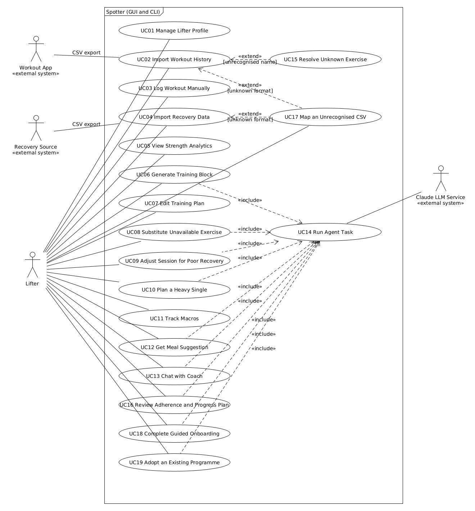

*Image:* [`usecase.png`](https://github.com/devparikh28/EECS3311_Project_Spotter/blob/master/diagrams/usecase.png) · *Editable UMLet source:* [`usecase.uxf`](https://github.com/devparikh28/EECS3311_Project_Spotter/blob/master/diagrams/usecase.uxf)

Files: `diagrams/usecase.uxf` and `diagrams/usecase.png`

## 5.1 Actors

| Actor | Type | Role |
|---|---|---|
| Lifter | Primary, human | The powerlifter using Spotter through either the GUI or the CLI. Initiates every use case. |
| Workout App | Secondary, external system | Produces the workout history CSV consumed by UC02. Hevy is recognised automatically; any other app is read through a confirmed column mapping (UC17). Spotter never calls these apps directly. |
| Recovery Source | Secondary, external system | Produces the recovery CSV consumed by UC04. Whoop is recognised automatically, other wearables through a mapping. A lifter with no wearable uses the check in in UC04 instead, so this actor is optional. |
| Claude LLM Service | Secondary, external system | Anthropic's Claude model, reached through `ClaudeClient`. Participates only through UC14, so every AI feature reaches the model through one controlled path. |

## 5.2 Relationships

**Include.** UC06, UC08, UC09, UC10, UC12, UC13, UC16, UC18 and UC19 all include **UC14 Run Agent Task**. UC14 captures the behaviour every AI feature shares: gather context, call Claude with tools, parse, validate, and retry once on failure. This mirrors the Template Method `CoachAgent.run()` in the class diagram.

**Extend.** **UC17 Map an Unrecognised CSV** extends UC02 and UC04 at the extension point "header matches no known format", and **UC15 Resolve Unknown Exercise** extends UC02 at the extension point "unrecognised exercise name", because it only happens when an imported name is not in the exercise catalog.

UC08 and UC09 end with the lifter accepting a change. That acceptance is carried out through the same plan edit mechanism as UC07 (a `PlanEditCommand`), which is why accepted substitutions and adjustments can be undone from UC07. This is described in the flows below rather than drawn as an extend relationship, to keep the diagram readable.

## 5.3 Interfaces

Every use case initiated by the lifter is available in both interfaces. The GUI action and the equivalent CLI command are listed in each description. Both call the same `CoachController` method, so the two interfaces behave identically.

---

# 6. Use Case Descriptions

## UC01 — Manage Lifter Profile

| Field | Description |
|---|---|
| Actor(s) | Lifter |
| Goal | Create or update the profile that every other feature depends on: bodyweight, training goal, split preference, optional meet date and weight class, training days, equipment, dietary constraints, and macro targets. |
| Interface | GUI: Profile tab, Save. CLI: `spotter profile set`, `spotter profile show` |
| Preconditions | The application is running and the database is initialised. |
| Trigger | The lifter opens the Profile tab and clicks Save, or runs `spotter profile set`. |
| Main Success Scenario | 1. Lifter enters or edits profile fields. 2. `ProfilePanel.onSaveClicked()` builds a `LifterProfile` and calls `CoachController.saveProfile()`. 3. The controller validates required fields, weight class, and meet date. 4. `ProfileRepository.save()` persists the profile. 5. The controller publishes `PROFILE_UPDATED` on the `EventBus`. 6. Subscribed panels refresh and a confirmation is shown. |
| Alternative / Exception Flows | 3a. A required field is missing: the save is blocked and the field is highlighted. 3b. A meet date is given but is in the past: the save is rejected with a message. 3d. The meet prep goal is selected with no meet date: the lifter is asked for one; every other goal leaves the field empty and unused. 3c. No equipment is selected: the profile is saved with bodyweight only equipment and a warning that plan generation will be limited. |
| Postconditions | A valid `LifterProfile` is stored and all panels show current values. |
| Related Feature(s) | F01, and macro targets for F09 |

## UC02 — Import Workout History

| Field | Description |
|---|---|
| Actor(s) | Lifter (primary), Hevy App (secondary, source of the file) |
| Goal | Load training history from a Hevy CSV export so analytics and planning have data. |
| Interface | GUI: Log tab, Import Hevy CSV. CLI: `spotter import hevy <file>` |
| Preconditions | A profile exists. The lifter has exported a CSV from Hevy. |
| Trigger | The lifter selects a file in the file picker, or runs the CLI command with a file path. |
| Main Success Scenario | 1. `LogPanel.onImportHevyClicked()` calls `CoachController.importWorkouts(path)`. 2. `CsvImportService.importFile()` asks `DataSourceFactory` for the correct adapter, which detects the Hevy header and returns a `HevyCsvAdapter`. 3. The adapter reads rows through `CsvFileReader` and converts them to `WorkoutSession` and `SetEntry` objects in an `ImportBatch`. 4. The service maps each exercise name through `ExerciseCatalog.byName()`. 5. Duplicate sessions (same date and exercises) are removed. 6. New sessions are saved through `WorkoutRepository`. 7. The controller publishes `DATA_IMPORTED`. 8. An `ImportReport` is shown with counts of imported sessions, skipped duplicates, and row errors. |
| Alternative / Exception Flows | 2a. The header matches neither Hevy nor Whoop: the import stops with "unrecognised file format" and nothing is saved. 3a. Individual rows are malformed: those rows are skipped and listed in the report, and valid rows continue. 4a. An exercise name is not in the catalog: **UC15** runs. 5a. The lifter chooses "import anyway" for duplicates: they are saved as separate sessions. |
| Postconditions | Valid sessions are stored, the Log and Analytics tabs reflect them, and the lifter has a report of anything skipped. |
| Related Feature(s) | F02 |

## UC03 — Log Workout Manually

| Field | Description |
|---|---|
| Actor(s) | Lifter |
| Goal | Record a session directly, either by confirming the prescribed session was completed or by typing it in. |
| Interface | GUI: Plan tab, Log as Prescribed on a session, or Log tab manual entry form. CLI: `spotter log prescribed <sessionId>`, `spotter log add` |
| Preconditions | A profile exists. |
| Trigger | The lifter submits the manual entry form. |
| Main Success Scenario | 1. The lifter either clicks Log as Prescribed, which calls `CoachController.logSessionAsPrescribed()` and turns the prescription into a logged session with only the deviations entered, or types a session in, calling `CoachController.logWorkout()`. 2. Either path produces a `WorkoutSession`. 3. The controller validates ranges (reps at least 1, RPE between 6 and 10, weight above zero). 4. `WorkoutRepository.save()` stores the session. 5. `DATA_IMPORTED` is published and the Log and Analytics tabs refresh. |
| Alternative / Exception Flows | 3a. A value is out of range: the specific field is highlighted and nothing is saved. 1a. The exercise is not in the catalog: the lifter is offered the same mapping choice as UC15. |
| Postconditions | The session is stored and included in analytics. |
| Related Feature(s) | F02 |

## UC04 — Import Recovery Data

| Field | Description |
|---|---|
| Actor(s) | Lifter (primary), Whoop App (secondary, source of the file) |
| Goal | Give the system something to judge recovery by, from a wearable export or a direct check in. |
| Interface | GUI: Log tab, Import CSV, or the Check In panel. CLI: `spotter import whoop <file>`, `spotter import csv <file> <profile>`, `spotter checkin` |
| Preconditions | A profile exists. The lifter has a recovery export, or is completing a check in. No wearable is required. |
| Trigger | The lifter selects a Whoop file or runs the CLI command. |
| Main Success Scenario | 1. `LogPanel.onImportWhoopClicked()` calls `CoachController.importRecovery(path)`. 2. `DataSourceFactory` detects the Whoop header and returns a `WhoopCsvAdapter`. 3. The adapter converts rows into `RecoveryDay` objects. 4. `RecoveryRepository` saves them. 5. The controller runs `RecoveryRuleEngine.evaluate()` on upcoming training days. 6. `DATA_IMPORTED` and, if any days were flagged, `RECOVERY_FLAGGED` are published. 7. The Plan tab shows warning badges on flagged sessions. |
| Alternative / Exception Flows | 3a. A day is missing some fields: it is stored with those fields empty rather than rejected. 4a. Dates overlap an earlier import: the lifter confirms, and newer values replace older ones. 2a. Unrecognised format: same as UC02 2a. |
| Postconditions | Recovery data is stored and any low recovery sessions are flagged. |
| Related Feature(s) | F03, and it triggers the flagging step of F07 |

## UC05 — View Strength Analytics

| Field | Description |
|---|---|
| Actor(s) | Lifter |
| Goal | See estimated one rep max trends, weekly tonnage, and best sets for a competition lift. |
| Interface | GUI: Analytics tab, lift dropdown. CLI: `spotter analytics <squat or bench or deadlift>` |
| Preconditions | A profile exists. |
| Trigger | The lifter selects a lift, or runs the CLI command. |
| Main Success Scenario | 1. `AnalyticsPanel.onLiftSelected()` calls `CoachController.getAnalytics(lift)`. 2. The controller loads history through `WorkoutRepository.findByLift()`. 3. `StrengthAnalytics` computes an e1RM for each set using `RPEChart`, then builds the e1RM series, weekly tonnage, and best set. 4. An `AnalyticsSummary` is returned. 5. The GUI draws a chart and summary figures; the CLI prints a table. |
| Alternative / Exception Flows | 2a. No history for the lift: an empty state is shown with a prompt to import data. 3a. A set has an invalid RPE or RPE 10 at more than one rep: it is excluded and a data quality note is shown. |
| Postconditions | No data changes. The lifter sees current strength figures. |
| Related Feature(s) | F04 |

## UC06 — Generate Training Block

| Field | Description |
|---|---|
| Actor(s) | Lifter (primary), Claude LLM Service (secondary, via UC14) |
| Goal | Produce a multi week training block toward the meet date that respects the lifter's strength levels, equipment, and chosen progression scheme. |
| Interface | GUI: Plan tab, Generate Block. CLI: `spotter plan generate <weeks>` |
| Preconditions | A profile exists with a training goal. At least some workout history exists for each main lift. A meet date is not required. |
| Trigger | The lifter clicks Generate Block or runs the CLI command. |
| Main Success Scenario | 1. `PlanPanel.onGenerateClicked()` calls `CoachController.generateBlock(weeks)`. 2. The controller asks `ProgressionStrategyFactory.forGoal()` for the strategy matching the training goal, builds an `AgentRequest` carrying the training days and split preference, and calls `BlockGenerationAgent.run()`. 3. **UC14** runs: the agent gathers current e1RMs through `AnalyticsTool` and available exercises through `ExerciseDBTool`, asks Claude for a block as JSON with a focus label per session, parses it with `ResponseParser.toBlock()`, and validates it with `PlanValidator.validateBlock()` against the active `ProgressionStrategy` and with `validateSplit()` against the lifter's training days and split preference. 4. The validated `TrainingBlock` is saved through `BlockRepository`. 5. `PLAN_UPDATED` is published. 6. The Plan tab displays the block week by week. |
| Alternative / Exception Flows | 1a. Not enough history for a lift: the lifter is warned and may continue, in which case the agent is told to use conservative loads. 3a. UC14 fails after its retry: an error is shown and any existing block is left unchanged. 4a. A block already exists: the lifter confirms replacement before saving. |
| Postconditions | A new validated block is active and visible. The previous block, if any, is kept in history. |
| Related Feature(s) | F05 |

## UC07 — Edit Training Plan

| Field | Description |
|---|---|
| Actor(s) | Lifter |
| Goal | Make manual changes to the active block (swap an exercise, change a load) and undo any change, including changes that came from the agent. |
| Interface | GUI: Plan tab, inline edits and Undo. CLI: `spotter plan edit load <prescriptionId> <kg>`, `spotter plan edit swap <prescriptionId> <exercise>`, `spotter plan undo` |
| Preconditions | An active training block exists. |
| Trigger | The lifter edits a value in the plan, or clicks Undo. |
| Main Success Scenario | 1. The lifter changes a load. 2. `PlanPanel` creates a `ChangeLoadCommand` and calls `CoachController.applyEdit(cmd)`. 3. `PlanEditHistory.execute()` runs the command, which records the old value and updates the `TrainingBlock`. 4. `BlockRepository.save()` persists the block. 5. `PLAN_UPDATED` is published and the tab refreshes. |
| Alternative / Exception Flows | 1a. The lifter clicks Undo: `CoachController.undoLastEdit()` calls `PlanEditHistory.undo()`, which pops the last command and restores the old value. 1b. Nothing to undo: the Undo button is disabled and the CLI prints "nothing to undo". 1c. The swap target requires equipment the lifter does not have: the edit is refused with a message suggesting UC08. |
| Postconditions | The block reflects the edit and the change is on the undo stack. |
| Related Feature(s) | F05, F06, F07 |

## UC08 — Substitute Unavailable Exercise

| Field | Description |
|---|---|
| Actor(s) | Lifter (primary), Claude LLM Service (secondary, via UC14) |
| Goal | Replace an exercise the lifter's gym cannot support with the closest suitable alternative. |
| Interface | GUI: Plan tab, warning icon, Suggest Substitute. CLI: `spotter plan substitute <prescriptionId>` |
| Preconditions | An active block exists and at least one prescription requires equipment not in the profile. |
| Trigger | The lifter clicks Suggest Substitute on a flagged exercise. |
| Main Success Scenario | 1. `PlanPanel.onSubstituteClicked()` calls `CoachController.suggestSubstitute(id)`. 2. `SubstitutionAgent.run()` executes **UC14**: `ExerciseDBTool` returns candidates with the same movement pattern and muscle groups that use only available equipment; Claude picks one and explains why. 3. `PlanValidator.validateSubstitution()` confirms the choice is one of the candidates. 4. The suggestion and rationale are shown. 5. The lifter accepts. 6. The controller applies a `SwapExerciseCommand` through `PlanEditHistory`, as in UC07. |
| Alternative / Exception Flows | 2a. No candidates exist: the lifter is told no automatic substitute is available and can swap manually through UC07. 3a. Claude picks an exercise outside the candidate list: validation fails and UC14 retries; if it fails again the candidate list is shown for manual choice. 5a. The lifter rejects the suggestion: nothing changes. |
| Postconditions | If accepted, the prescription uses an available exercise and the change is undoable. |
| Related Feature(s) | F06 |

## UC09 — Adjust Session for Poor Recovery

| Field | Description |
|---|---|
| Actor(s) | Lifter (primary), Claude LLM Service (secondary, via UC14) |
| Goal | Reduce the demand of a planned session when recovery data shows the lifter is under recovered. |
| Interface | GUI: Plan tab, recovery badge, Adjust Session. CLI: `spotter plan flags`, `spotter plan adjust <sessionId>` |
| Preconditions | An active block exists and recovery data exists for the session date or the day before. |
| Trigger | The lifter clicks Adjust Session on a flagged session. |
| Main Success Scenario | 1. `RecoveryRuleEngine.evaluate()` has already flagged the session (recovery score below 33 or sleep below 6 hours). 2. `PlanPanel.onAdjustClicked()` calls `CoachController.adjustSession(id)`. 3. `AdjustmentAgent.run()` executes **UC14** with the session, the `RecoveryFlag` reasons, and recent recovery trend; Claude returns a revised session and rationale. 4. `PlanValidator` confirms loads are not increased and competition lifts are not removed. 5. The original and adjusted sessions are shown side by side. 6. The lifter accepts, and an `ApplyAdjustmentCommand` is applied through `PlanEditHistory`. |
| Alternative / Exception Flows | 1a. Recovery data is missing: the session is not flagged and the lifter is told why. 3a. UC14 fails: the lifter is shown a deterministic fallback (reduce sets by one third) and may accept it instead. 6a. The lifter rejects the adjustment: the original session is kept. |
| Postconditions | If accepted, the session is lighter, carries an adjustment note, and can be undone. |
| Related Feature(s) | F07 |

## UC10 — Plan a Heavy Single (Meet Attempts or Test Day)

| Field | Description |
|---|---|
| Actor(s) | Lifter (primary), Claude LLM Service (secondary, via UC14) |
| Goal | Get either competition attempts (when a meet date is set) or a test day plan (when it is not), with an explanation grounded in recent training. |
| Interface | GUI: Meet tab, Calculate Attempts. CLI: `spotter meet attempts` |
| Preconditions | A profile exists and recent history exists for the competition lifts. |
| Trigger | The lifter clicks Calculate Attempts or runs the CLI command. |
| Main Success Scenario | 1. `MeetPanel.onCalculateClicked()` calls `CoachController.calculateAttempts()`. 2. The controller gets current e1RMs from `StrengthAnalytics.currentE1RMs()`. 3. `AttemptCalculator.calculateMeetAttempts()` produces `MeetAttempts` for each lift when a meet date is set, or `projectTestDay()` produces a `TestDayPlan` with warm ups and a top single when it is not. Both round to 2.5 kg. 4. `AttemptRationaleAgent.run()` executes **UC14** to write a rationale referencing the recent trend. 5. `PlanValidator.validateRationale()` confirms every number in the rationale matches the calculator. 6. Attempts and rationale are displayed. |
| Alternative / Exception Flows | 2a. Too little recent data for a lift: a conservative percentage is used and a warning shown. 4a. UC14 fails or the rationale contradicts the calculator: the attempts are still shown, without a rationale, and a note explains why. 6a. The lifter overrides an attempt manually: the override is stored and marked as manual. |
| Postconditions | Attempts are displayed and stored. The numbers always come from the deterministic calculator. |
| Related Feature(s) | F08 |

## UC11 — Track Macros

| Field | Description |
|---|---|
| Actor(s) | Lifter |
| Goal | Log daily food intake and see remaining macros and weekly adherence against targets. |
| Interface | GUI: Nutrition tab. CLI: `spotter macros log <food> <grams>`, `spotter macros today`, `spotter macros week` |
| Preconditions | Macro targets are set in the profile (UC01). |
| Trigger | The lifter logs a food entry or opens the Nutrition tab. |
| Main Success Scenario | 1. `NutritionPanel.onLogIntakeClicked()` calls `CoachController.logIntake(entry)`. 2. The food is looked up in `FoodCatalog` and a `FoodEntry` is created with its gram amount. 3. `MacroTracker.recordIntake()` adds it to the day's `DailyIntake`. 4. `IntakeRepository` saves it. 5. `MacroTracker.getRemaining()` and `weeklyAdherence()` are computed. 6. `INTAKE_LOGGED` is published and the tab shows remaining macros and adherence. |
| Alternative / Exception Flows | 2a. The food is not in the catalog: the lifter may enter its macros per 100 g manually, which adds it to the catalog. 3a. Grams are zero, negative, or above a sanity limit: the entry is rejected. 5a. A day has no entries: it is excluded from weekly adherence. |
| Postconditions | The entry is stored and remaining macros are current. |
| Related Feature(s) | F09 |

## UC12 — Get Meal Suggestion

| Field | Description |
|---|---|
| Actor(s) | Lifter (primary), Claude LLM Service (secondary, via UC14) |
| Goal | Receive a vegetarian meal that fits the macros remaining for the day. |
| Interface | GUI: Nutrition tab, Suggest a Meal. CLI: `spotter meal suggest` |
| Preconditions | Macro targets exist. Dietary constraints are set in the profile. |
| Trigger | The lifter clicks Suggest a Meal. |
| Main Success Scenario | 1. `NutritionPanel.onSuggestMealClicked()` calls `CoachController.suggestMeal()`. 2. The controller gets remaining macros from `MacroTracker.getRemaining()`. 3. `MealSuggestionAgent.run()` executes **UC14**: `FoodDBTool` returns foods permitted by `DietaryConstraints`; Claude composes a meal from those foods with gram amounts. 4. `ResponseParser.toMeal()` builds the `MealSuggestion` using catalog nutrition values, not model generated values. 5. `PlanValidator.validateMeal()` confirms every item is permitted and the totals do not exceed remaining calories by more than a tolerance. 6. The meal and its full nutrition breakdown are shown, with an option to log it through UC11. |
| Alternative / Exception Flows | 2a. Remaining calories are near zero: the lifter is told no meal is needed. 3a. No foods fit: the agent explains the shortfall instead of inventing a meal. 5a. A non permitted item appears: validation fails and UC14 retries. |
| Postconditions | A validated suggestion is shown. Nothing is logged until the lifter chooses to. |
| Related Feature(s) | F10 |

## UC13 — Chat with Coach

| Field | Description |
|---|---|
| Actor(s) | Lifter (primary), Claude LLM Service (secondary, via UC14) |
| Goal | Ask free form coaching questions and receive answers grounded in the lifter's own data and earlier conversations. |
| Interface | GUI: Coach Chat tab. CLI: `spotter chat "<question>"` or interactive `spotter chat` |
| Preconditions | A profile exists. |
| Trigger | The lifter sends a message. |
| Main Success Scenario | 1. `ChatPanel.onSendClicked()` calls `CoachController.chat(message)`. 2. `ChatAgent.run()` executes **UC14**: `MemoryManager.recall()` retrieves relevant earlier conversation summaries; Claude decides which tools to call (`AnalyticsTool`, `PlanLookupTool`, `RecoveryLookupTool`), receives their results, and writes an answer. 3. `MemoryManager.remember()` stores the exchange in `ConversationHistory`. 4. The answer is displayed. |
| Alternative / Exception Flows | 2a. The question needs data no tool can provide: the agent says so rather than guessing. 2b. The question is ambiguous: the agent asks a clarifying question. 2c. The conversation exceeds the history limit: older turns are summarised by `MemoryManager.summarizeOlderTurns()`. 2d. A tool fails: the agent reports that the data is unavailable. |
| Postconditions | The answer is shown and the exchange is available to later conversations. |
| Related Feature(s) | F11 |

## UC18 — Complete Guided Onboarding

| Field | Description |
|---|---|
| Actor(s) | Lifter (primary), Claude LLM Service (secondary, via UC14) |
| Goal | Set up a usable profile, and leave with a concrete first step, without needing to know what any of the fields mean. |
| Interface | GUI: onboarding panel on first run. CLI: `spotter onboard` |
| Preconditions | No profile exists, or the lifter chooses to redo onboarding. |
| Trigger | First run, or the lifter starts onboarding from the profile tab. |
| Main Success Scenario | 1. `CoachController.runOnboarding()` starts `OnboardingAgent`. 2. The agent asks one question at a time about training history, goal, available days, equipment and any limitations, adapting to the answers. 3. Each answer is recorded in a `ProfileDraft`. 4. `PlanValidator.validateProfileDraft()` checks the required fields and looks for contradictions. 5. The draft is shown for review. 6. The lifter confirms or corrects it and it is saved as a `LifterProfile`. 7. `StartingStrength.needsCalibration()` decides the first step: enter known maxes, or run a calibration week. |
| Alternative / Exception Flows | 2a. The lifter skips onboarding and uses the profile form. 4a. A contradiction is found, such as meet preparation with no meet date: the lifter is asked to resolve it. 4b. Required answers are missing after the question limit: the profile form opens prefilled with whatever was answered. 7a. History was already imported: no calibration is needed and block generation is offered. |
| Postconditions | A valid profile exists and the lifter knows exactly what to do next. |
| Related Feature(s) | F13, and it feeds F01 and F05 |

## UC19 — Adopt an Existing Programme

| Field | Description |
|---|---|
| Actor(s) | Lifter (primary), Claude LLM Service (secondary, via UC14, only for pasted text) |
| Goal | Keep following a programme the lifter already has, while gaining adherence tracking, substitutions and recovery adjustments. |
| Interface | GUI: Plan tab, Adopt Programme. CLI: `spotter plan adopt <file>`, `spotter plan adopt text` |
| Preconditions | A profile exists. The lifter has a programme as a file, as text, or in their head. |
| Trigger | The lifter chooses Adopt Programme rather than Generate Block. |
| Main Success Scenario | 1. `PlanPanel.onAdoptProgrammeClicked()` calls `CoachController.adoptProgramme()`. 2. For manual entry or a CSV, `ProgrammeImportService` builds the block deterministically, resolving names through `ExerciseCatalog`. 3. For pasted text, `ProgrammeParserAgent` executes **UC14** and returns the same structure. 4. `PlanValidator.validateAdoptedBlock()` checks exercises exist, sessions fit the lifter's training days and loads are plausible. 5. The block is saved with `origin = ADOPTED` and becomes the active plan. |
| Alternative / Exception Flows | 2a. Unrecognised exercise names open the mapping dialog from UC15. 4a. Loads are implausible against current strength: they are flagged for correction rather than accepted. 3a. Free text cannot be structured: manual entry opens prefilled with whatever was understood. |
| Postconditions | The lifter's own programme is the active block, and F06, F07, F12 and the analytics apply to it unchanged. |
| Related Feature(s) | F14, and it substitutes for F05 for lifters who do not want a generated plan |

## UC17 — Map an Unrecognised CSV (extends UC02 and UC04)

| Field | Description |
|---|---|
| Actor(s) | Lifter |
| Goal | Import from an app Spotter does not recognise, by describing its columns once. |
| Interface | GUI: mapping dialog opened automatically during import. CLI: `spotter import csv <file> <profile>` |
| Preconditions | An import is in progress and `DataSourceFactory.detect()` returned `GENERIC`. |
| Trigger | Extension point "header matches no known format" in UC02 or UC04. |
| Main Success Scenario | 1. `DataSourceFactory.suggestMapping()` proposes a `ColumnMapping` by matching header names against known synonyms. 2. The lifter confirms or corrects which column holds each field, the date format, and whether weights are kilograms or pounds. 3. `ColumnMapping.validate()` checks the required fields for the import kind are mapped. 4. The mapping is saved as a named import profile through `ImportProfileRepository`. 5. `GenericCsvAdapter` reads the file through it, converting units and dates. 6. The calling use case continues as normal. |
| Alternative / Exception Flows | 3a. A required column is not mapped: validation names the missing field and the import does not proceed. 2a. The lifter recognises the profile from a previous import and selects it, skipping the dialog. 5a. Rows fail to parse under the mapping: they are reported per row, as in any other import. |
| Postconditions | The file is imported and the mapping is stored, so future exports from that app import in one step. |
| Related Feature(s) | F02, F03 |

## UC16 — Review Adherence and Progress the Plan

| Field | Description |
|---|---|
| Actor(s) | Lifter (primary), Claude LLM Service (secondary, via UC14) |
| Goal | See how the week's training compared with what was prescribed, and let the plan respond to it. |
| Interface | GUI: Plan tab, Review Week and Progress Plan. CLI: `spotter plan review <week>`, `spotter plan progress <week>` |
| Preconditions | An active block exists and at least one session from the week in question has been logged or imported. |
| Trigger | The lifter opens Review Week, typically at the end of a training week. |
| Main Success Scenario | 1. `PlanPanel.onReviewWeekClicked()` calls `CoachController.reviewAdherence(week)`. 2. The controller loads the block and the logged sessions. 3. `PlanAdherence.compare()` matches each prescription to logged sets and assigns a verdict per exercise. 4. The `AdherenceReport` is displayed. 5. The lifter clicks Progress Plan. 6. `ProgressionAgent.run()` executes **UC14** using `AdherenceTool`, and proposes revised remaining weeks with reasons. 7. `PlanValidator.validateProgression()` confirms loads advance only where verdicts allow and within the week over week cap. 8. The lifter accepts, and an `ApplyProgressionCommand` is applied through `PlanEditHistory`. |
| Alternative / Exception Flows | 3a. A prescribed session has no matching log: it is reported as missed rather than assumed complete. 3b. A logged set carries no RPE: the comparison uses reps alone. 6a. There is no shortfall and the lifter does not ask: the report is shown and nothing changes. 7a. Validation fails twice, or the agent is unavailable: the report is still shown, since the comparison is deterministic. 8a. The lifter rejects the revision: the block is unchanged. |
| Postconditions | The lifter knows how the week went. If a revision was accepted, the remaining weeks reflect it and the change is undoable. |
| Related Feature(s) | F12, and it feeds F05 by giving the next block generation an execution history |

## UC14 — Run Agent Task (included)

| Field | Description |
|---|---|
| Actor(s) | Claude LLM Service (secondary). Always initiated by an including use case, never directly by the lifter. |
| Goal | Execute one AI task reliably: produce output that has been parsed and validated, or fail cleanly. |
| Preconditions | `ClaudeClient` is configured with an API key. The calling agent has registered its tools. |
| Trigger | An including use case calls `CoachAgent.run(request)`. |
| Main Success Scenario | 1. `gatherContext()` loads the profile and task inputs. 2. `buildPrompt()` uses `PromptBuilder` to assemble instructions, context, output schema, and memory. 3. `ClaudeClient.complete()` sends the messages and tool schemas to Claude. 4. If Claude requests a tool, `ToolManager.execute()` runs it and the result is sent back; this repeats until Claude returns a final answer. 5. `parse()` converts the answer into a domain object. 6. `validate()` checks it with `PlanValidator`. 7. An `AgentResult` with `success = true` is returned. |
| Alternative / Exception Flows | 5a or 6a. Parsing or validation fails: the errors are added to the prompt and steps 3 to 6 run once more; if they fail again, an `AgentResult` with `success = false` and the errors is returned. 3a. Claude times out or returns an API error: one retry after a short wait, then a failed result. 4a. Claude requests a tool that does not exist or passes invalid arguments: the tool returns an error result to Claude instead of executing. 4b. The tool loop exceeds a fixed limit of rounds: the task stops with a failed result. |
| Postconditions | The caller receives either validated output or a clear failure. Unvalidated model output never reaches the domain. |
| Related Feature(s) | F05, F06, F07, F08, F10, F11 |

## UC15 — Resolve Unknown Exercise (extends UC02)

| Field | Description |
|---|---|
| Actor(s) | Lifter |
| Goal | Map an imported exercise name that is not in the catalog so its sets can be imported. |
| Preconditions | UC02 is in progress and at least one name failed `ExerciseCatalog.byName()`. |
| Trigger | Extension point "unrecognised exercise name" in UC02. |
| Main Success Scenario | 1. The lifter is shown each unknown name with the closest catalog matches. 2. The lifter maps it to an existing exercise. 3. The mapping is saved so future imports resolve it automatically. 4. UC02 continues and imports those sets. |
| Alternative / Exception Flows | 2a. The lifter adds it as a new exercise, entering muscle groups, movement pattern, and equipment. 2b. The lifter skips it: those sets are excluded and listed in the import report. |
| Postconditions | Each unknown name is mapped, added, or explicitly skipped. |
| Related Feature(s) | F02 |

---

## 6.1 Feature Coverage

| Feature | Use Case(s) |
|---|---|
| F01 Lifter Profile and Constraints | UC01 |
| F02 Workout Logging and Import | UC02, UC03, UC15, UC17 |
| F03 Recovery Input | UC04, UC17 |
| F04 Strength Analytics | UC05 |
| F05 Training Block Generation | UC06, UC07, UC14 |
| F06 Equipment Substitution | UC08, UC07, UC14 |
| F07 Recovery Aware Session Adjustment | UC04, UC09, UC07, UC14 |
| F08 Max Testing and Attempt Planning | UC10, UC14 |
| F09 Macro Targets and Adherence | UC01, UC11 |
| F10 Vegetarian Meal Suggestion | UC12, UC14 |
| F11 Coaching Chat with Memory | UC13, UC14 |
| F12 Plan Adherence and Progression | UC16, UC07, UC14 |
| F13 Guided Onboarding | UC18, UC14 |
| F14 Adopt an Existing Programme | UC19, UC15, UC14 |

Every feature is covered by at least one use case, and every use case maps back to at least one feature.

# 7. Sequence Diagrams

Twelve sequence diagrams cover every important behaviour in the system. Each one uses the classes and method names defined in the class diagram, shows the initiating actor, the boundary object, the controller, domain objects, agent components, and external services, and includes the alternative and error flows described in the matching use case.

| Diagram | Covers | Use Case(s) | Files (in `diagrams/`) |
|---|---|---|---|
| SD01 Import CSV Data | F02, F03 | UC02, UC04, UC15, UC17 | `SD01-import-csv.uxf` / `.png` |
| SD02 View Strength Analytics | F04 | UC05 | `SD02-analytics.uxf` / `.png` |
| SD03 Generate Training Block | F05 | UC06, UC14 | `SD03-generate-block.uxf` / `.png` |
| SD04 Substitute Unavailable Exercise | F06 | UC08, UC07 | `SD04-substitute-exercise.uxf` / `.png` |
| SD05 Adjust Session for Poor Recovery | F07 | UC09, UC07 | `SD05-recovery-adjustment.uxf` / `.png` |
| SD06 Plan a Heavy Single | F08 | UC10 | `SD06-heavy-single.uxf` / `.png` |
| SD07 Get Meal Suggestion | F10 | UC12 | `SD07-meal-suggestion.uxf` / `.png` |
| SD08 Chat with Coach | F11 | UC13 | `SD08-coach-chat.uxf` / `.png` |
| SD09 Save Profile and Log Intake | F01, F09 | UC01, UC11 | `SD09-profile-and-macros.uxf` / `.png` |
| SD10 Review Adherence and Progress the Plan | F12 | UC16, UC07 | `SD10-adherence-progression.uxf` / `.png` |
| SD11 Complete Guided Onboarding | F13 | UC18 | `SD11-onboarding.uxf` / `.png` |
| SD12 Adopt an Existing Programme | F14 | UC19 | `SD12-adopt-programme.uxf` / `.png` |

SD03 is the reference diagram for the agent loop. Because all six AI features share that loop (the Template Method in `CoachAgent.run()`), the other agent diagrams use a UML `ref` fragment pointing back to SD03 rather than repeating the same twelve messages, and show only the parts that differ: which tools are called, what is validated, and what happens to the result.

---

## SD01 — Import CSV Data

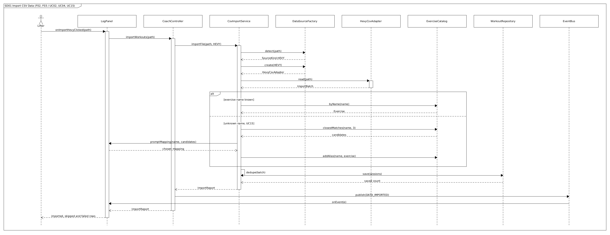

*Image:* [`SD01-import-csv.png`](https://github.com/devparikh28/EECS3311_Project_Spotter/blob/master/diagrams/SD01-import-csv.png) · *Editable UMLet source:* [`SD01-import-csv.uxf`](https://github.com/devparikh28/EECS3311_Project_Spotter/blob/master/diagrams/SD01-import-csv.uxf)

The lifter picks a file and `LogPanel` calls `CoachController.importWorkouts()`. `CsvImportService` asks `DataSourceFactory` to identify the file from its header, receives a `HevyCsvAdapter`, and the adapter translates raw rows from `CsvFileReader` into `WorkoutSession` and `SetEntry` objects. Each exercise name is resolved through `ExerciseCatalog`, duplicates are removed, and the surviving sessions are saved. The controller then publishes `DATA_IMPORTED`, which is what causes the Log and Analytics panels to refresh through the Observer relationship.

Three alternative flows appear: an unrecognised header opens the UC17 mapping dialog, where the lifter confirms which column holds each field and the mapping is saved as a named profile so the next export from that app imports in one step, individual malformed rows are collected into the report while valid rows continue, and an unknown exercise name opens the UC15 mapping dialog so the lifter can map or add it. Recovery import (UC04) has the same shape with `WhoopCsvAdapter`, `RecoveryDay` and `RecoveryRepository`, which is noted on the diagram rather than drawn twice, and the same generic path applies to any other wearable's export. A lifter with no wearable at all bypasses this diagram entirely and records a check in, which creates a `RecoveryDay` directly.

## SD02 — View Strength Analytics

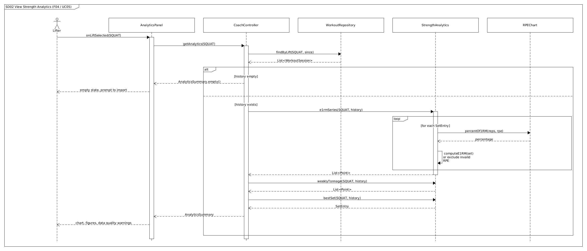

*Image:* [`SD02-analytics.png`](https://github.com/devparikh28/EECS3311_Project_Spotter/blob/master/diagrams/SD02-analytics.png) · *Editable UMLet source:* [`SD02-analytics.uxf`](https://github.com/devparikh28/EECS3311_Project_Spotter/blob/master/diagrams/SD02-analytics.uxf)

A purely deterministic path with no agent involvement. `StrengthAnalytics` loops over the history, converts each set into an estimated one rep max through `RPEChart`, and returns the series, weekly tonnage, and best set. The loop contains the data quality rule: sets with an invalid RPE, or RPE 10 above one rep, are excluded and reported rather than silently used. The empty history case returns an empty summary instead of an error.

## SD03 — Generate Training Block

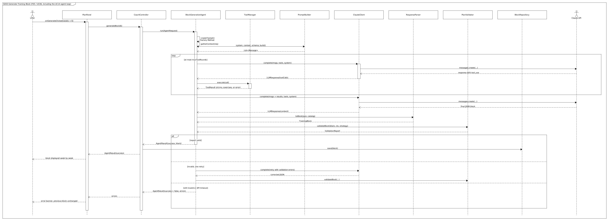

*Image:* [`SD03-generate-block.png`](https://github.com/devparikh28/EECS3311_Project_Spotter/blob/master/diagrams/SD03-generate-block.png) · *Editable UMLet source:* [`SD03-generate-block.uxf`](https://github.com/devparikh28/EECS3311_Project_Spotter/blob/master/diagrams/SD03-generate-block.uxf)

This is the most detailed diagram because it shows the full agent loop that the other AI features reuse.

`BlockGenerationAgent.run()` executes the template: `createToolset()` (the Factory Method, registering only the tools this agent needs), `gatherContext()`, and `buildPrompt()` through `PromptBuilder`. The `toolLoop` fragment then shows the real mechanics of tool use: `ClaudeClient` sends the messages and tool schemas to the Claude API, Claude replies asking for a tool, `ToolManager` executes it, and the result is sent back. The inner `alt` shows the three outcomes of a tool call, including a tool that does not exist or receives invalid arguments, which returns an error result to Claude instead of executing anything.

When Claude returns the final JSON, `ResponseParser.toBlock()` builds a `TrainingBlock` and `PlanValidator.validateBlock()` checks it against the lifter's context and the active `ProgressionStrategy`. The outer `alt` shows the three endings: valid on the first pass, one retry with the validation errors appended to the prompt, and failure after the retry or on API timeout. Only on success is the block saved and `PLAN_UPDATED` published; on failure the previous block is left untouched. This is where the principle that unvalidated model output never reaches the domain becomes visible in the design.

## SD04 — Substitute Unavailable Exercise

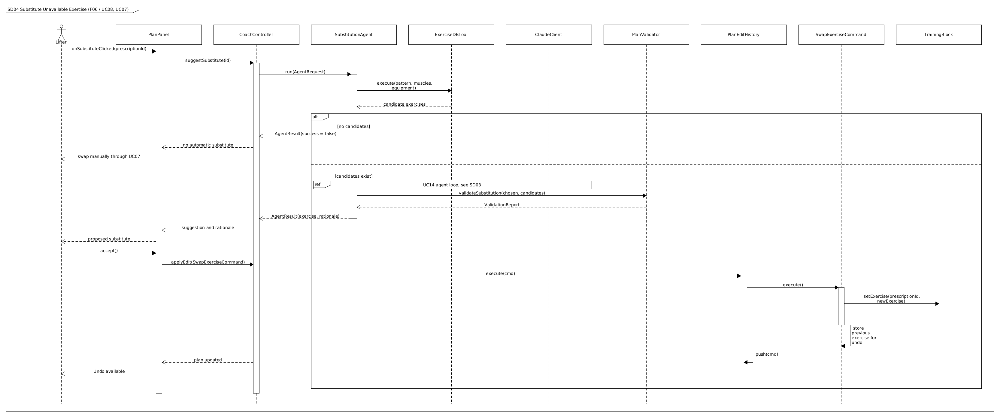

*Image:* [`SD04-substitute-exercise.png`](https://github.com/devparikh28/EECS3311_Project_Spotter/blob/master/diagrams/SD04-substitute-exercise.png) · *Editable UMLet source:* [`SD04-substitute-exercise.uxf`](https://github.com/devparikh28/EECS3311_Project_Spotter/blob/master/diagrams/SD04-substitute-exercise.uxf)

`ExerciseDBTool` filters the catalog deterministically first, so Claude chooses from a list it did not invent. `PlanValidator.validateSubstitution()` then confirms the chosen exercise is actually one of those candidates, and a choice outside the list triggers the retry. The second half of the diagram shows the Command pattern in full: acceptance creates a `SwapExerciseCommand`, `PlanEditHistory.execute()` runs it, the command records the previous exercise for undo, and the modified `TrainingBlock` is saved. This is why an agent suggestion can be undone with the same Undo button as a manual edit.

## SD05 — Adjust Session for Poor Recovery

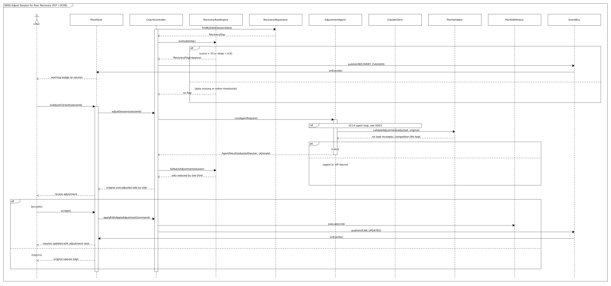

*Image:* [`SD05-recovery-adjustment.png`](https://github.com/devparikh28/EECS3311_Project_Spotter/blob/master/diagrams/SD05-recovery-adjustment.png) · *Editable UMLet source:* [`SD05-recovery-adjustment.uxf`](https://github.com/devparikh28/EECS3311_Project_Spotter/blob/master/diagrams/SD05-recovery-adjustment.uxf)

Split into two phases. Flagging is deterministic: `RecoveryRuleEngine.evaluate()` applies the thresholds and, when a day is flagged, `RECOVERY_FLAGGED` is published so a badge appears on the session. The agent is only invoked when the lifter asks for an adjustment, which keeps the LLM out of routine operation.

The validator here enforces direction: an adjustment may not raise loads or remove a competition lift. The diagram also shows the deterministic fallback, `RecoveryRuleEngine.fallbackAdjustment()`, which reduces sets by one third when the agent or the API fails, so the feature still works without Claude.

## SD06 — Plan a Heavy Single

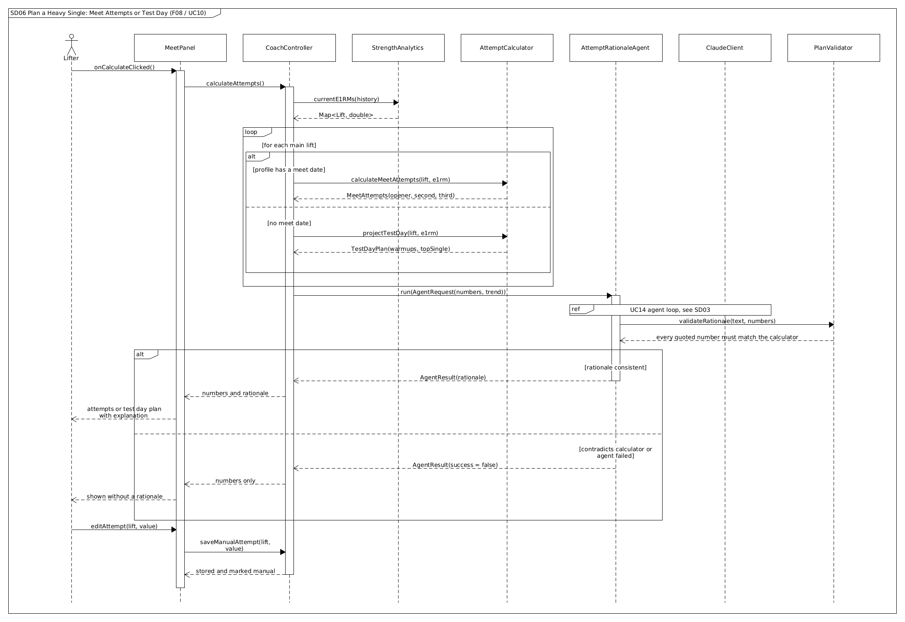

*Image:* [`SD06-heavy-single.png`](https://github.com/devparikh28/EECS3311_Project_Spotter/blob/master/diagrams/SD06-heavy-single.png) · *Editable UMLet source:* [`SD06-heavy-single.uxf`](https://github.com/devparikh28/EECS3311_Project_Spotter/blob/master/diagrams/SD06-heavy-single.uxf)

The numbers come from `AttemptCalculator` before the agent is involved at all, including the plate rounding. Which method runs depends on the profile: `calculateMeetAttempts()` when a meet date is set, `projectTestDay()` when it is not, so a lifter who never competes still gets a planned heavy single. The agent only writes the rationale, and `PlanValidator.validateRationale()` confirms every number quoted in that text matches the calculator. If the rationale contradicts the calculator or the agent fails, the attempts are still shown without a rationale. The diagram also covers thin data (a conservative percentage plus a warning) and a manual override by the lifter.

## SD07 — Get Meal Suggestion

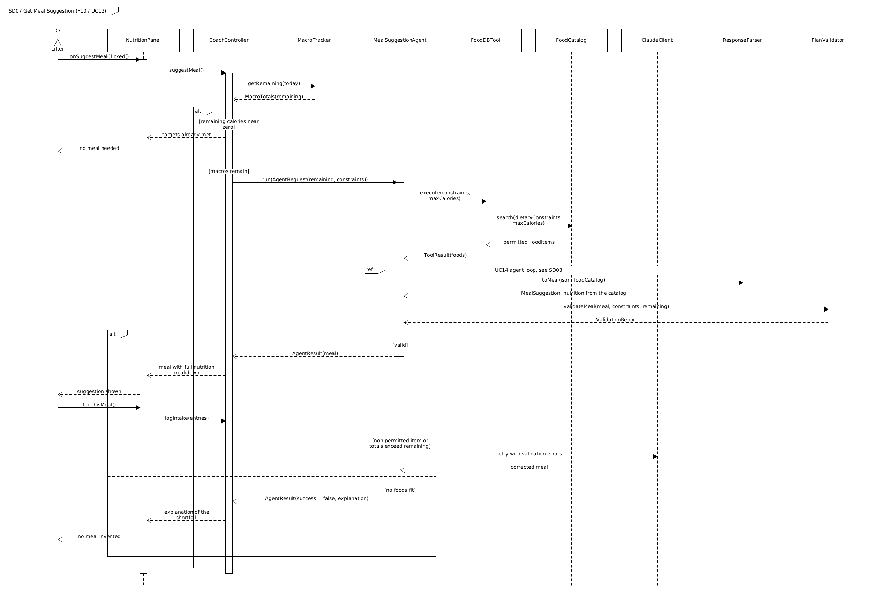

*Image:* [`SD07-meal-suggestion.png`](https://github.com/devparikh28/EECS3311_Project_Spotter/blob/master/diagrams/SD07-meal-suggestion.png) · *Editable UMLet source:* [`SD07-meal-suggestion.uxf`](https://github.com/devparikh28/EECS3311_Project_Spotter/blob/master/diagrams/SD07-meal-suggestion.uxf)

`FoodDBTool` returns only foods that `DietaryConstraints.permits()` allows, so the vegetarian constraint is enforced by code before the model sees the options. `ResponseParser.toMeal()` takes the gram amounts from the model but reads every nutrition value from `FoodCatalog`, which means the displayed breakdown cannot contain invented numbers. `PlanValidator.validateMeal()` performs the final check on permitted items and totals. The "no foods fit" branch is deliberate: the agent explains the shortfall instead of inventing a meal.

## SD08 — Chat with Coach

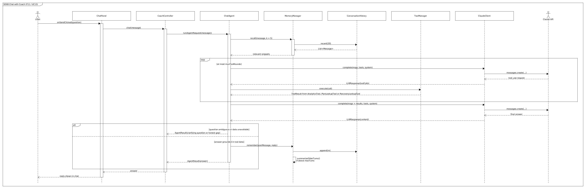

*Image:* [`SD08-coach-chat.png`](https://github.com/devparikh28/EECS3311_Project_Spotter/blob/master/diagrams/SD08-coach-chat.png) · *Editable UMLet source:* [`SD08-coach-chat.uxf`](https://github.com/devparikh28/EECS3311_Project_Spotter/blob/master/diagrams/SD08-coach-chat.uxf)

Shows memory and multi step tool use together. `MemoryManager.recall()` supplies relevant earlier turns before the prompt is built, Claude decides which of the chat tools to call, and the results are returned to it before the final answer. After answering, `MemoryManager.remember()` appends the exchange and summarises older turns once the history limit is reached. The alternative flows cover an ambiguous question (the agent asks for clarification rather than guessing) and a failing tool (reported as unavailable rather than answered from memory of the model's training).

## SD09 — Save Profile and Log Intake

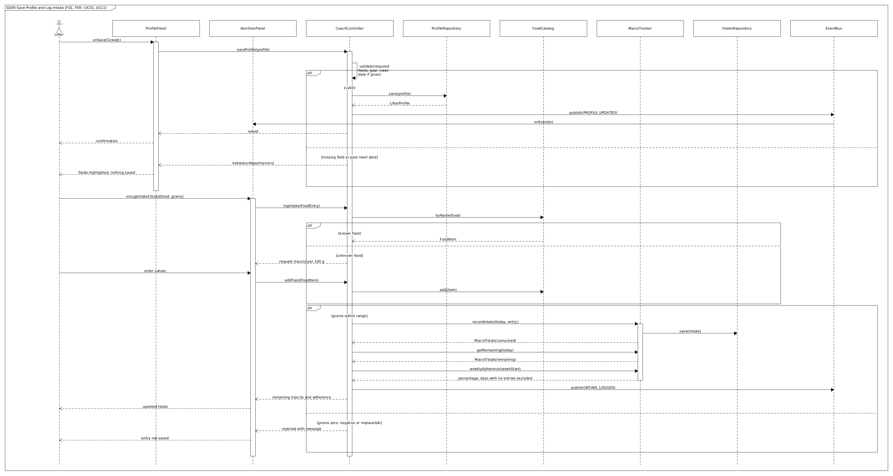

*Image:* [`SD09-profile-and-macros.png`](https://github.com/devparikh28/EECS3311_Project_Spotter/blob/master/diagrams/SD09-profile-and-macros.png) · *Editable UMLet source:* [`SD09-profile-and-macros.uxf`](https://github.com/devparikh28/EECS3311_Project_Spotter/blob/master/diagrams/SD09-profile-and-macros.uxf)

Two short deterministic interactions in one diagram. Profile saving shows validation before persistence and the `PROFILE_UPDATED` event that refreshes dependent panels. Intake logging shows the unknown food path (the lifter supplies macros per 100 g, which adds the item to `FoodCatalog`), range validation on the gram amount, and the adherence calculation that excludes days with no entries rather than counting them as zero.

---

## SD10 — Review Adherence and Progress the Plan

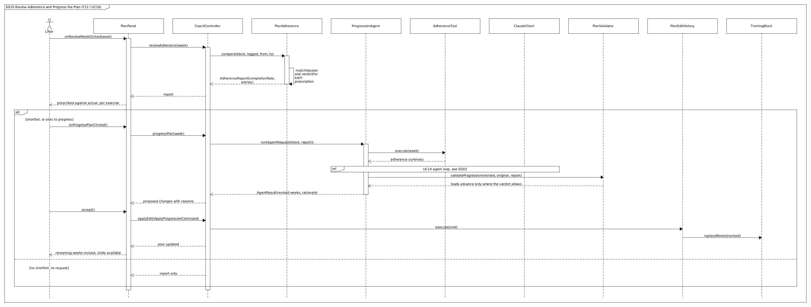

*Image:* [`SD10-adherence-progression.png`](https://github.com/devparikh28/EECS3311_Project_Spotter/blob/master/diagrams/SD10-adherence-progression.png) · *Editable UMLet source:* [`SD10-adherence-progression.uxf`](https://github.com/devparikh28/EECS3311_Project_Spotter/blob/master/diagrams/SD10-adherence-progression.uxf)

Split into a deterministic half and an agent half, which is the point of the feature. `PlanAdherence.compare()` matches each prescription to the logged sets and assigns a verdict, and that comparison is useful on its own: the lifter sees prescribed against actual per exercise whether or not the agent runs. Only when there is a shortfall, or the lifter asks, does `ProgressionAgent` propose revised remaining weeks, reading the comparison through `AdherenceTool` rather than re deriving it.

`PlanValidator.validateProgression()` is stricter than the other validators because this is the path that changes future training: loads may advance only where the verdict permits it, week over week increases are capped, and competition lifts cannot be dropped. An accepted revision is applied as an `ApplyProgressionCommand`, so a progression the lifter dislikes is one Undo away, exactly like a manual edit.

## SD11 — Complete Guided Onboarding

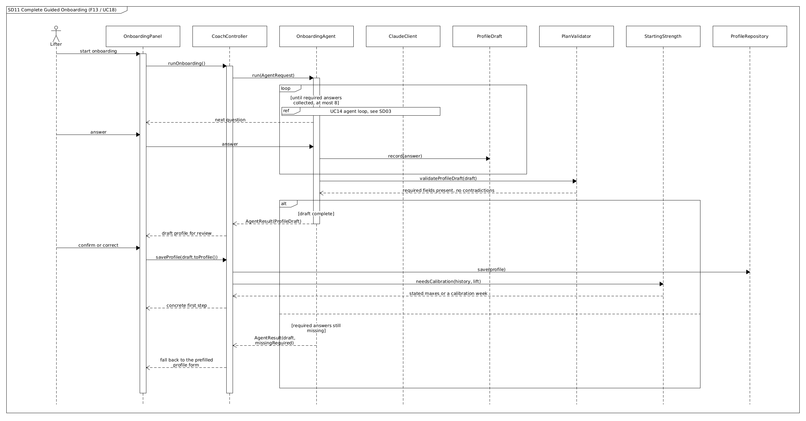

*Image:* [`SD11-onboarding.png`](https://github.com/devparikh28/EECS3311_Project_Spotter/blob/master/diagrams/SD11-onboarding.png) · *Editable UMLet source:* [`SD11-onboarding.uxf`](https://github.com/devparikh28/EECS3311_Project_Spotter/blob/master/diagrams/SD11-onboarding.uxf)

The loop is the interesting part: the agent asks one question at a time and adapts to the answers, rather than reading a script, and each answer lands in a `ProfileDraft`. Two deterministic guards surround it. `validateProfileDraft()` catches contradictions before a profile is created, and the question limit means onboarding can never trap someone in an endless interview; when it expires, the ordinary form opens prefilled with whatever was answered. The diagram ends on `StartingStrength`, because the point of onboarding is not a filled form but knowing what to do first.

## SD12 — Adopt an Existing Programme

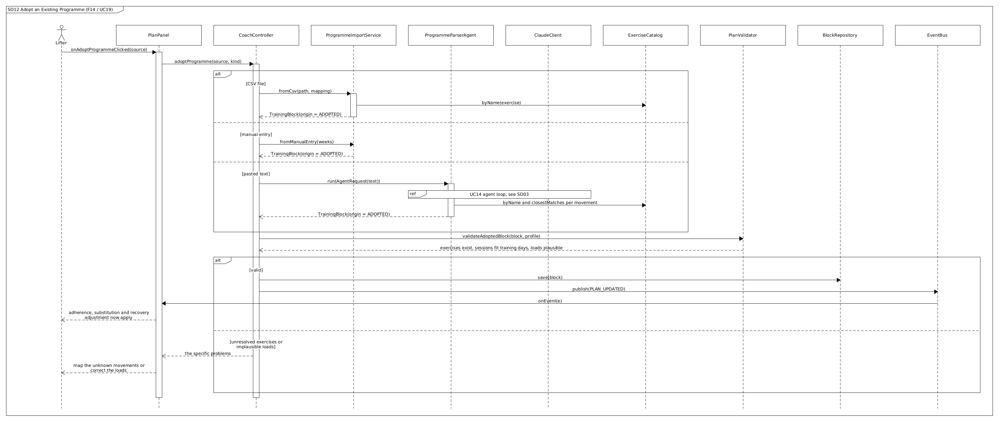

*Image:* [`SD12-adopt-programme.png`](https://github.com/devparikh28/EECS3311_Project_Spotter/blob/master/diagrams/SD12-adopt-programme.png) · *Editable UMLet source:* [`SD12-adopt-programme.uxf`](https://github.com/devparikh28/EECS3311_Project_Spotter/blob/master/diagrams/SD12-adopt-programme.uxf)

Three routes in, one route out. Manual entry and CSV import are deterministic, and only pasted free text involves the agent, which is the right split: interpreting a coach's message is a language problem, while building a block from structured rows is not. All three converge on `validateAdoptedBlock()`, which is a different check from the generated path, because an adopted block was never produced by a progression strategy and so cannot be validated against one. What it checks instead is that the exercises exist, the week fits the lifter's available days, and the loads are plausible against current strength.

## 7.1 Consistency with the Class Diagram

Every participant in these diagrams is a class in the class diagram, and every message is a method declared on that class. Writing the diagrams surfaced four methods that the first version of the class diagram was missing, and they were added to it rather than left implicit: `ExerciseCatalog.closestMatches()` and `addAlias()` for UC15, `FoodCatalog.byName()` and `add()` for unknown foods, `RecoveryRuleEngine.fallbackAdjustment()` for the SD05 failure path, and `CoachAgent.maxToolRounds` to bound the tool loop. This is the traceability the project asks for working in the intended direction: the design documents correcting each other before any code is written.

# 8. Feature to Design Traceability

Every feature traces to a use case that describes the interaction, the classes that implement it, the methods called, the sequence diagram that shows the runtime collaboration, and the design patterns involved. Section 9 expands each row into prose.

| Feature | Description | Type | Use Case | Classes | Key Methods | Sequence Diagram | Design Pattern(s) |
|---|---|---|---|---|---|---|---|
| F01 | Lifter profile, training goal, constraints and macro targets | Deterministic | UC01 | `ProfilePanel`, `CoachController`, `LifterProfile`, `DietaryConstraints`, `TrainingGoal`, `ExperienceLevel`, `SplitPreference`, `Limitation`, `StartingStrength`, `ProfileRepository`, `EventBus` | `onSaveClicked()`, `saveProfile()`, `hasMeetDate()`, `weeksUntilMeet()`, `needsCalibration()`, `fromStatedMax()`, `calibrationSession()`, `save()`, `publish()` | SD09 | Facade, Observer, Repository |
| F02 | Workout logging and import from any app | Deterministic | UC02, UC03, UC15, UC17 | `LogPanel`, `PlanPanel`, `CoachController`, `CsvImportService`, `DataSourceFactory`, `HevyCsvAdapter`, `GenericCsvAdapter`, `ColumnMapping`, `ImportProfileRepository`, `CsvFileReader`, `ExerciseCatalog`, `WorkoutSession`, `SetEntry`, `WorkoutRepository` | `onImportHevyClicked()`, `importWorkouts()`, `importWithMapping()`, `importFile()`, `detect()`, `suggestMapping()`, `create()`, `validate()`, `toKg()`, `read()`, `byName()`, `closestMatches()`, `addAlias()`, `dedupe()`, `logSessionAsPrescribed()`, `save()` | SD01 | Adapter, Factory Method, Facade, Observer, Repository |
| F03 | Recovery input from any wearable export or a manual check in | Deterministic | UC04, UC17 | `LogPanel`, `CoachController`, `CsvImportService`, `DataSourceFactory`, `WhoopCsvAdapter`, `GenericCsvAdapter`, `ColumnMapping`, `RecoveryDay`, `RecoverySource`, `RecoveryRepository`, `RecoveryRuleEngine`, `EventBus` | `onImportWhoopClicked()`, `importRecovery()`, `importWithMapping()`, `recordCheckIn()`, `read()`, `save()`, `hasObjectiveScore()`, `evaluate()`, `publish()` | SD01 | Adapter, Factory Method, Observer, Repository |
| F04 | Strength analytics: e1RM, tonnage, trends | Deterministic | UC05 | `AnalyticsPanel`, `CoachController`, `WorkoutRepository`, `StrengthAnalytics`, `RPEChart`, `AnalyticsSummary`, `Point` | `onLiftSelected()`, `getAnalytics()`, `findByLift()`, `computeE1RM()`, `percentOf1RM()`, `e1rmSeries()`, `weeklyTonnage()`, `bestSet()` | SD02 | Facade, Repository |
| F05 | Training block generation | AI | UC06, UC14 | `PlanPanel`, `CoachController`, `ProgressionStrategyFactory`, `ProgressionStrategy`, `SplitPreference`, `BlockGenerationAgent`, `ToolManager`, `AnalyticsTool`, `ExerciseDBTool`, `PromptBuilder`, `ClaudeClient`, `ResponseParser`, `PlanValidator`, `TrainingBlock`, `BlockRepository` | `onGenerateClicked()`, `generateBlock()`, `forGoal()`, `run()`, `createToolset()`, `gatherContext()`, `buildPrompt()`, `complete()`, `execute()`, `toBlock()`, `validateBlock()`, `validateSplit()`, `save()` | SD03 | Template Method, Strategy, Factory Method, Facade, Observer, Builder |
| F06 | Exercise substitution (equipment, pain, limitation or preference) | AI | UC08, UC07, UC14 | `PlanPanel`, `CoachController`, `SubstitutionAgent`, `ExerciseDBTool`, `ExerciseCatalog`, `ClaudeClient`, `PlanValidator`, `PlanEditHistory`, `SwapExerciseCommand`, `TrainingBlock` | `onSubstituteClicked()`, `suggestSubstitute()`, `run()`, `candidatesExcluding()`, `validateSubstitution()`, `applyEdit()`, `execute()`, `undo()` | SD04 | Template Method, Command, Factory Method, Facade |
| F07 | Recovery aware session adjustment | Hybrid | UC09, UC07, UC14 | `PlanPanel`, `CoachController`, `RecoveryRuleEngine`, `RecoveryFlag`, `RecoveryRepository`, `AdjustmentAgent`, `ClaudeClient`, `PlanValidator`, `PlanEditHistory`, `ApplyAdjustmentCommand`, `Session`, `EventBus` | `evaluate()`, `onAdjustClicked()`, `adjustSession()`, `run()`, `validateAdjustment()`, `fallbackAdjustment()`, `applyEdit()`, `publish()` | SD05 | Template Method, Command, Observer, Facade |
| F08 | Max testing and attempt planning | Hybrid | UC10, UC14 | `MeetPanel`, `CoachController`, `StrengthAnalytics`, `AttemptCalculator`, `MeetAttempts`, `TestDayPlan`, `AttemptRationaleAgent`, `ClaudeClient`, `PlanValidator` | `onCalculateClicked()`, `calculateAttempts()`, `currentE1RMs()`, `calculateMeetAttempts()`, `projectTestDay()`, `roundToPlate()`, `run()`, `validateRationale()` | SD06 | Template Method, Facade |
| F09 | Macro targets and adherence tracking | Deterministic | UC01, UC11 | `NutritionPanel`, `CoachController`, `FoodCatalog`, `FoodItem`, `FoodEntry`, `MacroTracker`, `MacroTarget`, `DailyIntake`, `MacroTotals`, `IntakeRepository`, `EventBus` | `onLogIntakeClicked()`, `logIntake()`, `byName()`, `add()`, `recordIntake()`, `getRemaining()`, `weeklyAdherence()`, `publish()` | SD09 | Facade, Observer, Repository |
| F10 | Vegetarian meal suggestion | AI | UC12, UC14 | `NutritionPanel`, `CoachController`, `MacroTracker`, `MealSuggestionAgent`, `ToolManager`, `FoodDBTool`, `FoodCatalog`, `DietaryConstraints`, `ClaudeClient`, `ResponseParser`, `PlanValidator`, `MealSuggestion` | `onSuggestMealClicked()`, `suggestMeal()`, `getRemaining()`, `run()`, `search()`, `permits()`, `toMeal()`, `validateMeal()` | SD07 | Template Method, Factory Method, Facade |
| F11 | Coaching chat with memory | AI | UC13, UC14 | `ChatPanel`, `CoachController`, `ChatAgent`, `MemoryManager`, `ConversationHistory`, `ToolManager`, `AnalyticsTool`, `PlanLookupTool`, `RecoveryLookupTool`, `ClaudeClient` | `onSendClicked()`, `chat()`, `run()`, `recall()`, `remember()`, `summarizeOlderTurns()`, `execute()`, `complete()` | SD08 | Template Method, Strategy, Factory Method, Facade |
| F12 | Plan adherence and progression | Hybrid | UC16, UC07, UC14 | `PlanPanel`, `CoachController`, `PlanAdherence`, `AdherenceReport`, `AdherenceEntry`, `AdherenceVerdict`, `AdherenceTool`, `ProgressionAgent`, `PlanValidator`, `PlanEditHistory`, `ApplyProgressionCommand`, `BlockRepository`, `WorkoutRepository` | `onReviewWeekClicked()`, `reviewAdherence()`, `compare()`, `verdictFor()`, `hasShortfall()`, `progressPlan()`, `run()`, `validateProgression()`, `applyEdit()` | SD10 | Template Method, Command, Strategy, Facade, Observer |
| F13 | Guided onboarding interview | AI | UC18, UC14 | `OnboardingPanel`, `CoachController`, `OnboardingAgent`, `ProfileDraft`, `PlanValidator`, `StartingStrength`, `LifterProfile`, `ProfileRepository` | `runOnboarding()`, `run()`, `record()`, `validateProfileDraft()`, `missingRequired()`, `toProfile()`, `needsCalibration()`, `calibrationSession()` | SD11 | Template Method, Facade, Strategy, Decorator |
| F14 | Adopt an existing programme | Hybrid | UC19, UC15, UC14 | `PlanPanel`, `CoachController`, `ProgrammeImportService`, `DataSourceFactory`, `ColumnMapping`, `ProgrammeParserAgent`, `ExerciseCatalog`, `PlanValidator`, `TrainingBlock`, `BlockOrigin`, `BlockRepository`, `EventBus` | `adoptProgramme()`, `fromCsv()`, `fromManualEntry()`, `unresolvedExercises()`, `run()`, `byName()`, `validateAdoptedBlock()`, `save()`, `publish()` | SD12 | Adapter, Factory Method, Template Method, Facade, Observer |

## 8.1 Coverage Checks

**Every feature has a use case and a sequence diagram.** F01 to F14 each appear in at least one use case description in section 6 and at least one diagram in section 7.

**Every use case belongs to a feature.** UC01 to UC13 map to features directly; UC14 (Run Agent Task) is included by the nine AI use cases and belongs to F05, F06, F07, F08, F10, F11, F12, F13 and F14; UC15 (Resolve Unknown Exercise) extends UC02 and belongs to F02; UC17 (Map an Unrecognised CSV) extends UC02 and UC04 and belongs to F02 and F03.

**Every pattern is used by more than one feature**, which is what distinguishes a structural decision from decoration.

| Pattern | Features |
|---|---|
| Facade | F01 to F14 |
| Strategy | F05, F11, and every feature that reaches the model through `LLMClient` |
| Observer | F01, F02, F03, F05, F06, F07, F09 |
| Command | F05, F06, F07, F12 |
| Adapter | F02, F03, F14 (Hevy, Whoop and a mapped generic adapter for any other app or programme file) |
| Factory Method | F02, F03, F05, F06, F10, F11, F14 |
| Template Method | F05 to F08, F10 to F14 |
| Decorator | F05 to F08 and F10 to F12 (caching and recording around every model call) |

**Deterministic and AI behaviour are separable for Stage 3.** The classes in the traceability table divide cleanly: `StrengthAnalytics`, `RPEChart`, `AttemptCalculator`, `MacroTracker`, `RecoveryRuleEngine`, `PlanAdherence`, `StartingStrength`, `CsvImportService`, `ProgrammeImportService`, the adapters, the catalogs and the repositories are all unit testable with JUnit, while the nine `CoachAgent` subclasses and their validators are what KUMA exercises. `PlanValidator` sits on the boundary and is testable both ways, which is deliberate: it is the component that decides whether model output is acceptable.

# 9. How Each Feature Is Realized

Each feature is described by its use case, its sequence diagram, the classes involved with the responsibility of each, the important methods, and the execution path from the user's action to the result.

---

## F01 — Lifter Profile and Constraints

**Use case:** UC01 Manage Lifter Profile **Sequence diagram:** SD09

**Classes**

- `ProfilePanel` — collects bodyweight, training goal, optional meet date and weight class, training days, equipment and dietary flags.
- `CoachController` — validates and coordinates the save.
- `LifterProfile` — the root entity every other feature reads; owns `DietaryConstraints` and its `Limitation` records, and carries a `TrainingGoal`, an `ExperienceLevel`, a `SplitPreference`, a display unit and an optional `meetDate`.
- `StartingStrength` — gives a lifter with no history somewhere to begin, from stated maxes or a calibration week.
- `ProfileRepository` — persists it in SQLite.
- `EventBus` — announces the change so other panels refresh.

**Methods:** `ProfilePanel.onSaveClicked()`, `CoachController.saveProfile()`, `LifterProfile.hasMeetDate()`, `LifterProfile.weeksUntilMeet()`, `ProfileRepository.save()`, `EventBus.publish()`

**Execution.** The profile is where the system learns who it is advising before it advises anything. Experience level selects the progression through `ProgressionStrategyFactory.forGoal(goal, experience)`, since a novice can add load session to session and an advanced lifter cannot; limitations are passed into planning and substitution so an excluded movement is never prescribed rather than corrected afterwards; and a lifter with no training history is routed to `StartingStrength`, which either converts a stated max into an estimate or prescribes a calibration week. The lifter fills the form and saves. `onSaveClicked()` builds a `LifterProfile` and passes it to `saveProfile()`, which checks the required fields, rejects a meet date in the past, and asks for one only when the goal is meet preparation. On success the profile is persisted and a `PROFILE_UPDATED` event is published, which the nutrition and plan panels observe. Because `meetDate` is optional, `weeksUntilMeet()` returns an `Optional<Integer>`, and every consumer, notably block generation and attempt planning, is written to handle its absence rather than assuming a date exists.

---

## F02 — Workout Logging and Import

**Use case:** UC02 Import Workout History, with UC03 for direct logging, UC15 for unknown names and UC17 for unrecognised files **Sequence diagram:** SD01

**Classes**

- `LogPanel` — file picker and manual entry form.
- `CoachController` — entry point for both paths.
- `DataSourceFactory` — identifies the file and creates the right adapter.
- `HevyCsvAdapter` — translates Hevy's columns into domain objects, using `CsvFileReader` for raw rows.
- `GenericCsvAdapter` and `ColumnMapping` — read any other app's export through a mapping the lifter confirmed once, converting date formats and pounds to kilograms.
- `ImportProfileRepository` — remembers each mapping by name, so a repeat import is one step.
- `CsvImportService` — resolves exercise names, removes duplicates, collects errors into an `ImportReport`.
- `ExerciseCatalog` — the known exercise list, including aliases learned from previous imports.
- `WorkoutSession` and `SetEntry` — the imported history.
- `WorkoutRepository` — persistence.

**Methods:** `LogPanel.onImportHevyClicked()`, `CoachController.importWorkouts()`, `CsvImportService.importFile()`, `DataSourceFactory.detect()` and `create()`, `HevyCsvAdapter.read()`, `ExerciseCatalog.byName()`, `closestMatches()` and `addAlias()`, `CsvImportService.dedupe()`, `WorkoutRepository.save()`

**Execution.** The lifter picks a file. The factory reads its header; a recognised one returns `HevyCsvAdapter`, and anything else returns a suggested `ColumnMapping` for the lifter to confirm, after which `GenericCsvAdapter` reads it. Either way the adapter produces an `ImportBatch` of sessions and per row errors, so nothing downstream knows or cares which app the data came from. A lifter who tracks nothing can instead click Log as Prescribed on a planned session, which records it as completed with only the deviations they enter. The service looks up each exercise name; an unrecognised name opens the UC15 dialog, where the lifter maps it, adds it, or skips it, and any mapping is stored as an alias so the next import resolves it silently. Duplicates are skipped by default, valid sessions are saved, `DATA_IMPORTED` is published, and the lifter sees a report of what was imported, skipped and rejected. Recovery import (F03) follows the identical path with `WhoopCsvAdapter`, which is precisely the point of the Adapter and Factory Method pair: a second source added no branching to the import service.

---

## F03 — Recovery Input

**Use case:** UC04 Record Recovery, with UC17 for unrecognised files **Sequence diagram:** SD01

**Classes**

- `LogPanel`, `CoachController`, `CsvImportService`, `DataSourceFactory` — as in F02.
- `WhoopCsvAdapter` — converts Whoop rows into `RecoveryDay` objects; `GenericCsvAdapter` does the same for any other wearable through a mapping.
- `RecoverySource` — records whether a day came from a wearable or from a check in, which decides how it is judged.
- `RecoveryRepository` — persistence, with lookup by date.
- `RecoveryRuleEngine` — evaluates upcoming sessions against thresholds immediately after import.
- `EventBus` — publishes `DATA_IMPORTED` and, where applicable, `RECOVERY_FLAGGED`.

**Methods:** `LogPanel.onImportWhoopClicked()`, `CoachController.importRecovery()`, `WhoopCsvAdapter.read()`, `RecoveryRepository.save()`, `RecoveryRuleEngine.evaluate()`

**Execution.** Recovery reaches the system three ways: a recognised export, any other export through a confirmed mapping, or a check in where the lifter gives sleep hours, soreness and energy. The last of these matters, because a lifter with no wearable would otherwise get a plan that ignores recovery entirely. After saving, the controller runs the rule engine over training days that now have recovery data behind them, and `RecoveryDay.hasObjectiveScore()` decides which thresholds apply: recovery score and sleep for a wearable, sleep with soreness and energy for a check in. Days below the thresholds produce a `RecoveryFlag`, and the plan panel shows a badge. A day missing fields is stored with those fields empty rather than rejected, and a missing day produces no flag rather than an assumed bad one, which keeps the absence of data from being read as evidence.

---

## F04 — Strength Analytics

**Use case:** UC05 View Strength Analytics **Sequence diagram:** SD02

**Classes**

- `AnalyticsPanel` — lift selector, chart and summary figures.
- `CoachController` — loads history and delegates.
- `WorkoutRepository` — supplies sessions for the selected lift.
- `StrengthAnalytics` — the calculations.
- `RPEChart` — the reps and RPE to percentage table.
- `AnalyticsSummary` and `Point` — the returned series, tonnage, best set and data quality warnings.

**Methods:** `AnalyticsPanel.onLiftSelected()`, `CoachController.getAnalytics()`, `WorkoutRepository.findByLift()`, `StrengthAnalytics.computeE1RM()`, `RPEChart.percentOf1RM()`, `StrengthAnalytics.e1rmSeries()`, `weeklyTonnage()`, `bestSet()`

**Execution.** For each recorded set, `computeE1RM()` converts weight, reps and RPE into an estimated one rep max through `RPEChart`, and the results are aggregated by week into the series that JavaFX plots. The loop also enforces data quality: a set with an RPE outside 6 to 10, or RPE 10 above a single, is excluded and reported as a warning instead of silently distorting the trend. An empty history returns `AnalyticsSummary.empty()` so the panel shows an empty state rather than an error. This class is the most heavily unit tested component in Stage 3, because every AI feature reads its output through `AnalyticsTool`.

---

## F05 — Training Block Generation

**Use case:** UC06 Generate Training Block, including UC14 Run Agent Task **Sequence diagram:** SD03

**Classes**

- `PlanPanel` — the Generate Block action and the rendered block.
- `CoachController` — selects the progression strategy and dispatches the agent on a background thread.
- `ProgressionStrategyFactory` and `ProgressionStrategy` — the load progression appropriate to the lifter's goal.
- `SplitPreference` — the structure the lifter wants, or auto to let the agent choose.
- `BlockGenerationAgent` — the concrete `CoachAgent` for this task.
- `ToolManager`, `AnalyticsTool`, `ExerciseDBTool` — supply current e1RMs and the exercises this gym supports.
- `PromptBuilder` — assembles instructions, context, output schema.
- `ClaudeClient` — the model call.
- `ResponseParser` — JSON into `TrainingBlock`, `Week`, `Session`, `ExercisePrescription`.
- `PlanValidator` — checks the result before it is accepted.
- `BlockRepository` — persistence.

**Methods:** `PlanPanel.onGenerateClicked()`, `CoachController.generateBlock()`, `ProgressionStrategyFactory.forGoal()`, `CoachAgent.run()`, `createToolset()`, `gatherContext()`, `buildPrompt()`, `ClaudeClient.complete()`, `ToolManager.execute()`, `ResponseParser.toBlock()`, `PlanValidator.validateBlock()`, `BlockRepository.save()`

**Execution.** The controller asks the factory for the progression strategy matching the training goal, then calls `run()` on the agent. The template method registers this agent's tools, gathers context, and builds a prompt carrying the lifter's goal, equipment, current e1RMs and a JSON schema. Claude replies asking for tools; `ToolManager` executes them and returns the results; Claude then returns the block as JSON. `ResponseParser` builds domain objects and `PlanValidator` checks loads against the progression strategy and confirms every exercise exists in the catalog. `validateSplit()` additionally confirms the block has one session per training day and matches the chosen split, which is what stops a lifter following an upper lower programme from being handed a full body block next month. Only a valid block is saved, and `PLAN_UPDATED` refreshes the panel. An invalid block is retried once with the validation errors appended to the prompt; a second failure leaves any existing block untouched and reports the error. Because the call takes seconds, the controller runs it through `FxTaskRunner` and returns the result on the JavaFX thread.

---

## F06 — Equipment Substitution

**Use case:** UC08 Substitute Unavailable Exercise, with UC07 for applying the change **Sequence diagram:** SD04

**Classes**

- `PlanPanel` — the warning icon and Suggest Substitute action.
- `CoachController` — coordinates.
- `ExerciseDBTool` and `ExerciseCatalog` — filter candidates by movement pattern, muscle groups and available equipment, and exclude whatever the reason rules out through `candidatesExcluding()`.
- `SubstitutionReason` and `Limitation` — why the swap is wanted, and what must be avoided.
- `SubstitutionAgent` — chooses among the candidates and explains the choice.
- `PlanValidator` — confirms the choice came from the candidate list.
- `PlanEditHistory`, `SwapExerciseCommand`, `TrainingBlock` — apply the accepted change reversibly.

**Methods:** `PlanPanel.onSubstituteClicked()`, `CoachController.suggestSubstitute()`, `ExerciseCatalog.candidates()`, `CoachAgent.run()`, `PlanValidator.validateSubstitution()`, `CoachController.applyEdit()`, `PlanEditHistory.execute()`, `SwapExerciseCommand.execute()` and `undo()`

**Execution.** Deterministic filtering happens first, so the model chooses from a list it did not invent, and the validator rejects anything outside that list or anything that violates a recorded limitation. The reason shapes the filter: equipment unavailable excludes what the gym lacks, pain or discomfort also excludes the painful movement pattern, and a limitation excludes everything that limitation covers. Pain is handled conservatively and without diagnosis: the alternative comes with a note that persistent pain warrants a professional opinion rather than indefinite working around. When the lifter accepts, the change is applied as a `SwapExerciseCommand` through `PlanEditHistory`, exactly like a manual edit, which is why an agent suggestion can be undone with the same Undo action. If no candidate exists the lifter is told to swap manually rather than being given a fabricated alternative.

---

## F07 — Recovery Aware Session Adjustment

**Use case:** UC09 Adjust Session for Poor Recovery **Sequence diagram:** SD05

**Classes**

- `RecoveryRuleEngine` and `RecoveryFlag` — deterministic flagging, and the fallback reduction.
- `PlanPanel` — badge and Adjust Session action.
- `CoachController` — coordinates.
- `AdjustmentAgent` — rewrites the session and explains why.
- `PlanValidator` — confirms the rewrite only reduces demand.
- `PlanEditHistory` and `ApplyAdjustmentCommand` — apply it reversibly.
- `EventBus` — badge and refresh events.

**Methods:** `RecoveryRuleEngine.evaluate()` and `fallbackAdjustment()`, `PlanPanel.onAdjustClicked()`, `CoachController.adjustSession()`, `CoachAgent.run()`, `PlanValidator.validateAdjustment()`, `CoachController.applyEdit()`

**Execution.** Flagging is deterministic and automatic; the agent runs only when the lifter asks for an adjustment, which keeps the model out of routine operation. The validator enforces direction: an adjustment may not raise a load or remove a competition lift, so the worst outcome of a poor model response is a session that was not lightened enough, never one made harder. If the agent or the API fails, `fallbackAdjustment()` offers a fixed reduction instead, so the feature degrades rather than disappearing. The lifter can reject the proposal, and an accepted one is undoable.

---

## F08 — Max Testing and Attempt Planning

**Use case:** UC10 Plan a Heavy Single **Sequence diagram:** SD06

**Classes**

- `MeetPanel` — the action and the displayed numbers.
- `CoachController` — coordinates.
- `StrengthAnalytics` — supplies current e1RMs.
- `AttemptCalculator` — produces the numbers, with plate rounding.
- `MeetAttempts` and `TestDayPlan` — the two output shapes.
- `AttemptRationaleAgent` — writes the explanation.
- `PlanValidator` — confirms the explanation matches the numbers.

**Methods:** `MeetPanel.onCalculateClicked()`, `CoachController.calculateAttempts()`, `StrengthAnalytics.currentE1RMs()`, `AttemptCalculator.calculateMeetAttempts()` or `projectTestDay()`, `roundToPlate()`, `CoachAgent.run()`, `PlanValidator.validateRationale()`

**Execution.** The numbers are computed before the agent is involved. With a meet date the calculator produces opener, second and third attempts at fixed percentages of e1RM; without one it produces a test day plan of warm up sets and a top single, so a lifter who never competes is still served. The agent only writes the rationale, and `validateRationale()` confirms every number quoted in that text matches the calculator's output. If it does not, or if the agent fails, the numbers are shown without a rationale. The model can therefore influence how the plan is explained but never what weight is on the bar.

---

## F09 — Macro Targets and Adherence Tracking

**Use case:** UC11 Track Macros, with targets set in UC01 **Sequence diagram:** SD09

**Classes**

- `NutritionPanel` — intake form and daily totals.
- `CoachController` — coordinates.
- `FoodCatalog` and `FoodItem` — the food reference data.
- `FoodEntry`, `DailyIntake`, `MacroTotals` — a logged amount, the day, and the arithmetic.
- `MacroTracker` and `MacroTarget` — remaining macros and weekly adherence.
- `IntakeRepository` — persistence.

**Methods:** `NutritionPanel.onLogIntakeClicked()`, `CoachController.logIntake()`, `FoodCatalog.byName()` and `add()`, `MacroTracker.recordIntake()`, `getRemaining()`, `weeklyAdherence()`

**Execution.** A logged food is looked up in the catalog; an unknown one prompts for macros per 100 g and is added, so the catalog grows with use. Implausible gram amounts are rejected. `getRemaining()` subtracts the day's totals from the target, and `weeklyAdherence()` averages only days that have entries, since counting an unlogged day as zero adherence would misrepresent the week. The remaining macros computed here are the input to F10.

---

## F10 — Vegetarian Meal Suggestion

**Use case:** UC12 Get Meal Suggestion **Sequence diagram:** SD07

**Classes**

- `NutritionPanel` — the Suggest a Meal action and the displayed breakdown.
- `CoachController` — coordinates.
- `MacroTracker` — supplies the macros remaining.
- `FoodDBTool`, `FoodCatalog`, `DietaryConstraints` — return only foods the lifter's constraints permit.
- `MealSuggestionAgent` — composes the meal.
- `ResponseParser` — builds `MealSuggestion`, reading nutrition values from the catalog.
- `PlanValidator` — final check on items and totals.

**Methods:** `NutritionPanel.onSuggestMealClicked()`, `CoachController.suggestMeal()`, `MacroTracker.getRemaining()`, `FoodCatalog.search()`, `DietaryConstraints.permits()`, `CoachAgent.run()`, `ResponseParser.toMeal()`, `PlanValidator.validateMeal()`

**Execution.** The dietary constraint is enforced in code before the model sees anything: `FoodDBTool` returns only permitted foods. The model chooses among them and proposes gram amounts, but every nutrition figure displayed comes from `FoodCatalog` through `ResponseParser.toMeal()`, so the breakdown cannot contain invented numbers. `validateMeal()` then confirms no item violates the constraints and the totals fit within the remaining macros plus a tolerance. When nothing fits, the agent explains the shortfall instead of inventing a meal. This feature is the clearest KUMA target in the project, because a vegetarian constraint is easy to state, easy to test adversarially, and unambiguous when violated.

---

## F11 — Coaching Chat with Memory

**Use case:** UC13 Chat with Coach **Sequence diagram:** SD08

**Classes**

- `ChatPanel` — the conversation view.
- `CoachController` — coordinates.
- `ChatAgent` — the only agent with long term memory.
- `MemoryManager` and `ConversationHistory` — recall, storage and summarising.
- `ToolManager` with `AnalyticsTool`, `PlanLookupTool` and `RecoveryLookupTool` — retrieval of the lifter's own data.
- `ClaudeClient` — the model call.

**Methods:** `ChatPanel.onSendClicked()`, `CoachController.chat()`, `CoachAgent.run()`, `MemoryManager.recall()`, `remember()`, `summarizeOlderTurns()`, `ToolManager.execute()`, `ClaudeClient.complete()`

**Execution.** Before the prompt is built, `recall()` retrieves relevant earlier turns, which is what lets "how did last week go" work across sessions. Claude then decides which tools to call, receives their results, and answers from them. The exchange is stored, and older turns are summarised once the history limit is reached so the context stays bounded. Three behaviours are designed rather than incidental: a question the tools cannot answer receives an honest statement that the data is unavailable, an ambiguous question receives a clarifying question, and a failing tool is reported rather than worked around. These are the behavioural requirements this feature contributes to Stage 3.

---

## F12 — Plan Adherence and Progression

**Use case:** UC16 Review Adherence and Progress the Plan **Sequence diagram:** SD10

**Classes**

- `PlanPanel` — Review Week and Progress Plan actions, and the comparison table.
- `CoachController` — loads the block and the logged sessions, then coordinates.
- `PlanAdherence` — the deterministic comparison; matches prescriptions to logged sets and assigns a verdict.
- `AdherenceReport`, `AdherenceEntry`, `AdherenceVerdict` — the result: completion rate, per exercise figures, and one of completed at target, completed below target RPE, completed above target RPE, missed reps or missed session.
- `AdherenceTool` — exposes that report to the agent.
- `ProgressionAgent` — proposes revised remaining weeks.
- `PlanValidator` — confirms the revision only advances load where the verdict allows, within a week over week cap.
- `PlanEditHistory` and `ApplyProgressionCommand` — apply it reversibly.

**Methods:** `PlanPanel.onReviewWeekClicked()`, `CoachController.reviewAdherence()`, `PlanAdherence.compare()`, `matchSession()`, `verdictFor()`, `AdherenceReport.hasShortfall()`, `CoachController.progressPlan()`, `CoachAgent.run()`, `PlanValidator.validateProgression()`, `CoachController.applyEdit()`

**Execution.** At the end of a week the lifter opens Review Week. The controller loads the active block and the sessions logged in that window, and `PlanAdherence.compare()` walks each prescription, finds the matching logged sets, and assigns a verdict. Three reps prescribed at RPE 8 but logged as two reps at RPE 7 becomes `MISSED_REPS` with actual RPE below target; the same prescription logged as three reps at RPE 6.5 becomes `COMPLETED_BELOW_TARGET_RPE`, which is the signal that load can advance. The report is shown regardless of what happens next, because it is deterministic and useful by itself.

If there is a shortfall, or the lifter asks, `ProgressionAgent` reads the report through `AdherenceTool` and proposes revisions to the remaining weeks with reasons. The validator is stricter here than elsewhere, because this path changes future training rather than describing it: loads may rise only where the verdict permits, increases are capped week over week, and competition lifts cannot be removed. An accepted revision goes through the same command mechanism as a manual edit, so it can be undone.

**Why this feature matters beyond the course.** Without it, Spotter plans and never learns. The estimated one rep max does update from logged sets, so a regenerated block reflects reality, but nothing notices a pattern of missed reps inside a block, and nothing adapts the weeks that remain. F12 is what makes the system behave like a coach rather than a plan generator, and it reuses classes that already exist rather than adding a new layer.

---

## F13 — Guided Onboarding

**Use case:** UC18 Complete Guided Onboarding **Sequence diagram:** SD11

**Classes**

- `OnboardingPanel` — asks one question at a time and shows the draft for review.
- `CoachController` — starts the interview and saves the confirmed profile.
- `OnboardingAgent` — conducts the intake, adapting questions to answers, bounded by a question limit.
- `ProfileDraft` — the answers so far, what is still missing, and the conversion to a `LifterProfile`.
- `PlanValidator` — checks required fields and contradictions before a profile exists.
- `StartingStrength` — decides the first concrete step once the profile is saved.

**Methods:** `CoachController.runOnboarding()`, `CoachAgent.run()`, `ProfileDraft.record()`, `missingRequired()`, `toProfile()`, `PlanValidator.validateProfileDraft()`, `StartingStrength.needsCalibration()`, `calibrationSession()`

**Execution.** A new user meeting an empty profile form has to know what an RPE progression is, what split suits their goal, and what their macro targets should be. Onboarding replaces that with a short conversation: how long have you been training, what are you training for, how many days can you train, what equipment do you have, is anything bothering you. Answers accumulate in a `ProfileDraft`, the validator catches contradictions such as meet preparation with no meet date, and the lifter sees and corrects the draft before it becomes their profile. The interview is bounded, and on expiry the ordinary form opens prefilled, so the agent can never trap a user in an interview that will not end. It finishes on `StartingStrength`, because the useful outcome is not a filled form but a first session to do.

## F14 — Adopt an Existing Programme

**Use case:** UC19 Adopt an Existing Programme **Sequence diagram:** SD12

**Classes**

- `PlanPanel` — the Adopt Programme action and its three routes.
- `CoachController` — coordinates whichever route was chosen.
- `ProgrammeImportService` — builds a block from manual entry or a CSV, resolving names through `ExerciseCatalog`.
- `ProgrammeParserAgent` — interprets a pasted programme in free text into the same structure.
- `PlanValidator` — checks an adopted block, which no progression strategy produced.
- `TrainingBlock` with `BlockOrigin` — records that this plan came from outside.

**Methods:** `PlanPanel.onAdoptProgrammeClicked()`, `CoachController.adoptProgramme()`, `ProgrammeImportService.fromCsv()`, `fromManualEntry()`, `unresolvedExercises()`, `CoachAgent.run()`, `PlanValidator.validateAdoptedBlock()`, `BlockRepository.save()`

**Execution.** Plenty of lifters already have a programme they trust, from a coach or a published template, and telling them to abandon it in favour of a generated one is the fastest way to lose them. Adoption takes the programme as structured entry, a CSV, or pasted text, and produces the same `TrainingBlock` the generator would have produced, marked `ADOPTED`. Only the text route uses the agent, because interpreting a coach's message is a language problem while reading structured rows is not.

The validation differs deliberately. A generated block is checked against the progression strategy that produced it; an adopted block has no such strategy, so the check becomes existence of the exercises, sessions fitting the lifter's available days, and loads that are plausible against current strength. From the moment it is saved, everything else in the system treats it identically: adherence comparison, substitutions for equipment or pain, recovery adjustments, analytics and chat all work against it. That is the real payoff of having kept the domain model independent of how a block was created.

---

## 9.1 What This Design Is Meant to Demonstrate

Reading the eleven descriptions together, the same shape recurs: deterministic code establishes the facts and the constraints, the agent supplies judgement within them, and a validator decides whether that judgement is acceptable before it reaches the domain model. The lifter always keeps the final say, through acceptance, rejection and undo.

This is what makes the system testable in the two separate ways Stage 3 requires. The deterministic components have correct answers, so they take ordinary unit tests. The agent components have expected behaviours rather than expected outputs, which is what KUMA evaluates. `PlanValidator` is the seam between them, and it is deliberately a deterministic class: whether model output is acceptable is itself a decision with a correct answer, and it can be tested as such.

---

# 10. Appendices

## Appendix A — Testing Map (preparing for Stage 3)

Spotter keeps deterministic code and agent code apart because the two are tested in different ways. Section 4.12 describes the JUnit approach; this table says which classes fall on which side of the line.

| Group | Classes | Stage 3 method |
|---|---|---|
| Deterministic | `StrengthAnalytics`, `RPEChart`, `AttemptCalculator`, `MacroTracker`, `RecoveryRuleEngine`, `ProgressionStrategy` and its three implementations, `CsvImportService`, `HevyCsvAdapter`, `WhoopCsvAdapter`, `GenericCsvAdapter`, `ExerciseCatalog`, `FoodCatalog`, the `Repository<T>` implementations, `PlanEditHistory` and the four commands | JUnit 5 unit tests with Mockito and AssertJ |
| Boundary | `PlanValidator`, `ResponseParser` | JUnit 5 against recorded good and deliberately bad model output; also exercised by the KUMA tests |
| Agent | `CoachAgent` and its subclasses, `PromptBuilder`, `ToolManager` and the five tools, `MemoryManager`, `ClaudeClient` | Behavioural tests with KUMA, driving the `spotter` CLI |

**Planned behavioural requirements** (to be refined in Stage 3):

- **BR-01 Tool use before answering.** A block generation request calls `AnalyticsTool` and `ExerciseDBTool` before producing a plan; the agent never invents a lifter's current strength.
- **BR-02 Grounded numbers.** Every load, percentage and macro figure in an agent's output either comes from a tool result or matches what the deterministic calculator produced for the same input.
- **BR-03 Validation is never bypassed.** No model output reaches the domain model without passing `PlanValidator`; a plan with an out of range load is rejected and retried once, then reported as an error rather than saved.
- **BR-04 Catalog grounding.** Every prescribed exercise exists in `ExerciseCatalog`, every substitute is one of the candidates the deterministic filter produced, and every food in a meal suggestion exists in `FoodCatalog` and satisfies the lifter's `DietaryConstraints`.
- **BR-05 Failure recovery.** When a tool or the model fails, the agent says what is unavailable rather than guessing; the recovery adjustment falls back to `RecoveryRuleEngine.fallbackAdjustment()`.
- **BR-06 Clarification over assumption.** An onboarding interview with a missing required answer asks for it instead of filling in a default, and an ambiguous programme file opens the column mapping dialog rather than guessing.

**KUMA and Java.** KUMA is a Python SDK and Spotter is written in Java, so a small Python harness in `tools/kuma/` starts the `spotter` process, passes the test input on the command line, and returns the CLI's JSON output and trace to KUMA. The harness holds no application logic. Every agent command accepts `--json` to print the result and the agent trace as JSON, which is what makes this possible.

## Appendix B — CLI Command Map (GUI and CLI parity)

Both interfaces call the same `CoachController` methods, so every feature is reachable either way. The CLI is also what the Stage 3 behavioural tests drive.

| CLI command | `CoachController` method | Feature |
|---|---|---|
| `spotter onboard` | `runOnboarding()` | F13 |
| `spotter profile show` · `profile set` | `getProfile()`, `saveProfile()` | F01 |
| `spotter import hevy <file>` · `import csv <file> <profile>` · `log add` · `log prescribed <sessionId>` | `importWorkouts()`, `logWorkout()`, `logAsPrescribed()` | F02 |
| `spotter import whoop <file>` · `checkin` | `importRecovery()`, `recordCheckIn()` | F03 |
| `spotter analytics <lift>` | `getAnalytics()` | F04 |
| `spotter plan generate <weeks>` | `generateBlock()` | F05 |
| `spotter plan substitute <prescriptionId>` · `plan edit swap <prescriptionId> <exercise>` | `suggestSubstitute()`, `applyEdit()` | F06 |
| `spotter plan flags` · `plan adjust <sessionId>` | `getRecoveryFlags()`, `adjustSession()` | F07 |
| `spotter meet attempts` · `test plan` | `calculateAttempts()`, `projectTestDay()` | F08 |
| `spotter macros today` · `macros week` · `macros log <food> <grams>` | `getRemaining()`, `weeklyAdherence()`, `logIntake()` | F09 |
| `spotter meal suggest` | `suggestMeal()` | F10 |
| `spotter chat "<question>"` · `chat` | `chat()` | F11 |
| `spotter plan review <week>` · `plan progress <week>` | `reviewAdherence()`, `progressPlan()` | F12 |
| `spotter plan adopt <file>` · `plan adopt text` | `adoptProgramme()` | F14 |
| `spotter plan edit load <prescriptionId> <kg>` · `plan undo` | `applyEdit()`, `undoLastEdit()` | supports F05 to F07, F12, F14 |

**`--json`.** Every agent command (`plan generate`, `plan substitute`, `plan adjust`, `meet attempts`, `meal suggest`, `chat`, `onboard`, `plan adopt`, `plan review`) accepts `--json` to print the result and its agent trace, including the tools called and the validation outcome, as JSON. It changes only the output format, never the behaviour.

## Appendix C — Diagram Files

Every diagram is delivered in two formats, and they are the same picture: the `.uxf` is the UMLet file, and the `.png` is UMLet's own export of it. Both sit side by side in `diagrams/`. A `.uxf` opens in UMLet 15.1 or in the browser at [umletino.com](https://www.umletino.com/umletino.html) through File → Open.

| ID | Diagram | Image | UMLet file |
|---|---|---|---|
| Fig 1 | System overview (layered architecture) | [png](https://github.com/devparikh28/EECS3311_Project_Spotter/blob/master/diagrams/architecture.png) | [uxf](https://github.com/devparikh28/EECS3311_Project_Spotter/blob/master/diagrams/architecture.uxf) |
| Fig 3.0 | Class diagram, complete model | [png](https://github.com/devparikh28/EECS3311_Project_Spotter/blob/master/diagrams/class-full.png) | [uxf](https://github.com/devparikh28/EECS3311_Project_Spotter/blob/master/diagrams/class-full.uxf) |
| Fig 3.1 | Class diagram, presentation and application layers | [png](https://github.com/devparikh28/EECS3311_Project_Spotter/blob/master/diagrams/class-presentation-application.png) | [uxf](https://github.com/devparikh28/EECS3311_Project_Spotter/blob/master/diagrams/class-presentation-application.uxf) |
| Fig 3.2 | Class diagram, domain layer | [png](https://github.com/devparikh28/EECS3311_Project_Spotter/blob/master/diagrams/class-domain.png) | [uxf](https://github.com/devparikh28/EECS3311_Project_Spotter/blob/master/diagrams/class-domain.uxf) |
| Fig 3.3 | Class diagram, agent layer | [png](https://github.com/devparikh28/EECS3311_Project_Spotter/blob/master/diagrams/class-agent.png) | [uxf](https://github.com/devparikh28/EECS3311_Project_Spotter/blob/master/diagrams/class-agent.uxf) |
| Fig 3.4 | Class diagram, infrastructure layer | [png](https://github.com/devparikh28/EECS3311_Project_Spotter/blob/master/diagrams/class-infrastructure.png) | [uxf](https://github.com/devparikh28/EECS3311_Project_Spotter/blob/master/diagrams/class-infrastructure.uxf) |
| Fig 5 | Use case diagram | [png](https://github.com/devparikh28/EECS3311_Project_Spotter/blob/master/diagrams/usecase.png) | [uxf](https://github.com/devparikh28/EECS3311_Project_Spotter/blob/master/diagrams/usecase.uxf) |
| SD01 | Import CSV data | [png](https://github.com/devparikh28/EECS3311_Project_Spotter/blob/master/diagrams/SD01-import-csv.png) | [uxf](https://github.com/devparikh28/EECS3311_Project_Spotter/blob/master/diagrams/SD01-import-csv.uxf) |
| SD02 | View strength analytics | [png](https://github.com/devparikh28/EECS3311_Project_Spotter/blob/master/diagrams/SD02-analytics.png) | [uxf](https://github.com/devparikh28/EECS3311_Project_Spotter/blob/master/diagrams/SD02-analytics.uxf) |
| SD03 | Generate training block | [png](https://github.com/devparikh28/EECS3311_Project_Spotter/blob/master/diagrams/SD03-generate-block.png) | [uxf](https://github.com/devparikh28/EECS3311_Project_Spotter/blob/master/diagrams/SD03-generate-block.uxf) |
| SD04 | Substitute unavailable exercise | [png](https://github.com/devparikh28/EECS3311_Project_Spotter/blob/master/diagrams/SD04-substitute-exercise.png) | [uxf](https://github.com/devparikh28/EECS3311_Project_Spotter/blob/master/diagrams/SD04-substitute-exercise.uxf) |
| SD05 | Adjust session for poor recovery | [png](https://github.com/devparikh28/EECS3311_Project_Spotter/blob/master/diagrams/SD05-recovery-adjustment.png) | [uxf](https://github.com/devparikh28/EECS3311_Project_Spotter/blob/master/diagrams/SD05-recovery-adjustment.uxf) |
| SD06 | Plan a heavy single | [png](https://github.com/devparikh28/EECS3311_Project_Spotter/blob/master/diagrams/SD06-heavy-single.png) | [uxf](https://github.com/devparikh28/EECS3311_Project_Spotter/blob/master/diagrams/SD06-heavy-single.uxf) |
| SD07 | Get meal suggestion | [png](https://github.com/devparikh28/EECS3311_Project_Spotter/blob/master/diagrams/SD07-meal-suggestion.png) | [uxf](https://github.com/devparikh28/EECS3311_Project_Spotter/blob/master/diagrams/SD07-meal-suggestion.uxf) |
| SD08 | Chat with coach | [png](https://github.com/devparikh28/EECS3311_Project_Spotter/blob/master/diagrams/SD08-coach-chat.png) | [uxf](https://github.com/devparikh28/EECS3311_Project_Spotter/blob/master/diagrams/SD08-coach-chat.uxf) |
| SD09 | Save profile and log intake | [png](https://github.com/devparikh28/EECS3311_Project_Spotter/blob/master/diagrams/SD09-profile-and-macros.png) | [uxf](https://github.com/devparikh28/EECS3311_Project_Spotter/blob/master/diagrams/SD09-profile-and-macros.uxf) |
| SD10 | Review adherence and progress the plan | [png](https://github.com/devparikh28/EECS3311_Project_Spotter/blob/master/diagrams/SD10-adherence-progression.png) | [uxf](https://github.com/devparikh28/EECS3311_Project_Spotter/blob/master/diagrams/SD10-adherence-progression.uxf) |
| SD11 | Complete guided onboarding | [png](https://github.com/devparikh28/EECS3311_Project_Spotter/blob/master/diagrams/SD11-onboarding.png) | [uxf](https://github.com/devparikh28/EECS3311_Project_Spotter/blob/master/diagrams/SD11-onboarding.uxf) |
| SD12 | Adopt an existing programme | [png](https://github.com/devparikh28/EECS3311_Project_Spotter/blob/master/diagrams/SD12-adopt-programme.png) | [uxf](https://github.com/devparikh28/EECS3311_Project_Spotter/blob/master/diagrams/SD12-adopt-programme.uxf) |

The five class views are generated from one shared model, `diagrams/sources/model.iuml`, so they cannot contradict each other; `class-full` is that whole model in one picture, and the four layer views are the readable form. `diagrams/sources/` holds the PlantUML the `.uxf` files are generated from, and `tools/uxf/` holds the generators. Those are build inputs, not deliverables.

## Appendix D — Requirements Checklist

| Requirement | Where it is met |
|---|---|
| GUI | JavaFX `DashboardApp` with seven panels: section 1.6, section 3, and the user interaction field of every feature in section 2 |
| CLI | `CoachCLI` (picocli) calling the same `CoachController` methods: section 1.6, Appendix B |
| At least 10 features | Fourteen features, F01 to F14: section 2 |
| At least 5 design patterns | Eight patterns, plus two supporting ones: section 4 |
| AI or LLM model named | Anthropic Claude through LangChain4j, wrapped in `ClaudeClient`: section 1.5 |
| How the AI interacts with the rest of the software | Section 1.5, the agent layer in section 3, and SD03 as the reference diagram for the agent loop |
| Agent behaviour (planning, tool use, memory, multi-step execution) | `CoachAgent.run()` in section 4.7, the five tools and `MemoryManager` in section 3, SD03 to SD08 and SD11 to SD12 |
| UML class diagram | Section 3, five views |
| Design pattern explanations | Section 4, each with problem, participants, why it fits, and what would be harder without it |
| Design principles | Section 4.11, the five SOLID principles mapped to classes |
| Use case diagram | Section 5 |
| Use case descriptions | Section 6, nineteen use cases UC01 to UC19 |
| Sequence diagrams | Section 7, twelve diagrams SD01 to SD12 |
| Traceability table | Section 8 |
| Feature realization explanations | Section 9 |
| Diagrams in PNG and UXF | Every figure links both formats; the full list is in Appendix C |
| Testing plan for Stage 3 | Section 4.12 and Appendix A |
